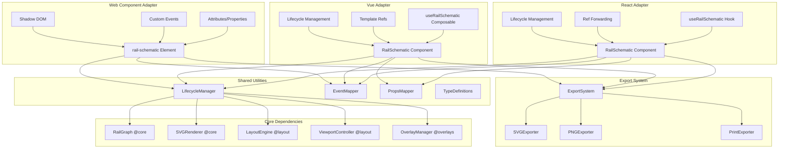

# Design Document: rail-schematic-viz-adapters

## Overview

The rail-schematic-viz-adapters package provides the framework integration layer for the Rail Schematic Viz library, implementing export capabilities (SVG, PNG, print) and framework-specific adapters (React, Vue, Web Components) that enable developers to integrate railway schematic visualizations into their applications using idiomatic patterns for their chosen framework.

This package transforms the core library into production-ready components for modern web frameworks. The export system provides multiple output formats with configurable quality and dimensions. The React adapter uses functional components, hooks, and ref forwarding for seamless integration with React 18+ applications. The Vue adapter leverages the Composition API, reactive props, and composables for Vue 3 integration. The Web Component adapter uses Custom Elements v1 and Shadow DOM for framework-agnostic integration.

The architecture prioritizes developer experience, type safety, and performance. Each adapter manages the underlying renderer lifecycle, integrates with framework-specific reactivity systems, and provides framework-native event handling patterns. Export capabilities are accessible from all adapters through a unified API. TypeScript type definitions ensure compile-time safety. Comprehensive documentation and examples accelerate adoption.

This package builds on @rail-schematic-viz/core (data model, rendering, coordinate bridge), @rail-schematic-viz/layout (viewport, interaction), and @rail-schematic-viz/overlays (data visualization) to provide the final integration layer for production applications.

## Architecture

### System Architecture

The package follows a layered architecture with clear separation between export functionality, framework adapters, and shared utilities:



### Module Structure

```
@rail-schematic-viz/react/
├── src/
│   ├── components/
│   │   └── RailSchematic.tsx
│   ├── hooks/
│   │   └── useRailSchematic.ts
│   ├── types/
│   │   └── index.ts
│   └── index.ts
└── package.json

@rail-schematic-viz/vue/
├── src/
│   ├── components/
│   │   └── RailSchematic.vue
│   ├── composables/
│   │   └── useRailSchematic.ts
│   ├── types/
│   │   └── index.ts
│   └── index.ts
└── package.json

@rail-schematic-viz/web-component/
├── src/
│   ├── RailSchematicElement.ts
│   ├── register.ts
│   ├── types/
│   │   └── index.ts
│   └── index.ts
└── package.json

@rail-schematic-viz/adapters-shared/
├── src/
│   ├── export/
│   │   ├── ExportSystem.ts
│   │   ├── SVGExporter.ts
│   │   ├── PNGExporter.ts
│   │   └── PrintExporter.ts
│   ├── lifecycle/
│   │   └── LifecycleManager.ts
│   ├── events/
│   │   └── EventMapper.ts
│   ├── props/
│   │   └── PropsMapper.ts
│   └── index.ts
└── package.json
```

### Design Principles

1. **Framework Idioms**: Each adapter follows framework-specific patterns and conventions. React uses hooks and functional components, Vue uses Composition API and reactive refs, Web Components use Custom Elements v1 and attributes/properties.

2. **Shared Core Logic**: Export functionality and lifecycle management are implemented once in a shared package and reused across all adapters, ensuring consistency and reducing maintenance burden.

3. **Type Safety**: All adapters provide comprehensive TypeScript type definitions for props, events, methods, and return values. Branded types prevent mixing incompatible values.

4. **Lifecycle Management**: Each adapter properly manages the underlying renderer lifecycle, cleaning up resources on unmount to prevent memory leaks.

5. **Reactivity Integration**: Adapters integrate with framework-specific reactivity systems (React reconciliation, Vue reactivity tracking, Web Component attribute observation) to efficiently update visualizations when props change.

6. **Event Mapping**: Framework-native event patterns (React synthetic events, Vue emits, Web Component CustomEvents) are mapped to underlying library events.

7. **Performance Optimization**: Adapters use framework-specific optimization techniques (React.memo, useMemo, useCallback for React; computed, watchEffect for Vue; Shadow DOM for Web Components) to minimize unnecessary re-renders.

8. **Accessibility**: All adapters support ARIA attributes, keyboard navigation, and focus management from the underlying library.


## Components and Interfaces

### Export System

#### ExportSystem

The central export manager providing SVG, PNG, and print capabilities.

```typescript
class ExportSystem {
  private renderer: SVGRenderer;
  private viewport: ViewportController;
  private overlayManager: OverlayManager;
  private eventEmitter: EventEmitter;
  
  constructor(
    renderer: SVGRenderer,
    viewport: ViewportController,
    overlayManager: OverlayManager
  );
  
  // SVG export
  exportSVG(config?: SVGExportConfig): Promise<string>;
  
  // PNG export
  exportPNG(config?: PNGExportConfig): Promise<string>;
  
  // Print configuration
  configurePrint(config: PrintConfig): void;
  printPreview(): void;
  print(): void;
  
  // Event registration
  on(event: ExportEvent, handler: EventHandler): void;
}

type ExportEvent = 
  | 'export-start'
  | 'export-progress'
  | 'export-complete'
  | 'export-error';

interface SVGExportConfig {
  width?: number | string;
  height?: number | string;
  preserveAspectRatio?: string;
  includeOverlays?: string[] | 'all';
  excludeOverlays?: string[];
  backgroundColor?: string;
  embedFonts?: boolean;
  prettyPrint?: boolean;
  viewportMode?: 'current' | 'full' | 'selection';
  selectedElements?: string[];
}

interface PNGExportConfig {
  width?: number;
  height?: number;
  scale?: number;
  format?: 'png' | 'jpeg' | 'webp';
  quality?: number;
  backgroundColor?: string;
  includeOverlays?: string[] | 'all';
  excludeOverlays?: string[];
  viewportMode?: 'current' | 'full' | 'selection';
  selectedElements?: string[];
}

interface PrintConfig {
  pageSize?: 'A4' | 'Letter' | 'Legal' | { width: number; height: number };
  orientation?: 'portrait' | 'landscape';
  margins?: { top: number; right: number; bottom: number; left: number };
  includeLegend?: boolean;
  includeScaleBar?: boolean;
  includeMetadata?: boolean;
  multiPage?: boolean;
}
```

**Design Rationale**: Centralized export system ensures consistent behavior across all adapters. Async methods support progress reporting for large exports. Configuration objects provide flexibility without method proliferation. Event system enables UI feedback during export operations.

#### SVGExporter

Handles SVG export with configurable options.

```typescript
class SVGExporter {
  exportSVG(
    renderer: SVGRenderer,
    viewport: ViewportController,
    overlayManager: OverlayManager,
    config: SVGExportConfig
  ): Promise<string> {
    // 1. Clone SVG DOM tree
    // 2. Apply viewport transformation based on viewportMode
    // 3. Filter overlays based on include/exclude config
    // 4. Embed CSS styles inline
    // 5. Add metadata elements (timestamp, library version)
    // 6. Optionally embed fonts
    // 7. Serialize to string (pretty-print or minified)
    // 8. Validate SVG structure
    // 9. Return SVG string
  }
  
  private cloneSVGTree(svgElement: SVGSVGElement): SVGSVGElement;
  private applyViewportTransform(svg: SVGSVGElement, mode: string): void;
  private filterOverlays(svg: SVGSVGElement, config: SVGExportConfig): void;
  private embedStyles(svg: SVGSVGElement): void;
  private addMetadata(svg: SVGSVGElement): void;
  private embedFonts(svg: SVGSVGElement): Promise<void>;
  private serializeToString(svg: SVGSVGElement, prettyPrint: boolean): string;
  private validateSVG(svgString: string): Result<void, ValidationError>;
}
```

**Design Rationale**: Cloning prevents mutations to the live DOM. Inline styles ensure consistent rendering in external applications. Metadata provides traceability. Font embedding ensures consistent typography across systems.


#### PNGExporter

Handles PNG export using Canvas API for rasterization.

```typescript
class PNGExporter {
  exportPNG(
    renderer: SVGRenderer,
    viewport: ViewportController,
    overlayManager: OverlayManager,
    config: PNGExportConfig
  ): Promise<string> {
    // 1. Export SVG using SVGExporter
    // 2. Create offscreen canvas with configured dimensions
    // 3. Create Image element from SVG data URL
    // 4. Wait for image load
    // 5. Draw image to canvas with scaling
    // 6. Apply background color if specified
    // 7. Convert canvas to data URL with format and quality
    // 8. Return data URL
  }
  
  private createCanvas(width: number, height: number): HTMLCanvasElement;
  private svgToDataURL(svgString: string): string;
  private drawToCanvas(
    canvas: HTMLCanvasElement,
    image: HTMLImageElement,
    config: PNGExportConfig
  ): void;
  private canvasToDataURL(
    canvas: HTMLCanvasElement,
    format: string,
    quality: number
  ): string;
  private checkCanvasSizeLimits(width: number, height: number): Result<void, ExportError>;
}
```

**Design Rationale**: Leverages SVGExporter for consistency. Offscreen canvas prevents visual artifacts. Image load waiting ensures complete rendering. Canvas size limit checking prevents browser crashes. Format and quality parameters balance file size and visual fidelity.

#### PrintExporter

Handles print configuration and stylesheet generation.

```typescript
class PrintExporter {
  private config: PrintConfig;
  private styleSheet: CSSStyleSheet;
  
  configurePrint(config: PrintConfig): void {
    // 1. Store configuration
    // 2. Generate print stylesheet
    // 3. Inject stylesheet into document
  }
  
  printPreview(): void {
    // 1. Apply print styles
    // 2. Open browser print preview
  }
  
  print(): void {
    // 1. Apply print styles
    // 2. Trigger browser print dialog
  }
  
  private generatePrintStylesheet(config: PrintConfig): string {
    // Generate CSS with:
    // - Page size and orientation
    // - Margins
    // - High-contrast colors for B&W printing
    // - Legend positioning
    // - Scale bar positioning
    // - Metadata footer
    // - Multi-page layout if enabled
  }
  
  private calculatePageLayout(
    bounds: BoundingBox,
    config: PrintConfig
  ): PageLayout;
  
  private renderLegend(overlays: RailOverlay[]): string;
  private renderScaleBar(viewport: ViewportController): string;
  private renderMetadata(graph: RailGraph): string;
}

interface PageLayout {
  pages: number;
  pageWidth: number;
  pageHeight: number;
  contentBounds: BoundingBox[];
}
```

**Design Rationale**: Print stylesheet approach leverages browser's native print capabilities. High-contrast colors ensure readability on B&W printers. Multi-page layout automatically splits large schematics. Legend, scale bar, and metadata provide context for printed output.

### React Adapter

#### RailSchematic Component

The main React component for railway schematic visualization.

```typescript
interface RailSchematicProps {
  data: RailGraph;
  width?: number | string;
  height?: number | string;
  layoutMode?: LayoutMode;
  style?: StylingConfiguration;
  overlays?: OverlayConfiguration[];
  viewport?: ViewportState;
  onClick?: (event: ElementClickEvent) => void;
  onHover?: (event: ElementHoverEvent) => void;
  onSelectionChange?: (event: SelectionChangeEvent) => void;
  onViewportChange?: (event: ViewportChangeEvent) => void;
  onOverlayClick?: (event: OverlayClickEvent) => void;
  className?: string;
  ariaLabel?: string;
}

interface RailSchematicRef {
  pan(x: number, y: number, animated?: boolean): Promise<void>;
  zoom(scale: number, animated?: boolean): Promise<void>;
  fitToView(padding?: number): Promise<void>;
  addOverlay(type: string, config: OverlayConfiguration): string;
  removeOverlay(id: string): void;
  toggleOverlay(id: string): void;
  exportSVG(config?: SVGExportConfig): Promise<string>;
  exportPNG(config?: PNGExportConfig): Promise<string>;
  print(config?: PrintConfig): void;
  selectElements(ids: string[]): void;
  clearSelection(): void;
  getRenderer(): SVGRenderer;
  getViewport(): ViewportController;
  getOverlayManager(): OverlayManager;
}

const RailSchematic = React.forwardRef<RailSchematicRef, RailSchematicProps>(
  (props, ref) => {
    const containerRef = useRef<HTMLDivElement>(null);
    const rendererRef = useRef<SVGRenderer | null>(null);
    const viewportRef = useRef<ViewportController | null>(null);
    const overlayManagerRef = useRef<OverlayManager | null>(null);
    const exportSystemRef = useRef<ExportSystem | null>(null);
    
    // Initialize renderer and dependencies
    useEffect(() => {
      if (!containerRef.current) return;
      
      // Create renderer
      const renderer = new SVGRenderer(props.style);
      rendererRef.current = renderer;
      
      // Create layout engine
      const layoutEngine = new LayoutEngine(
        getLayoutStrategy(props.layoutMode || 'proportional')
      );
      
      // Create viewport controller
      const viewport = new ViewportController(
        renderer.getSVGElement(),
        props.viewport
      );
      viewportRef.current = viewport;
      
      // Create overlay manager
      const overlayManager = new OverlayManager({
        coordinateBridge: new CoordinateBridge(props.data, props.data),
        railGraph: props.data,
        viewport,
        eventManager: viewport.getEventManager(),
        svgRoot: renderer.getSVGElement(),
      });
      overlayManagerRef.current = overlayManager;
      
      // Create export system
      const exportSystem = new ExportSystem(renderer, viewport, overlayManager);
      exportSystemRef.current = exportSystem;
      
      // Render initial graph
      const positionedGraph = await layoutEngine.layout(props.data);
      renderer.render(positionedGraph);
      containerRef.current.appendChild(renderer.getSVGElement());
      
      // Cleanup on unmount
      return () => {
        viewport.destroy();
        overlayManager.destroy();
        renderer.destroy();
      };
    }, []);
    
    // Update graph when data changes
    useEffect(() => {
      if (!rendererRef.current) return;
      
      const layoutEngine = new LayoutEngine(
        getLayoutStrategy(props.layoutMode || 'proportional')
      );
      const positionedGraph = await layoutEngine.layout(props.data);
      rendererRef.current.render(positionedGraph);
    }, [props.data, props.layoutMode]);
    
    // Update overlays when configuration changes
    useEffect(() => {
      if (!overlayManagerRef.current || !props.overlays) return;
      
      // Sync overlay configuration
      syncOverlays(overlayManagerRef.current, props.overlays);
    }, [props.overlays]);
    
    // Setup event handlers
    useEffect(() => {
      if (!viewportRef.current) return;
      
      const viewport = viewportRef.current;
      const eventManager = viewport.getEventManager();
      
      if (props.onClick) {
        eventManager.on('element-click', props.onClick);
      }
      if (props.onHover) {
        eventManager.on('element-hover', props.onHover);
      }
      if (props.onSelectionChange) {
        eventManager.on('selection-change', props.onSelectionChange);
      }
      if (props.onViewportChange) {
        viewport.on('viewport-change', props.onViewportChange);
      }
      if (props.onOverlayClick) {
        eventManager.on('overlay-click', props.onOverlayClick);
      }
      
      return () => {
        // Cleanup event listeners
      };
    }, [props.onClick, props.onHover, props.onSelectionChange, props.onViewportChange, props.onOverlayClick]);
    
    // Expose imperative methods via ref
    useImperativeHandle(ref, () => ({
      pan: (x, y, animated) => viewportRef.current!.panTo(x, y, animated),
      zoom: (scale, animated) => viewportRef.current!.zoomTo(scale, animated),
      fitToView: (padding) => viewportRef.current!.fitToView(padding),
      addOverlay: (type, config) => overlayManagerRef.current!.addOverlay(type, config),
      removeOverlay: (id) => overlayManagerRef.current!.removeOverlay(id),
      toggleOverlay: (id) => overlayManagerRef.current!.toggleOverlay(id),
      exportSVG: (config) => exportSystemRef.current!.exportSVG(config),
      exportPNG: (config) => exportSystemRef.current!.exportPNG(config),
      print: (config) => exportSystemRef.current!.print(config),
      selectElements: (ids) => viewportRef.current!.getSelectionEngine().select(ids),
      clearSelection: () => viewportRef.current!.getSelectionEngine().clearSelection(),
      getRenderer: () => rendererRef.current!,
      getViewport: () => viewportRef.current!,
      getOverlayManager: () => overlayManagerRef.current!,
    }), []);
    
    return (
      <div
        ref={containerRef}
        className={props.className}
        style={{ width: props.width, height: props.height }}
        aria-label={props.ariaLabel || 'Railway schematic diagram'}
        role="img"
      />
    );
  }
);

RailSchematic.displayName = 'RailSchematic';

export default React.memo(RailSchematic);
```

**Design Rationale**: Functional component with hooks follows React best practices. useEffect manages lifecycle (initialization, updates, cleanup). useImperativeHandle exposes imperative API via ref. React.memo prevents unnecessary re-renders. Event handlers are properly cleaned up to prevent memory leaks.


#### useRailSchematic Hook

React hook for programmatic control of schematic instances.

```typescript
interface UseRailSchematicReturn {
  viewport: {
    position: { x: number; y: number };
    scale: number;
    pan: (x: number, y: number, animated?: boolean) => Promise<void>;
    zoom: (scale: number, animated?: boolean) => Promise<void>;
    fitToView: (padding?: number) => Promise<void>;
  };
  overlays: {
    add: (type: string, config: OverlayConfiguration) => string;
    remove: (id: string) => void;
    toggle: (id: string) => void;
    list: () => RailOverlay[];
  };
  selection: {
    selected: string[];
    select: (ids: string[]) => void;
    clear: () => void;
  };
  export: {
    toSVG: (config?: SVGExportConfig) => Promise<string>;
    toPNG: (config?: PNGExportConfig) => Promise<string>;
    print: (config?: PrintConfig) => void;
  };
}

function useRailSchematic(
  ref: React.RefObject<RailSchematicRef>
): UseRailSchematicReturn {
  const [viewportPosition, setViewportPosition] = useState({ x: 0, y: 0 });
  const [viewportScale, setViewportScale] = useState(1);
  const [selectedElements, setSelectedElements] = useState<string[]>([]);
  
  useEffect(() => {
    if (!ref.current) return;
    
    const viewport = ref.current.getViewport();
    
    // Subscribe to viewport changes
    const handleViewportChange = (event: ViewportChangeEvent) => {
      setViewportPosition({ x: event.x, y: event.y });
      setViewportScale(event.scale);
    };
    viewport.on('viewport-change', handleViewportChange);
    
    // Subscribe to selection changes
    const handleSelectionChange = (event: SelectionChangeEvent) => {
      setSelectedElements(event.selectedIds);
    };
    viewport.getEventManager().on('selection-change', handleSelectionChange);
    
    return () => {
      // Cleanup subscriptions
    };
  }, [ref]);
  
  const viewport = useMemo(() => ({
    position: viewportPosition,
    scale: viewportScale,
    pan: (x: number, y: number, animated?: boolean) => 
      ref.current!.pan(x, y, animated),
    zoom: (scale: number, animated?: boolean) => 
      ref.current!.zoom(scale, animated),
    fitToView: (padding?: number) => 
      ref.current!.fitToView(padding),
  }), [viewportPosition, viewportScale, ref]);
  
  const overlays = useMemo(() => ({
    add: (type: string, config: OverlayConfiguration) => 
      ref.current!.addOverlay(type, config),
    remove: (id: string) => 
      ref.current!.removeOverlay(id),
    toggle: (id: string) => 
      ref.current!.toggleOverlay(id),
    list: () => 
      ref.current!.getOverlayManager().getAllOverlays(),
  }), [ref]);
  
  const selection = useMemo(() => ({
    selected: selectedElements,
    select: (ids: string[]) => 
      ref.current!.selectElements(ids),
    clear: () => 
      ref.current!.clearSelection(),
  }), [selectedElements, ref]);
  
  const exportMethods = useMemo(() => ({
    toSVG: (config?: SVGExportConfig) => 
      ref.current!.exportSVG(config),
    toPNG: (config?: PNGExportConfig) => 
      ref.current!.exportPNG(config),
    print: (config?: PrintConfig) => 
      ref.current!.print(config),
  }), [ref]);
  
  return {
    viewport,
    overlays,
    selection,
    export: exportMethods,
  };
}

export default useRailSchematic;
```

**Design Rationale**: Hook provides reactive state (viewport position, scale, selection) and imperative methods. useMemo prevents unnecessary re-creation of method objects. State updates are driven by events from the underlying library. Hook follows React hooks conventions and rules.

### Vue Adapter

#### RailSchematic Component

The main Vue component for railway schematic visualization.

```typescript
<template>
  <div
    ref="containerRef"
    :class="className"
    :style="{ width, height }"
    :aria-label="ariaLabel || 'Railway schematic diagram'"
    role="img"
  />
</template>

<script setup lang="ts">
import { ref, onMounted, onUnmounted, watch, computed } from 'vue';
import type { RailGraph, LayoutMode, StylingConfiguration, OverlayConfiguration, ViewportState } from '@rail-schematic-viz/core';

interface Props {
  data: RailGraph;
  width?: number | string;
  height?: number | string;
  layoutMode?: LayoutMode;
  style?: StylingConfiguration;
  overlays?: OverlayConfiguration[];
  viewport?: ViewportState;
  className?: string;
  ariaLabel?: string;
}

interface Emits {
  (e: 'click', event: ElementClickEvent): void;
  (e: 'hover', event: ElementHoverEvent): void;
  (e: 'selection-change', event: SelectionChangeEvent): void;
  (e: 'viewport-change', event: ViewportChangeEvent): void;
  (e: 'overlay-click', event: OverlayClickEvent): void;
}

const props = withDefaults(defineProps<Props>(), {
  layoutMode: 'proportional',
  width: '100%',
  height: '600px',
});

const emit = defineEmits<Emits>();

const containerRef = ref<HTMLDivElement | null>(null);
const rendererRef = ref<SVGRenderer | null>(null);
const viewportRef = ref<ViewportController | null>(null);
const overlayManagerRef = ref<OverlayManager | null>(null);
const exportSystemRef = ref<ExportSystem | null>(null);

// Initialize on mount
onMounted(async () => {
  if (!containerRef.value) return;
  
  // Create renderer
  const renderer = new SVGRenderer(props.style);
  rendererRef.value = renderer;
  
  // Create layout engine
  const layoutEngine = new LayoutEngine(
    getLayoutStrategy(props.layoutMode)
  );
  
  // Create viewport controller
  const viewport = new ViewportController(
    renderer.getSVGElement(),
    props.viewport
  );
  viewportRef.value = viewport;
  
  // Create overlay manager
  const overlayManager = new OverlayManager({
    coordinateBridge: new CoordinateBridge(props.data, props.data),
    railGraph: props.data,
    viewport,
    eventManager: viewport.getEventManager(),
    svgRoot: renderer.getSVGElement(),
  });
  overlayManagerRef.value = overlayManager;
  
  // Create export system
  const exportSystem = new ExportSystem(renderer, viewport, overlayManager);
  exportSystemRef.value = exportSystem;
  
  // Render initial graph
  const positionedGraph = await layoutEngine.layout(props.data);
  renderer.render(positionedGraph);
  containerRef.value.appendChild(renderer.getSVGElement());
  
  // Setup event handlers
  setupEventHandlers();
});

// Cleanup on unmount
onUnmounted(() => {
  viewportRef.value?.destroy();
  overlayManagerRef.value?.destroy();
  rendererRef.value?.destroy();
});

// Watch for data changes
watch(() => props.data, async (newData) => {
  if (!rendererRef.value) return;
  
  const layoutEngine = new LayoutEngine(
    getLayoutStrategy(props.layoutMode)
  );
  const positionedGraph = await layoutEngine.layout(newData);
  rendererRef.value.render(positionedGraph);
}, { deep: true });

// Watch for layout mode changes
watch(() => props.layoutMode, async (newMode) => {
  if (!rendererRef.value || !props.data) return;
  
  const layoutEngine = new LayoutEngine(getLayoutStrategy(newMode));
  const positionedGraph = await layoutEngine.layout(props.data);
  rendererRef.value.render(positionedGraph);
});

// Watch for overlay changes
watch(() => props.overlays, (newOverlays) => {
  if (!overlayManagerRef.value || !newOverlays) return;
  syncOverlays(overlayManagerRef.value, newOverlays);
}, { deep: true });

// Setup event handlers
function setupEventHandlers() {
  if (!viewportRef.value) return;
  
  const viewport = viewportRef.value;
  const eventManager = viewport.getEventManager();
  
  eventManager.on('element-click', (event) => emit('click', event));
  eventManager.on('element-hover', (event) => emit('hover', event));
  eventManager.on('selection-change', (event) => emit('selection-change', event));
  viewport.on('viewport-change', (event) => emit('viewport-change', event));
  eventManager.on('overlay-click', (event) => emit('overlay-click', event));
}

// Expose methods via template ref
defineExpose({
  pan: (x: number, y: number, animated?: boolean) => 
    viewportRef.value?.panTo(x, y, animated),
  zoom: (scale: number, animated?: boolean) => 
    viewportRef.value?.zoomTo(scale, animated),
  fitToView: (padding?: number) => 
    viewportRef.value?.fitToView(padding),
  addOverlay: (type: string, config: OverlayConfiguration) => 
    overlayManagerRef.value?.addOverlay(type, config),
  removeOverlay: (id: string) => 
    overlayManagerRef.value?.removeOverlay(id),
  toggleOverlay: (id: string) => 
    overlayManagerRef.value?.toggleOverlay(id),
  exportSVG: (config?: SVGExportConfig) => 
    exportSystemRef.value?.exportSVG(config),
  exportPNG: (config?: PNGExportConfig) => 
    exportSystemRef.value?.exportPNG(config),
  print: (config?: PrintConfig) => 
    exportSystemRef.value?.print(config),
  selectElements: (ids: string[]) => 
    viewportRef.value?.getSelectionEngine().select(ids),
  clearSelection: () => 
    viewportRef.value?.getSelectionEngine().clearSelection(),
  getRenderer: () => rendererRef.value,
  getViewport: () => viewportRef.value,
  getOverlayManager: () => overlayManagerRef.value,
});
</script>
```

**Design Rationale**: Composition API with script setup provides clean, type-safe component definition. Reactive refs manage component state. watch functions handle prop changes efficiently. defineExpose provides imperative API via template refs. Event emitters follow Vue 3 conventions with typed emits.


#### useRailSchematic Composable

Vue composable for programmatic control of schematic instances.

```typescript
interface UseRailSchematicReturn {
  viewport: {
    position: Ref<{ x: number; y: number }>;
    scale: Ref<number>;
    pan: (x: number, y: number, animated?: boolean) => Promise<void>;
    zoom: (scale: number, animated?: boolean) => Promise<void>;
    fitToView: (padding?: number) => Promise<void>;
  };
  overlays: {
    add: (type: string, config: OverlayConfiguration) => string;
    remove: (id: string) => void;
    toggle: (id: string) => void;
    list: () => RailOverlay[];
  };
  selection: {
    selected: Ref<string[]>;
    select: (ids: string[]) => void;
    clear: () => void;
  };
  export: {
    toSVG: (config?: SVGExportConfig) => Promise<string>;
    toPNG: (config?: PNGExportConfig) => Promise<string>;
    print: (config?: PrintConfig) => void;
  };
}

function useRailSchematic(
  componentRef: Ref<ComponentPublicInstance | null>
): UseRailSchematicReturn {
  const viewportPosition = ref({ x: 0, y: 0 });
  const viewportScale = ref(1);
  const selectedElements = ref<string[]>([]);
  
  onMounted(() => {
    if (!componentRef.value) return;
    
    const viewport = componentRef.value.getViewport();
    
    // Subscribe to viewport changes
    viewport.on('viewport-change', (event: ViewportChangeEvent) => {
      viewportPosition.value = { x: event.x, y: event.y };
      viewportScale.value = event.scale;
    });
    
    // Subscribe to selection changes
    viewport.getEventManager().on('selection-change', (event: SelectionChangeEvent) => {
      selectedElements.value = event.selectedIds;
    });
  });
  
  const viewport = computed(() => ({
    position: viewportPosition,
    scale: viewportScale,
    pan: (x: number, y: number, animated?: boolean) => 
      componentRef.value?.pan(x, y, animated),
    zoom: (scale: number, animated?: boolean) => 
      componentRef.value?.zoom(scale, animated),
    fitToView: (padding?: number) => 
      componentRef.value?.fitToView(padding),
  }));
  
  const overlays = computed(() => ({
    add: (type: string, config: OverlayConfiguration) => 
      componentRef.value?.addOverlay(type, config),
    remove: (id: string) => 
      componentRef.value?.removeOverlay(id),
    toggle: (id: string) => 
      componentRef.value?.toggleOverlay(id),
    list: () => 
      componentRef.value?.getOverlayManager().getAllOverlays(),
  }));
  
  const selection = computed(() => ({
    selected: selectedElements,
    select: (ids: string[]) => 
      componentRef.value?.selectElements(ids),
    clear: () => 
      componentRef.value?.clearSelection(),
  }));
  
  const exportMethods = computed(() => ({
    toSVG: (config?: SVGExportConfig) => 
      componentRef.value?.exportSVG(config),
    toPNG: (config?: PNGExportConfig) => 
      componentRef.value?.exportPNG(config),
    print: (config?: PrintConfig) => 
      componentRef.value?.print(config),
  }));
  
  return {
    viewport: viewport.value,
    overlays: overlays.value,
    selection: selection.value,
    export: exportMethods.value,
  };
}

export default useRailSchematic;
```

**Design Rationale**: Composable provides reactive state using Vue refs. computed properties ensure reactivity. onMounted sets up event subscriptions. Composable follows Vue 3 Composition API conventions.

### Web Component Adapter

#### RailSchematicElement

Custom element implementation for framework-agnostic integration.

```typescript
class RailSchematicElement extends HTMLElement {
  private renderer: SVGRenderer | null = null;
  private viewport: ViewportController | null = null;
  private overlayManager: OverlayManager | null = null;
  private exportSystem: ExportSystem | null = null;
  private shadowRoot: ShadowRoot;
  
  // Observed attributes
  static get observedAttributes() {
    return ['data', 'width', 'height', 'layout-mode', 'overlays'];
  }
  
  constructor() {
    super();
    this.shadowRoot = this.attachShadow({ mode: 'open' });
  }
  
  // Lifecycle callbacks
  connectedCallback() {
    this.initialize();
  }
  
  disconnectedCallback() {
    this.cleanup();
  }
  
  attributeChangedCallback(name: string, oldValue: string, newValue: string) {
    if (oldValue === newValue) return;
    
    switch (name) {
      case 'data':
        this.updateData(JSON.parse(newValue));
        break;
      case 'width':
        this.updateDimensions();
        break;
      case 'height':
        this.updateDimensions();
        break;
      case 'layout-mode':
        this.updateLayout(newValue as LayoutMode);
        break;
      case 'overlays':
        this.updateOverlays(JSON.parse(newValue));
        break;
    }
  }
  
  // Properties (for programmatic access)
  get data(): RailGraph | null {
    return this._data;
  }
  
  set data(value: RailGraph | null) {
    this._data = value;
    this.updateData(value);
  }
  
  get config(): Configuration | null {
    return this._config;
  }
  
  set config(value: Configuration | null) {
    this._config = value;
    this.updateConfiguration(value);
  }
  
  get overlays(): OverlayConfiguration[] {
    return this._overlays;
  }
  
  set overlays(value: OverlayConfiguration[]) {
    this._overlays = value;
    this.updateOverlays(value);
  }
  
  get viewport(): ViewportState | null {
    return this._viewport;
  }
  
  set viewport(value: ViewportState | null) {
    this._viewport = value;
    this.updateViewport(value);
  }
  
  // Public methods
  pan(x: number, y: number, animated?: boolean): Promise<void> {
    return this.viewport?.panTo(x, y, animated) || Promise.resolve();
  }
  
  zoom(scale: number, animated?: boolean): Promise<void> {
    return this.viewport?.zoomTo(scale, animated) || Promise.resolve();
  }
  
  fitToView(padding?: number): Promise<void> {
    return this.viewport?.fitToView(padding) || Promise.resolve();
  }
  
  addOverlay(type: string, config: OverlayConfiguration): string | null {
    return this.overlayManager?.addOverlay(type, config).value || null;
  }
  
  removeOverlay(id: string): void {
    this.overlayManager?.removeOverlay(id);
  }
  
  exportSVG(config?: SVGExportConfig): Promise<string> {
    return this.exportSystem?.exportSVG(config) || Promise.reject('Not initialized');
  }
  
  exportPNG(config?: PNGExportConfig): Promise<string> {
    return this.exportSystem?.exportPNG(config) || Promise.reject('Not initialized');
  }
  
  print(config?: PrintConfig): void {
    this.exportSystem?.print(config);
  }
  
  // Private methods
  private async initialize() {
    // Create container
    const container = document.createElement('div');
    container.style.width = this.getAttribute('width') || '100%';
    container.style.height = this.getAttribute('height') || '600px';
    
    // Inject styles
    const style = document.createElement('style');
    style.textContent = this.getStyles();
    this.shadowRoot.appendChild(style);
    this.shadowRoot.appendChild(container);
    
    // Parse data attribute
    const dataAttr = this.getAttribute('data');
    if (!dataAttr) return;
    
    const data = JSON.parse(dataAttr);
    
    // Create renderer
    this.renderer = new SVGRenderer();
    
    // Create layout engine
    const layoutMode = this.getAttribute('layout-mode') as LayoutMode || 'proportional';
    const layoutEngine = new LayoutEngine(getLayoutStrategy(layoutMode));
    
    // Create viewport controller
    this.viewport = new ViewportController(this.renderer.getSVGElement());
    
    // Create overlay manager
    this.overlayManager = new OverlayManager({
      coordinateBridge: new CoordinateBridge(data, data),
      railGraph: data,
      viewport: this.viewport,
      eventManager: this.viewport.getEventManager(),
      svgRoot: this.renderer.getSVGElement(),
    });
    
    // Create export system
    this.exportSystem = new ExportSystem(
      this.renderer,
      this.viewport,
      this.overlayManager
    );
    
    // Render initial graph
    const positionedGraph = await layoutEngine.layout(data);
    this.renderer.render(positionedGraph);
    container.appendChild(this.renderer.getSVGElement());
    
    // Setup event handlers
    this.setupEventHandlers();
  }
  
  private cleanup() {
    this.viewport?.destroy();
    this.overlayManager?.destroy();
    this.renderer?.destroy();
  }
  
  private setupEventHandlers() {
    if (!this.viewport) return;
    
    const eventManager = this.viewport.getEventManager();
    
    eventManager.on('element-click', (event) => {
      this.dispatchEvent(new CustomEvent('rail-click', {
        detail: event,
        bubbles: true,
        composed: true,
      }));
    });
    
    eventManager.on('element-hover', (event) => {
      this.dispatchEvent(new CustomEvent('rail-hover', {
        detail: event,
        bubbles: true,
        composed: true,
      }));
    });
    
    eventManager.on('selection-change', (event) => {
      this.dispatchEvent(new CustomEvent('rail-selection-change', {
        detail: event,
        bubbles: true,
        composed: true,
      }));
    });
    
    this.viewport.on('viewport-change', (event) => {
      this.dispatchEvent(new CustomEvent('rail-viewport-change', {
        detail: event,
        bubbles: true,
        composed: true,
      }));
    });
    
    eventManager.on('overlay-click', (event) => {
      this.dispatchEvent(new CustomEvent('rail-overlay-click', {
        detail: event,
        bubbles: true,
        composed: true,
      }));
    });
  }
  
  private async updateData(data: RailGraph | null) {
    if (!this.renderer || !data) return;
    
    const layoutMode = this.getAttribute('layout-mode') as LayoutMode || 'proportional';
    const layoutEngine = new LayoutEngine(getLayoutStrategy(layoutMode));
    const positionedGraph = await layoutEngine.layout(data);
    this.renderer.render(positionedGraph);
  }
  
  private updateDimensions() {
    const container = this.shadowRoot.querySelector('div');
    if (!container) return;
    
    container.style.width = this.getAttribute('width') || '100%';
    container.style.height = this.getAttribute('height') || '600px';
  }
  
  private async updateLayout(mode: LayoutMode) {
    if (!this.renderer || !this._data) return;
    
    const layoutEngine = new LayoutEngine(getLayoutStrategy(mode));
    const positionedGraph = await layoutEngine.layout(this._data);
    this.renderer.render(positionedGraph);
  }
  
  private updateOverlays(overlays: OverlayConfiguration[]) {
    if (!this.overlayManager) return;
    syncOverlays(this.overlayManager, overlays);
  }
  
  private updateConfiguration(config: Configuration | null) {
    // Update renderer, viewport, and overlay configurations
  }
  
  private updateViewport(viewport: ViewportState | null) {
    if (!this.viewport || !viewport) return;
    this.viewport.panTo(viewport.x, viewport.y, false);
    this.viewport.zoomTo(viewport.scale, false);
  }
  
  private getStyles(): string {
    return `
      :host {
        display: block;
        --rail-track-color: var(--rail-track-color, #333333);
        --rail-station-color: var(--rail-station-color, #ffffff);
        --rail-signal-color: var(--rail-signal-color, #ff0000);
      }
      
      div {
        position: relative;
        overflow: hidden;
      }
    `;
  }
  
  // Private state
  private _data: RailGraph | null = null;
  private _config: Configuration | null = null;
  private _overlays: OverlayConfiguration[] = [];
  private _viewport: ViewportState | null = null;
}

// Register custom element
function register() {
  if (!customElements.get('rail-schematic')) {
    customElements.define('rail-schematic', RailSchematicElement);
  }
}

export { RailSchematicElement, register };
```

**Design Rationale**: Custom element extends HTMLElement following Custom Elements v1 spec. Shadow DOM provides style encapsulation. Observed attributes enable declarative configuration. Properties provide programmatic access to complex objects. CustomEvents with bubbling and composition enable event delegation. CSS custom properties enable theming from outside Shadow DOM.

## Data Models

### Type Definitions

```typescript
// Common types across all adapters
type LayoutMode = 'proportional' | 'compressed' | 'fixed-segment' | 'metro-map' | 'auto';

interface ViewportState {
  x: number;
  y: number;
  scale: number;
}

interface Configuration {
  layout?: LayoutConfiguration;
  viewport?: ViewportConfiguration;
  styling?: StylingConfiguration;
  interaction?: InteractionConfiguration;
  accessibility?: AccessibilityConfiguration;
}

// Event types
interface ElementClickEvent {
  elementId: string;
  elementType: string;
  elementData: unknown;
  coordinates: { x: number; y: number };
  modifiers: { shift: boolean; ctrl: boolean; alt: boolean };
}

interface ElementHoverEvent {
  elementId: string;
  elementType: string;
  elementData: unknown;
  coordinates: { x: number; y: number };
}

interface SelectionChangeEvent {
  selectedIds: string[];
  addedIds: string[];
  removedIds: string[];
}

interface ViewportChangeEvent {
  x: number;
  y: number;
  scale: number;
  bounds: BoundingBox;
}

interface OverlayClickEvent {
  overlayId: string;
  overlayType: string;
  dataPoint: unknown;
  coordinates: { x: number; y: number };
}

// Export types
interface ExportMetadata {
  timestamp: string;
  libraryVersion: string;
  schematicId?: string;
}

interface ExportProgress {
  stage: 'preparing' | 'rendering' | 'encoding' | 'complete';
  progress: number;
}

interface ExportError extends Error {
  code: string;
  stage: string;
  details?: unknown;
}
```

## Error Handling

### Error Types

```typescript
class AdapterError extends Error {
  constructor(
    message: string,
    public code: string,
    public context?: unknown
  ) {
    super(message);
    this.name = 'AdapterError';
  }
}

class ExportError extends AdapterError {
  constructor(message: string, code: string, stage: string, context?: unknown) {
    super(message, code, { stage, ...context });
    this.name = 'ExportError';
  }
}

class LifecycleError extends AdapterError {
  constructor(message: string, code: string, phase: string, context?: unknown) {
    super(message, code, { phase, ...context });
    this.name = 'LifecycleError';
  }
}

// Error codes
const ERROR_CODES = {
  // Export errors
  EXPORT_SVG_FAILED: 'EXPORT_SVG_FAILED',
  EXPORT_PNG_FAILED: 'EXPORT_PNG_FAILED',
  EXPORT_CANVAS_SIZE_EXCEEDED: 'EXPORT_CANVAS_SIZE_EXCEEDED',
  EXPORT_INVALID_CONFIG: 'EXPORT_INVALID_CONFIG',
  
  // Lifecycle errors
  LIFECYCLE_INIT_FAILED: 'LIFECYCLE_INIT_FAILED',
  LIFECYCLE_UPDATE_FAILED: 'LIFECYCLE_UPDATE_FAILED',
  LIFECYCLE_CLEANUP_FAILED: 'LIFECYCLE_CLEANUP_FAILED',
  
  // Adapter errors
  ADAPTER_INVALID_PROPS: 'ADAPTER_INVALID_PROPS',
  ADAPTER_MISSING_DEPENDENCY: 'ADAPTER_MISSING_DEPENDENCY',
  ADAPTER_RENDER_FAILED: 'ADAPTER_RENDER_FAILED',
} as const;
```

### Error Handling Strategy

1. **Graceful Degradation**: Export errors should not crash the application. Display error messages and allow retry.

2. **Validation**: Validate props/attributes before processing. Provide clear error messages for invalid values.

3. **Resource Cleanup**: Ensure cleanup happens even when errors occur. Use try-finally blocks.

4. **Error Boundaries**: React adapter should work with React Error Boundaries. Vue adapter should emit error events.

5. **Logging**: Log errors with context for debugging. Include library version, browser info, and error stack.

6. **User Feedback**: Provide user-friendly error messages. Include suggestions for resolution when possible.


## Testing Strategy

### Testing Approach

The testing strategy employs a dual approach combining unit tests for specific behaviors and property-based tests for universal correctness guarantees:

**Unit Testing**:
- Specific examples demonstrating correct behavior
- Edge cases and error conditions
- Integration points between adapters and core library
- Framework-specific lifecycle management
- Event handling and propagation
- Memory leak prevention

**Property-Based Testing**:
- Universal properties that hold for all inputs
- Export round-trip properties (export then re-import)
- Reactivity properties (prop changes trigger updates)
- Lifecycle properties (initialization, cleanup)
- Event mapping properties (framework events map to library events)
- Comprehensive input coverage through randomization

### Testing Tools

- **Test Framework**: Vitest for all packages
- **Property-Based Testing**: fast-check library
- **React Testing**: @testing-library/react for component testing
- **Vue Testing**: @vue/test-utils for component testing
- **Web Component Testing**: @open-wc/testing for custom element testing
- **Coverage Target**: 80%+ code coverage for all packages
- **Property Test Configuration**: Minimum 100 iterations per property test

### Test Organization

```
@rail-schematic-viz/react/
├── src/
│   └── __tests__/
│       ├── RailSchematic.test.tsx
│       ├── RailSchematic.properties.test.tsx
│       ├── useRailSchematic.test.ts
│       └── lifecycle.test.tsx

@rail-schematic-viz/vue/
├── src/
│   └── __tests__/
│       ├── RailSchematic.test.ts
│       ├── RailSchematic.properties.test.ts
│       ├── useRailSchematic.test.ts
│       └── lifecycle.test.ts

@rail-schematic-viz/web-component/
├── src/
│   └── __tests__/
│       ├── RailSchematicElement.test.ts
│       ├── RailSchematicElement.properties.test.ts
│       ├── attributes.test.ts
│       └── events.test.ts

@rail-schematic-viz/adapters-shared/
├── src/
│   └── __tests__/
│       ├── export/
│       │   ├── SVGExporter.test.ts
│       │   ├── SVGExporter.properties.test.ts
│       │   ├── PNGExporter.test.ts
│       │   ├── PNGExporter.properties.test.ts
│       │   └── PrintExporter.test.ts
│       └── lifecycle/
│           └── LifecycleManager.test.ts
```

### Property Test Tagging

Each property-based test must include a comment tag referencing the design document property:

```typescript
// Feature: rail-schematic-viz-adapters, Property 1: SVG export round-trip
test('SVG export then parse produces equivalent structure', async () => {
  await fc.assert(
    fc.asyncProperty(
      railGraphArbitrary(),
      async (graph) => {
        // Test implementation
      }
    ),
    { numRuns: 100 }
  );
});
```

### Test Data Generators

Property-based tests require generators for random test data:

```typescript
// Arbitrary generators for property-based testing
function railGraphArbitrary(): fc.Arbitrary<RailGraph> {
  return fc.record({
    nodes: fc.array(railNodeArbitrary(), { minLength: 2, maxLength: 100 }),
    edges: fc.array(railEdgeArbitrary(), { minLength: 1, maxLength: 200 }),
    lines: fc.array(railLineArbitrary(), { minLength: 0, maxLength: 20 }),
  }).map(data => buildRailGraph(data));
}

function svgExportConfigArbitrary(): fc.Arbitrary<SVGExportConfig> {
  return fc.record({
    width: fc.option(fc.oneof(fc.nat(), fc.constant('100%'))),
    height: fc.option(fc.oneof(fc.nat(), fc.constant('600px'))),
    preserveAspectRatio: fc.option(fc.constantFrom('xMidYMid meet', 'none')),
    backgroundColor: fc.option(fc.hexaString({ minLength: 6, maxLength: 6 })),
    embedFonts: fc.boolean(),
    prettyPrint: fc.boolean(),
  });
}

function pngExportConfigArbitrary(): fc.Arbitrary<PNGExportConfig> {
  return fc.record({
    width: fc.option(fc.integer({ min: 100, max: 4000 })),
    height: fc.option(fc.integer({ min: 100, max: 4000 })),
    scale: fc.option(fc.integer({ min: 1, max: 3 })),
    format: fc.constantFrom('png', 'jpeg', 'webp'),
    quality: fc.option(fc.double({ min: 0, max: 1 })),
  });
}
```

### Integration Testing

Integration tests verify that adapters correctly integrate with the core library:

```typescript
describe('React Adapter Integration', () => {
  it('should initialize renderer on mount', () => {
    const { container } = render(<RailSchematic data={testGraph} />);
    expect(container.querySelector('svg')).toBeInTheDocument();
  });
  
  it('should cleanup resources on unmount', () => {
    const { unmount } = render(<RailSchematic data={testGraph} />);
    const destroySpy = vi.spyOn(SVGRenderer.prototype, 'destroy');
    unmount();
    expect(destroySpy).toHaveBeenCalled();
  });
  
  it('should update visualization when data prop changes', async () => {
    const { rerender } = render(<RailSchematic data={testGraph1} />);
    rerender(<RailSchematic data={testGraph2} />);
    await waitFor(() => {
      // Verify updated rendering
    });
  });
});
```

### Performance Testing

Performance tests ensure adapters meet the 60 FPS target:

```typescript
describe('React Adapter Performance', () => {
  it('should update within 16ms for 60 FPS', async () => {
    const { rerender } = render(<RailSchematic data={largeGraph} />);
    
    const startTime = performance.now();
    rerender(<RailSchematic data={updatedLargeGraph} />);
    await waitFor(() => {
      // Wait for update to complete
    });
    const endTime = performance.now();
    
    expect(endTime - startTime).toBeLessThan(16);
  });
});
```

### Memory Leak Testing

Memory leak tests verify proper resource cleanup:

```typescript
describe('React Adapter Memory Leaks', () => {
  it('should not leak event listeners', () => {
    const { unmount } = render(<RailSchematic data={testGraph} />);
    const initialListenerCount = getEventListenerCount();
    
    unmount();
    
    const finalListenerCount = getEventListenerCount();
    expect(finalListenerCount).toBe(initialListenerCount);
  });
});
```


## Correctness Properties

A property is a characteristic or behavior that should hold true across all valid executions of a system—essentially, a formal statement about what the system should do. Properties serve as the bridge between human-readable specifications and machine-verifiable correctness guarantees.

### Property Reflection

After analyzing all acceptance criteria, I identified the following redundancies:

- **Export completeness properties (1.3, 2.3, 2.4, 4.3)**: Multiple properties test that exports include all visible elements. These can be consolidated into a single comprehensive property about export completeness.
- **Configuration properties (1.4, 2.6, 3.2-3.7, 4.4-4.6, 5.2-5.5)**: Many properties test that configuration options are applied correctly. These can be grouped into fewer properties about configuration application.
- **Props interface properties (9.1-9.7, 15.1-15.7, 21.1-21.7)**: These all test that components accept specific props/attributes. These are API surface tests that can be consolidated into examples rather than separate properties.
- **Event handler properties (10.1-10.5, 16.1-16.5, 23.1-23.5)**: These test that event handlers exist and work. Can be consolidated into properties about event mapping.
- **Lifecycle properties (8.5-8.6, 14.5-14.6, 20.5-20.6)**: These test lifecycle management across all adapters. Can be consolidated into universal lifecycle properties.
- **Ref/method API properties (11.2-11.5, 12.2-12.6, 17.2-17.6, 18.2-18.6, 24.1-24.8)**: These test that imperative APIs exist. Can be consolidated into examples.
- **Package structure properties (28.1-28.8, 29.1-29.8, 30.1-30.8)**: These test package organization. Can be consolidated into examples.

After reflection, the following properties provide unique validation value:

### Property 1: Export Viewport Capture

For any viewport state (pan position and zoom level), exporting the schematic shall preserve that viewport state in the exported output dimensions and viewBox.

**Validates: Requirements 1.2**

### Property 2: Export Completeness

For any schematic with N visible elements (tracks, nodes, overlays), the exported output (SVG or PNG) shall contain all N elements.

**Validates: Requirements 1.3, 2.3, 2.4, 4.3**

### Property 3: Export Dimension Configuration

For any valid export configuration specifying width and height, the exported output shall have those exact dimensions.

**Validates: Requirements 1.4, 2.6, 4.4**

### Property 4: Selection-Based Export

For any selection of K elements from a schematic with N elements (where K < N), exporting with viewportMode='selection' shall produce output containing only those K elements.

**Validates: Requirements 1.6**

### Property 5: Export Error Handling

For any invalid export configuration (e.g., negative dimensions, unsupported format), the export operation shall return an error with a descriptive message rather than throwing an exception.

**Validates: Requirements 1.8**

### Property 6: SVG Validity

For any valid schematic, the exported SVG string shall be parseable by a standard SVG parser without errors.

**Validates: Requirements 2.2**

### Property 7: SVG Style Embedding

For any exported SVG, the output shall contain embedded style elements ensuring consistent rendering in external applications.

**Validates: Requirements 2.5**

### Property 8: SVG Metadata Inclusion

For any exported SVG, the output shall contain metadata elements with export timestamp and library version.

**Validates: Requirements 2.7**

### Property 9: SVG Export Round-Trip

For any valid schematic, exporting to SVG then parsing and rendering shall produce a visual result structurally equivalent to the original (same elements, same positions, same styles).

**Validates: Requirements 2.8, 27.8**

### Property 10: SVG Configuration Application

For any SVG export configuration (viewBox, preserveAspectRatio, backgroundColor, embedFonts, prettyPrint), the exported SVG shall reflect those configuration values in its attributes and content.

**Validates: Requirements 3.2, 3.3, 3.5, 3.6, 3.7**

### Property 11: Overlay Filtering

For any overlay configuration specifying includeOverlays or excludeOverlays, the exported output shall contain only the specified overlays.

**Validates: Requirements 3.4**

### Property 12: Configuration Validation and Defaults

For any export configuration with invalid values, the export system shall use default values for invalid fields and complete the export successfully.

**Validates: Requirements 3.8**

### Property 13: PNG Dimension Scaling

For any PNG export configuration with scale factor S, the exported PNG dimensions shall be S times the base dimensions.

**Validates: Requirements 4.5, 5.2**

### Property 14: PNG Format Selection

For any PNG export configuration specifying format (PNG, JPEG, WebP), the exported data URL shall have the correct MIME type for that format.

**Validates: Requirements 5.5**

### Property 15: PNG Color Preservation

For any schematic with specific element colors, the exported PNG shall preserve those colors (within acceptable color space conversion tolerance).

**Validates: Requirements 5.7**

### Property 16: PNG Export Performance

For any schematic with up to 1000 elements, PNG export shall complete within 2 seconds.

**Validates: Requirements 4.7**

### Property 17: Print Aspect Ratio Preservation

For any schematic with aspect ratio R, configuring print with any page size shall maintain aspect ratio R in the print layout.

**Validates: Requirements 6.4**

### Property 18: Print Legend Inclusion

For any schematic with N visible overlays, the print output shall include a legend with N entries when includeLegend is true.

**Validates: Requirements 6.5**

### Property 19: Print Page Orientation

For any print configuration with orientation (portrait or landscape), the print stylesheet shall apply the correct page orientation.

**Validates: Requirements 6.8, 7.3**

### Property 20: Print Margin Application

For any print configuration with margins (top, right, bottom, left), the print layout shall inset content by those margin values.

**Validates: Requirements 7.4**

### Property 21: Print Multi-Page Layout

For any schematic with bounds larger than a single page, configuring print with multiPage=true shall generate multiple pages covering the entire schematic.

**Validates: Requirements 7.7**

### Property 22: React Lifecycle Management

For any React component instance, mounting shall initialize the renderer and unmounting shall destroy the renderer and clean up all resources.

**Validates: Requirements 8.5, 8.6**

### Property 23: React Props Reactivity

For any React component with data prop D1, changing the prop to D2 shall trigger a re-render with the new data without full component remount.

**Validates: Requirements 9.8**

### Property 24: React Event Mapping

For any React component with event handler props (onClick, onHover, etc.), triggering the corresponding library event shall invoke the handler with correctly typed event data.

**Validates: Requirements 10.6**

### Property 25: React Event Cleanup

For any React component instance with event handlers, unmounting shall remove all event listeners preventing memory leaks.

**Validates: Requirements 10.8**

### Property 26: React Hook Reactive State

For any useRailSchematic hook instance, viewport changes in the underlying library shall update the hook's reactive state (position, scale).

**Validates: Requirements 11.6**

### Property 27: React Memo Optimization

For any React component with unchanged props, React.memo shall prevent re-rendering when parent re-renders.

**Validates: Requirements 13.1**

### Property 28: React Update Performance

For any React component prop change, the update shall complete within 16 milliseconds to maintain 60 FPS.

**Validates: Requirements 13.7**

### Property 29: Vue Lifecycle Management

For any Vue component instance, mounting shall initialize the renderer and unmounting shall destroy the renderer and clean up all resources.

**Validates: Requirements 14.5, 14.6**

### Property 30: Vue Props Reactivity

For any Vue component with reactive data prop D1, changing the prop to D2 shall trigger a re-render with the new data using Vue's reactivity tracking.

**Validates: Requirements 15.8**

### Property 31: Vue Event Emission

For any Vue component, triggering a library event shall emit the corresponding Vue event with correctly typed event data.

**Validates: Requirements 16.6**

### Property 32: Vue Composable Reactive State

For any useRailSchematic composable instance, viewport changes in the underlying library shall update the composable's reactive refs (position, scale).

**Validates: Requirements 17.6**

### Property 33: Vue Reactive Update Efficiency

For any Vue component with multiple reactive prop changes in the same tick, Vue shall batch updates into a single re-render.

**Validates: Requirements 19.1-19.7**

### Property 34: Web Component Lifecycle Management

For any Web Component instance, connecting to the DOM shall initialize the renderer and disconnecting shall destroy the renderer and clean up all resources.

**Validates: Requirements 20.5, 20.6**

### Property 35: Web Component Attribute Reactivity

For any Web Component with observed attribute A1, changing the attribute to A2 shall trigger attributeChangedCallback and update the schematic.

**Validates: Requirements 21.7**

### Property 36: Web Component Attribute Validation

For any Web Component with invalid attribute value, the component shall emit a warning and use a default value rather than failing.

**Validates: Requirements 21.8**

### Property 37: Web Component Property Precedence

For any Web Component with both attribute and property set for the same configuration, the property value shall take precedence.

**Validates: Requirements 22.8**

### Property 38: Web Component Event Bubbling

For any Web Component CustomEvent, the event shall bubble up the DOM tree and be capturable by parent elements.

**Validates: Requirements 23.7**

### Property 39: Web Component Shadow DOM Style Isolation

For any Web Component instance, styles defined inside the Shadow DOM shall not affect external page styles, and external styles shall not affect Shadow DOM content (except via CSS custom properties).

**Validates: Requirements 25.5, 25.6**
