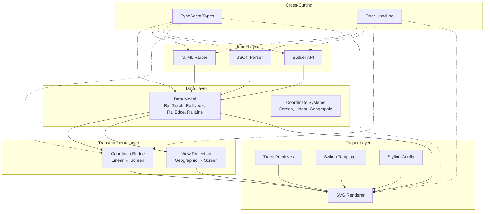
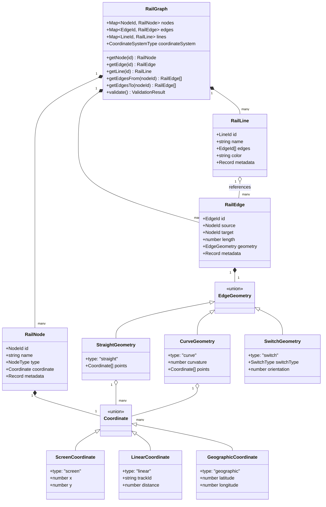
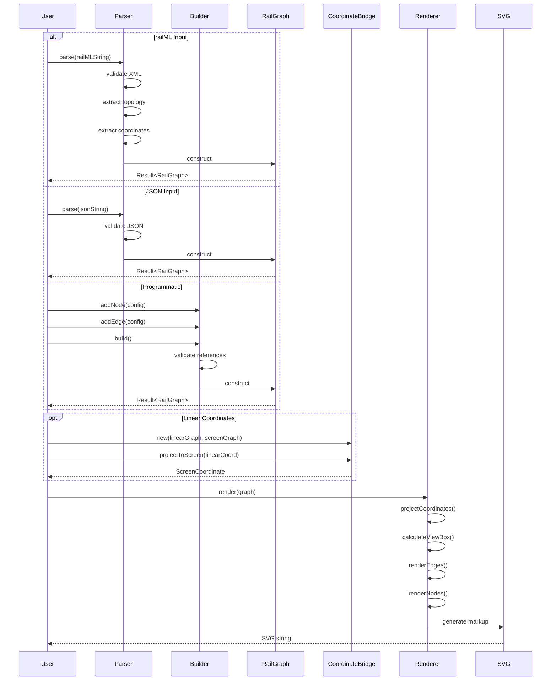

# Design Document: rail-schematic-viz-core

## Overview

The rail-schematic-viz-core package is the foundational layer of the Rail Schematic Viz library, providing core data structures, coordinate systems, parsers, and rendering capabilities for railway network visualization. This package implements a graph-based data model (RailGraph) with support for three coordinate systems (screen, linear, geographic), multiple data import formats (railML® 3 XML, JSON, programmatic Builder API), and a basic SVG rendering engine with track primitives and switch templates.

The architecture prioritizes modularity, type safety, and extensibility. The core data model is immutable and coordinate-system-agnostic, allowing the same graph structure to work with different positioning schemes. The parser architecture uses a common interface with format-specific implementations. The CoordinateBridge provides bidirectional projection between linear referencing (distance along track) and screen coordinates, enabling railway operations use cases. The rendering system separates geometry generation from styling, allowing customization without modifying core rendering logic.

This package serves as the foundation for subsequent packages that will add layout algorithms (rail-schematic-viz-layout-and-interaction), data overlays (rail-schematic-viz-overlays), and framework adapters (rail-schematic-viz-adapters).

## Architecture

### System Architecture

The package follows a layered architecture with clear separation of concerns:



### Module Structure

```
@rail-schematic-viz/core/
├── src/
│   ├── model/
│   │   ├── RailGraph.ts          # Core graph data structure
│   │   ├── RailNode.ts           # Node entity
│   │   ├── RailEdge.ts           # Edge entity
│   │   └── RailLine.ts           # Line entity
│   ├── coordinates/
│   │   ├── types.ts              # Coordinate type definitions
│   │   ├── CoordinateBridge.ts   # Linear ↔ Screen projection
│   │   └── projections.ts        # Geographic projections
│   ├── parsers/
│   │   ├── Parser.ts             # Parser interface
│   │   ├── RailMLParser.ts       # railML 3 XML parser
│   │   ├── JSONParser.ts         # JSON parser
│   │   └── schema.ts             # JSON schema definition
│   ├── builder/
│   │   └── GraphBuilder.ts       # Fluent API for graph construction
│   ├── renderer/
│   │   ├── SVGRenderer.ts        # Main renderer
│   │   ├── primitives.ts         # Track primitive generators
│   │   ├── switches.ts           # Switch template definitions
│   │   └── styling.ts            # Styling configuration
│   ├── errors/
│   │   └── index.ts              # Error classes and handlers
│   └── index.ts                  # Main entry point
├── types/
│   └── index.d.ts                # TypeScript type exports
└── package.json
```

### Design Principles

1. **Immutability**: Core data structures (RailGraph, RailNode, RailEdge) are immutable after construction, preventing accidental mutations and enabling safe sharing across components.

2. **Coordinate System Agnosticism**: The RailGraph model doesn't enforce a specific coordinate system. Nodes can use Screen, Linear, or Geographic coordinates, with validation ensuring consistency within a graph.

3. **Parser Abstraction**: All parsers implement a common `Parser<T>` interface with `parse(input: T): Result<RailGraph, ParseError>`, allowing uniform error handling and easy addition of new formats.

4. **Separation of Geometry and Style**: The renderer generates SVG geometry based on graph structure, while styling is applied through a separate configuration object, enabling theme customization without code changes.

5. **Type Safety**: All public APIs use TypeScript strict mode with explicit types, discriminated unions for coordinate systems, and branded types for identifiers to prevent mixing incompatible values.

6. **Error Transparency**: Errors include context (line numbers, field paths, coordinate values) without exposing internal implementation details, using custom error classes with error codes for programmatic handling.

## Components and Interfaces

### Core Data Model

#### RailGraph

The central data structure representing a railway network as a directed graph.

```typescript
interface RailGraph {
  readonly nodes: ReadonlyMap<NodeId, RailNode>;
  readonly edges: ReadonlyMap<EdgeId, RailEdge>;
  readonly lines: ReadonlyMap<LineId, RailLine>;
  readonly coordinateSystem: CoordinateSystemType;
  
  // Query methods
  getNode(id: NodeId): RailNode | undefined;
  getEdge(id: EdgeId): RailEdge | undefined;
  getLine(id: LineId): RailLine | undefined;
  
  // Traversal methods
  getEdgesFrom(nodeId: NodeId): ReadonlyArray<RailEdge>;
  getEdgesTo(nodeId: NodeId): ReadonlyArray<RailEdge>;
  getConnectedNodes(nodeId: NodeId): ReadonlyArray<RailNode>;
  
  // Validation
  validate(): ValidationResult;
}

type CoordinateSystemType = 'screen' | 'linear' | 'geographic';
type NodeId = string & { readonly __brand: 'NodeId' };
type EdgeId = string & { readonly __brand: 'EdgeId' };
type LineId = string & { readonly __brand: 'LineId' };
```

**Design Rationale**: Using branded types for IDs prevents accidentally passing an edge ID where a node ID is expected. ReadonlyMap and ReadonlyArray prevent external mutation. The coordinate system is stored at the graph level to enforce consistency.

#### RailNode

Represents a vertex in the railway network (station, junction, signal, or endpoint).

```typescript
interface RailNode {
  readonly id: NodeId;
  readonly name: string;
  readonly type: NodeType;
  readonly coordinate: Coordinate;
  readonly metadata?: Record<string, unknown>;
}

type NodeType = 'station' | 'junction' | 'signal' | 'endpoint';

type Coordinate = 
  | ScreenCoordinate 
  | LinearCoordinate 
  | GeographicCoordinate;

interface ScreenCoordinate {
  readonly type: 'screen';
  readonly x: number;
  readonly y: number;
}

interface LinearCoordinate {
  readonly type: 'linear';
  readonly trackId: string;
  readonly distance: number; // in meters
}

interface GeographicCoordinate {
  readonly type: 'geographic';
  readonly latitude: number;
  readonly longitude: number;
}
```

**Design Rationale**: Discriminated union for coordinates enables type-safe handling of different coordinate systems. The `type` field allows TypeScript to narrow types in switch statements. Metadata field provides extensibility for domain-specific properties.

#### RailEdge

Represents a directed edge between two nodes (track segment).

```typescript
interface RailEdge {
  readonly id: EdgeId;
  readonly source: NodeId;
  readonly target: NodeId;
  readonly length: number; // in meters
  readonly geometry: EdgeGeometry;
  readonly metadata?: Record<string, unknown>;
}

type EdgeGeometry = 
  | StraightGeometry 
  | CurveGeometry 
  | SwitchGeometry;

interface StraightGeometry {
  readonly type: 'straight';
  readonly points?: ReadonlyArray<Coordinate>; // Optional intermediate points
}

interface CurveGeometry {
  readonly type: 'curve';
  readonly curvature: number; // radius in meters
  readonly points?: ReadonlyArray<Coordinate>;
}

interface SwitchGeometry {
  readonly type: 'switch';
  readonly switchType: SwitchType;
  readonly orientation: number; // angle in degrees
}

type SwitchType = 
  | 'left_turnout' 
  | 'right_turnout' 
  | 'double_crossover' 
  | 'single_crossover';
```

**Design Rationale**: Geometry is a discriminated union allowing different rendering strategies. Optional points array supports both simple (source→target) and complex (multi-segment) edges. Switch geometry includes orientation for proper template rotation.

#### RailLine

Represents a logical grouping of edges forming a named route.

```typescript
interface RailLine {
  readonly id: LineId;
  readonly name: string;
  readonly edges: ReadonlyArray<EdgeId>;
  readonly color?: string; // Optional line color for rendering
  readonly metadata?: Record<string, unknown>;
}
```

**Design Rationale**: Lines are ordered sequences of edge references, not copies. This allows multiple lines to share edges (common in railway networks) without data duplication.

### Parser Architecture

#### Parser Interface

```typescript
interface Parser<TInput> {
  parse(input: TInput): Result<RailGraph, ParseError>;
}

type Result<T, E> = 
  | { success: true; value: T }
  | { success: false; error: E };

class ParseError extends Error {
  readonly code: string;
  readonly context?: ParseErrorContext;
  
  constructor(message: string, code: string, context?: ParseErrorContext);
}

type ParseErrorContext = 
  | { type: 'xml'; line: number; column: number }
  | { type: 'json'; path: string }
  | { type: 'validation'; field: string; value: unknown };
```

**Design Rationale**: Result type makes error handling explicit (no thrown exceptions in normal flow). Context provides format-specific debugging information. Error codes enable programmatic error handling.

#### railML Parser

```typescript
class RailMLParser implements Parser<string> {
  parse(xmlString: string): Result<RailGraph, ParseError> {
    // 1. Parse XML to DOM
    // 2. Validate against railML 3 schema
    // 3. Extract topology (netElements → nodes, netRelations → edges)
    // 4. Extract positioning systems (screen/geographic coordinates)
    // 5. Extract switches and signals
    // 6. Build RailGraph
  }
  
  private extractTopology(doc: Document): TopologyData;
  private extractCoordinates(doc: Document): CoordinateData;
  private extractSwitches(doc: Document): SwitchData;
  private extractSignals(doc: Document): SignalData;
}
```

**Design Rationale**: railML 3 uses a complex XML structure with separate sections for topology, positioning, and operational elements. The parser extracts each concern separately then combines them into the unified RailGraph model.

#### JSON Parser and Serializer

```typescript
interface JSONSchema {
  nodes: Array<{
    id: string;
    name: string;
    type: string;
    coordinate: object;
    metadata?: object;
  }>;
  edges: Array<{
    id: string;
    source: string;
    target: string;
    length: number;
    geometry: object;
    metadata?: object;
  }>;
  lines?: Array<{
    id: string;
    name: string;
    edges: string[];
    color?: string;
    metadata?: object;
  }>;
}

class JSONParser implements Parser<string> {
  parse(jsonString: string): Result<RailGraph, ParseError>;
}

class JSONSerializer {
  serialize(graph: RailGraph): string;
}
```

**Design Rationale**: JSON format mirrors the internal data model for simplicity. Separate serializer class enables round-trip testing (parse → serialize → parse).

### Builder API

```typescript
class GraphBuilder {
  private nodes: Map<NodeId, RailNode> = new Map();
  private edges: Map<EdgeId, RailEdge> = new Map();
  private lines: Map<LineId, RailLine> = new Map();
  private coordinateSystem?: CoordinateSystemType;
  
  addNode(config: NodeConfig): this;
  addEdge(config: EdgeConfig): this;
  addLine(config: LineConfig): this;
  build(): Result<RailGraph, BuildError>;
}

interface NodeConfig {
  id: string;
  name: string;
  type: NodeType;
  coordinate: Coordinate;
  metadata?: Record<string, unknown>;
}

interface EdgeConfig {
  id: string;
  source: string;
  target: string;
  length: number;
  geometry: EdgeGeometry;
  metadata?: Record<string, unknown>;
}

interface LineConfig {
  id: string;
  name: string;
  edges: string[];
  color?: string;
  metadata?: Record<string, unknown>;
}
```

**Design Rationale**: Fluent API with method chaining enables readable graph construction. Validation happens at `build()` time, allowing flexible construction order. Returning `this` from add methods enables chaining.

### CoordinateBridge

```typescript
class CoordinateBridge {
  constructor(
    linearGraph: RailGraph,  // Graph with linear coordinates
    screenGraph: RailGraph   // Same topology with screen coordinates
  );
  
  projectToScreen(coord: LinearCoordinate): Result<ScreenCoordinate, ProjectionError>;
  projectToLinear(coord: ScreenCoordinate): Result<LinearCoordinate, ProjectionError>;
  
  private buildSegmentIndex(): void;
  private interpolateAlongEdge(
    edge: RailEdge, 
    distance: number
  ): ScreenCoordinate;
}

class ProjectionError extends Error {
  readonly code: string;
  readonly coordinate: Coordinate;
  readonly validRange?: { min: number; max: number };
}
```

**Design Rationale**: Requires two graphs with identical topology but different coordinate systems. Builds an internal index of track segments with accumulated distances for efficient lookup. Interpolation uses linear interpolation for straight segments and parametric curves for curved segments.

### SVG Renderer

```typescript
class SVGRenderer {
  constructor(config?: StylingConfiguration);
  
  render(graph: RailGraph): string; // Returns SVG markup
  
  private renderEdges(edges: ReadonlyArray<RailEdge>): string;
  private renderNodes(nodes: ReadonlyArray<RailNode>): string;
  private calculateViewBox(graph: RailGraph): ViewBox;
  private projectCoordinates(graph: RailGraph): RailGraph; // Project to screen if needed
}

interface StylingConfiguration {
  track: {
    strokeColor: string;
    strokeWidth: number;
    fillColor: string;
  };
  station: {
    radius: number;
    fillColor: string;
    strokeColor: string;
  };
  signal: {
    size: number;
    fillColor: string;
  };
  switch: {
    scaleFactor: number;
  };
}

const DEFAULT_STYLING: StylingConfiguration = {
  track: {
    strokeColor: '#333333',
    strokeWidth: 2,
    fillColor: 'none',
  },
  station: {
    radius: 6,
    fillColor: '#ffffff',
    strokeColor: '#333333',
  },
  signal: {
    size: 8,
    fillColor: '#ff0000',
  },
  switch: {
    scaleFactor: 1.0,
  },
};
```

**Design Rationale**: Renderer is stateless except for configuration. Coordinate projection happens internally, allowing rendering of any coordinate system. ViewBox calculation ensures all elements are visible. CSS classes on elements enable external styling overrides.

### Track Primitives

```typescript
interface TrackPrimitive {
  generatePath(edge: RailEdge, config: StylingConfiguration): string;
}

class StraightPrimitive implements TrackPrimitive {
  generatePath(edge: RailEdge, config: StylingConfiguration): string {
    // Generate SVG path for straight track
    // M x1,y1 L x2,y2
  }
}

class CurvePrimitive implements TrackPrimitive {
  generatePath(edge: RailEdge, config: StylingConfiguration): string {
    // Generate SVG path with cubic Bézier curve
    // M x1,y1 C cx1,cy1 cx2,cy2 x2,y2
    // Control points calculated from curvature
  }
}

class SwitchPrimitive implements TrackPrimitive {
  constructor(private templates: SwitchTemplates);
  
  generatePath(edge: RailEdge, config: StylingConfiguration): string {
    // Apply appropriate switch template based on switchType
    // Transform template based on orientation and scale
  }
}
```

**Design Rationale**: Strategy pattern for different geometry types. Each primitive encapsulates the SVG path generation logic for its geometry type. Bézier control points are calculated using the curvature radius and edge direction.

### Switch Templates

```typescript
interface SwitchTemplate {
  readonly paths: ReadonlyArray<string>; // SVG path data
  readonly width: number;
  readonly height: number;
}

const SWITCH_TEMPLATES: Record<SwitchType, SwitchTemplate> = {
  left_turnout: {
    paths: [
      'M 0,0 L 100,0',           // Main track
      'M 0,0 Q 50,-20 100,-40',  // Diverging track
    ],
    width: 100,
    height: 40,
  },
  right_turnout: {
    paths: [
      'M 0,0 L 100,0',           // Main track
      'M 0,0 Q 50,20 100,40',    // Diverging track
    ],
    width: 100,
    height: 40,
  },
  double_crossover: {
    paths: [
      'M 0,0 L 100,0',           // Track 1
      'M 0,20 L 100,20',         // Track 2
      'M 0,0 L 100,20',          // Crossover 1
      'M 0,20 L 100,0',          // Crossover 2
    ],
    width: 100,
    height: 20,
  },
  single_crossover: {
    paths: [
      'M 0,0 L 100,0',           // Track 1
      'M 0,20 L 100,20',         // Track 2
      'M 0,0 L 100,20',          // Crossover
    ],
    width: 100,
    height: 20,
  },
};
```

**Design Rationale**: Templates are defined in a normalized coordinate space (0-100 units) and transformed during rendering based on actual edge position, orientation, and scale factor. Multiple paths per template support complex switch geometries.

## Data Models

### Type System Hierarchy



### Data Flow



### Coordinate Projection Algorithm

For CoordinateBridge linear-to-screen projection:

1. **Build Segment Index**: On construction, iterate through all edges in the linear graph and build a map of `trackId → sorted array of (distance, nodeId, screenCoordinate)` tuples.

2. **Lookup Segment**: Given a `LinearCoordinate(trackId, distance)`, binary search the segment array to find the two nodes that bracket the distance.

3. **Interpolate**: Calculate the interpolation factor `t = (distance - startDistance) / (endDistance - startDistance)` and linearly interpolate between the start and end screen coordinates: `screenX = startX + t * (endX - startX)`, `screenY = startY + t * (endY - startY)`.

4. **Handle Curves**: For edges with curve geometry, use parametric interpolation along the Bézier curve instead of linear interpolation.

For screen-to-linear projection (reverse):

1. **Find Nearest Edge**: Iterate through all edges and calculate the perpendicular distance from the screen coordinate to each edge's line segment.

2. **Project to Edge**: Find the closest point on the nearest edge to the given screen coordinate.

3. **Calculate Distance**: Use the interpolation factor to calculate the linear distance along the track.

### Geographic Projection

For rendering graphs with geographic coordinates, use Web Mercator projection:

```
x = R * (longitude - λ₀)
y = R * ln(tan(π/4 + latitude/2))
```

Where R is the Earth's radius (6378137 meters) and λ₀ is the central meridian (typically 0).

This projection is used by most web mapping libraries and provides reasonable accuracy for railway-scale visualizations.


## Correctness Properties

A property is a characteristic or behavior that should hold true across all valid executions of a system—essentially, a formal statement about what the system should do. Properties serve as the bridge between human-readable specifications and machine-verifiable correctness guarantees.

### Property Reflection

After analyzing all acceptance criteria, I identified the following redundancies:

- **Rendering properties (6.2-6.4, 6.7, 7.1-7.2, 7.4-7.7, 8.5-8.8)**: Many of these test similar concepts (that specific elements appear in rendered output with correct attributes). These can be consolidated into fewer, more comprehensive properties.
- **Styling properties (6.5, 7.6, 7.7, 8.8)**: Multiple properties test that styling configuration is applied. These can be combined into a single property about styling application.
- **Coordinate system properties (6.8, 6.9)**: These test coordinate handling and can be combined into a single property about coordinate projection.
- **Switch template properties (8.5, 8.6)**: These test the same behavior for different switch types and can be combined.

After reflection, the following properties provide unique validation value:

### Property 1: Node Query Correctness

For any RailGraph and any node ID that exists in the graph, querying by that ID shall return the node with that ID.

**Validates: Requirements 1.7**

### Property 2: Edge Query by Endpoints

For any RailGraph and any edge in the graph, querying edges by that edge's source and target nodes shall return a collection containing that edge.

**Validates: Requirements 1.8**

### Property 3: Connected Edge Traversal

For any RailGraph and any node in the graph, the set of connected edges shall be exactly the union of edges where the node is the source and edges where the node is the target.

**Validates: Requirements 1.9**

### Property 4: Coordinate System Consistency

For any RailGraph, all nodes shall use the same coordinate system type (screen, linear, or geographic).

**Validates: Requirements 2.7**

### Property 5: JSON Serialization Round-Trip

For any valid RailGraph instance, serializing to JSON then parsing back shall produce a graph that is structurally equivalent (same nodes, edges, and lines with same properties).

**Validates: Requirements 4.7**

### Property 6: Builder Node Reference Validation

For any edge configuration with a source or target node ID that does not exist in the builder's current node set, attempting to add that edge shall result in an error.

**Validates: Requirements 5.5**

### Property 7: Builder Edge Reference Validation

For any line configuration with an edge ID that does not exist in the builder's current edge set, attempting to add that line shall result in an error.

**Validates: Requirements 5.6**

### Property 8: SVG Validity

For any RailGraph, the rendered output shall be valid SVG markup (parseable by a standard SVG parser without errors).

**Validates: Requirements 6.1**

### Property 9: Edge Rendering Completeness

For any RailGraph with N edges, the rendered SVG shall contain at least N path elements (one per edge, possibly more for complex geometries).

**Validates: Requirements 6.2**

### Property 10: Station Node Rendering

For any RailGraph with N station-type nodes, the rendered SVG shall contain at least N circle elements.

**Validates: Requirements 6.3**

### Property 11: Signal Node Rendering

For any RailGraph with N signal-type nodes, the rendered SVG shall contain at least N polygon elements.

**Validates: Requirements 6.4**

### Property 12: Styling Application

For any RailGraph and any StylingConfiguration, the rendered SVG shall contain style attributes (stroke, fill, stroke-width) that match the configuration values.

**Validates: Requirements 6.5, 7.6, 7.7**

### Property 13: ViewBox Encompasses All Nodes

For any RailGraph with screen coordinates, the SVG viewBox shall have bounds that include all node coordinates (no node shall fall outside the viewBox).

**Validates: Requirements 6.6**

### Property 14: CSS Class Presence

For any RailGraph, all rendered SVG elements (paths, circles, polygons) shall have CSS class attributes for styling hooks.

**Validates: Requirements 6.7**

### Property 15: Screen Coordinate Direct Mapping

For any RailGraph using screen coordinates, the SVG coordinates of rendered nodes shall match the node coordinate values directly (within floating-point precision).

**Validates: Requirements 6.8**

### Property 16: Geographic Coordinate Projection

For any RailGraph using geographic coordinates, the SVG coordinates shall be the Web Mercator projection of the node coordinates (within projection precision tolerance).

**Validates: Requirements 6.9**

### Property 17: Straight Geometry Rendering

For any RailEdge with straight geometry type, the rendered SVG path shall use only M (moveto) and L (lineto) commands (no curve commands).

**Validates: Requirements 7.1**

### Property 18: Curve Geometry Rendering

For any RailEdge with curve geometry type, the rendered SVG path shall contain at least one C (cubic Bézier) command.

**Validates: Requirements 7.2**

### Property 19: Bézier Control Point Calculation

For any RailEdge with curve geometry and curvature radius R, the calculated Bézier control points shall be positioned such that the curve approximates a circular arc with radius R (within 5% error).

**Validates: Requirements 7.3**

### Property 20: Switch Template Application

For any RailEdge with switch geometry, the rendered SVG shall contain path elements matching the template for that switch type (left_turnout, right_turnout, double_crossover, or single_crossover).

**Validates: Requirements 7.4, 8.5, 8.6**

### Property 21: Switch Template Orientation

For any RailEdge with switch geometry and orientation angle θ, the rendered switch template shall be rotated by θ degrees from its base orientation.

**Validates: Requirements 8.7**

### Property 22: Switch Template Scaling

For any RailEdge with switch geometry and StylingConfiguration with scale factor S, the rendered switch template dimensions shall be scaled by factor S.

**Validates: Requirements 8.8**

### Property 23: Default Styling Fallback

For any RailGraph rendered without a StylingConfiguration, the rendered SVG shall use the default styling values defined in DEFAULT_STYLING.

**Validates: Requirements 9.8**

### Property 24: Linear Coordinate Interpolation

For any CoordinateBridge and any LinearCoordinate that falls between two nodes on a track, the projected ScreenCoordinate shall lie on the line segment (or curve) connecting those two nodes' screen positions.

**Validates: Requirements 10.5**

### Property 25: Out-of-Range Coordinate Rejection

For any CoordinateBridge and any LinearCoordinate with a distance value outside the valid track range (less than 0 or greater than total track length), projection shall return an error.

**Validates: Requirements 10.6**

### Property 26: Coordinate Bridge Round-Trip

For any CoordinateBridge and any valid LinearCoordinate, projecting to screen then projecting back to linear shall produce a coordinate within 0.1% of the original distance value.

**Validates: Requirements 10.7**

### Property 27: Multi-Segment Distance Accumulation

For any CoordinateBridge with a track composed of multiple edges, the total track length shall equal the sum of all edge lengths, and distance calculations shall accumulate correctly across segment boundaries.

**Validates: Requirements 10.8**

### Property 28: Error Code Presence

For any error returned by parsers, builders, or coordinate bridge, the error object shall contain a non-empty error code string for programmatic handling.

**Validates: Requirements 12.7**

## Error Handling

### Error Class Hierarchy

```typescript
abstract class RailSchematicError extends Error {
  abstract readonly code: string;
  
  constructor(message: string) {
    super(message);
    this.name = this.constructor.name;
  }
}

class ParseError extends RailSchematicError {
  readonly code: string;
  readonly context?: ParseErrorContext;
  
  constructor(message: string, code: string, context?: ParseErrorContext) {
    super(message);
    this.code = code;
    this.context = context;
  }
}

class ValidationError extends RailSchematicError {
  readonly code: string;
  readonly field: string;
  readonly value: unknown;
  
  constructor(message: string, code: string, field: string, value: unknown) {
    super(message);
    this.code = code;
    this.field = field;
    this.value = value;
  }
}

class ProjectionError extends RailSchematicError {
  readonly code: string;
  readonly coordinate: Coordinate;
  readonly validRange?: { min: number; max: number };
  
  constructor(
    message: string, 
    code: string, 
    coordinate: Coordinate, 
    validRange?: { min: number; max: number }
  ) {
    super(message);
    this.code = code;
    this.coordinate = coordinate;
    this.validRange = validRange;
  }
}

class BuildError extends RailSchematicError {
  readonly code: string;
  readonly invalidId?: string;
  
  constructor(message: string, code: string, invalidId?: string) {
    super(message);
    this.code = code;
    this.invalidId = invalidId;
  }
}
```

### Error Codes

Error codes follow the pattern `COMPONENT_ERROR_TYPE`:

- `PARSE_INVALID_XML`: XML parsing failed
- `PARSE_INVALID_JSON`: JSON parsing failed
- `PARSE_MISSING_ELEMENT`: Required element missing in input
- `PARSE_INVALID_COORDINATE`: Coordinate data is malformed
- `VALIDATION_INCONSISTENT_COORDINATES`: Mixed coordinate systems in graph
- `VALIDATION_INVALID_REFERENCE`: Referenced ID does not exist
- `VALIDATION_INVALID_GEOMETRY`: Geometry data is invalid
- `PROJECTION_OUT_OF_RANGE`: Coordinate outside valid track range
- `PROJECTION_NO_TRACK`: Referenced track does not exist
- `BUILD_INVALID_NODE_REF`: Edge references non-existent node
- `BUILD_INVALID_EDGE_REF`: Line references non-existent edge
- `RENDER_UNSUPPORTED_COORDINATE`: Coordinate system not supported for rendering

### Error Handling Strategy

1. **Parser Errors**: Parsers return `Result<RailGraph, ParseError>` rather than throwing exceptions. This makes error handling explicit and forces callers to handle the error case.

2. **Validation Errors**: Validation happens at graph construction time (in Builder.build() or parser output). Invalid graphs are never created.

3. **Projection Errors**: CoordinateBridge methods return `Result<Coordinate, ProjectionError>` for out-of-range inputs.

4. **Context Preservation**: Errors include context (line numbers, field paths, coordinate values) to aid debugging without exposing internal implementation details.

5. **Error Recovery**: Where possible, errors include suggestions for recovery (e.g., "valid range is 0-1000m" for out-of-range coordinates).

## Testing Strategy

### Dual Testing Approach

The testing strategy employs both unit tests and property-based tests as complementary approaches:

- **Unit tests** verify specific examples, edge cases, and error conditions with concrete inputs
- **Property-based tests** verify universal properties across randomly generated inputs

Together, these approaches provide comprehensive coverage: unit tests catch concrete bugs in specific scenarios, while property tests verify general correctness across the input space.

### Property-Based Testing Configuration

**Library Selection**: Use `fast-check` for TypeScript property-based testing. It provides:
- Arbitrary generators for primitive and complex types
- Shrinking to find minimal failing examples
- Configurable iteration counts
- Good TypeScript integration

**Test Configuration**:
- Minimum 100 iterations per property test (due to randomization)
- Each property test must reference its design document property in a comment
- Tag format: `// Feature: rail-schematic-viz-core, Property {number}: {property_text}`

**Example Property Test Structure**:

```typescript
import fc from 'fast-check';

describe('Property 1: Node Query Correctness', () => {
  it('should return the correct node when querying by ID', () => {
    // Feature: rail-schematic-viz-core, Property 1: Node Query Correctness
    fc.assert(
      fc.property(
        arbitraryRailGraph(),
        (graph) => {
          // For any node in the graph
          for (const [nodeId, expectedNode] of graph.nodes) {
            const actualNode = graph.getNode(nodeId);
            expect(actualNode).toEqual(expectedNode);
          }
        }
      ),
      { numRuns: 100 }
    );
  });
});
```

### Unit Testing Focus Areas

Unit tests should focus on:

1. **Specific Examples**: Concrete test cases that demonstrate correct behavior
   - Parsing a specific railML document with known structure
   - Building a simple 3-node graph with the Builder API
   - Rendering a graph with 2 stations and 1 track

2. **Edge Cases**: Boundary conditions and special cases
   - Empty graphs (no nodes, no edges)
   - Single-node graphs (no edges)
   - Graphs with disconnected components
   - Coordinates at extreme values (very large/small numbers)
   - Zero-length edges
   - Circular routes (line that returns to starting node)

3. **Error Conditions**: Specific error scenarios
   - Parsing invalid XML with syntax errors
   - Parsing JSON with missing required fields
   - Building graph with invalid node reference
   - Projecting coordinate outside track range
   - Mixed coordinate systems in same graph

4. **Integration Points**: Component interactions
   - Parser → RailGraph → Renderer pipeline
   - Builder → RailGraph → Serializer → Parser round-trip
   - CoordinateBridge with multi-segment tracks

### Property Test Generators

Custom generators (arbitraries) needed for property tests:

```typescript
// Generate random valid node IDs
const arbitraryNodeId = (): fc.Arbitrary<NodeId> => 
  fc.string({ minLength: 1, maxLength: 20 })
    .map(s => s as NodeId);

// Generate random coordinates of a specific type
const arbitraryScreenCoordinate = (): fc.Arbitrary<ScreenCoordinate> =>
  fc.record({
    type: fc.constant('screen' as const),
    x: fc.double({ min: -1000, max: 1000 }),
    y: fc.double({ min: -1000, max: 1000 }),
  });

// Generate random nodes
const arbitraryRailNode = (
  coordinateType: CoordinateSystemType
): fc.Arbitrary<RailNode> =>
  fc.record({
    id: arbitraryNodeId(),
    name: fc.string(),
    type: fc.constantFrom('station', 'junction', 'signal', 'endpoint'),
    coordinate: coordinateType === 'screen' 
      ? arbitraryScreenCoordinate()
      : arbitraryLinearCoordinate(),
  });

// Generate random valid graphs
const arbitraryRailGraph = (): fc.Arbitrary<RailGraph> =>
  fc.record({
    nodes: fc.array(arbitraryRailNode('screen'), { minLength: 1, maxLength: 10 }),
    edges: fc.array(arbitraryRailEdge(), { minLength: 0, maxLength: 20 }),
  }).chain(({ nodes, edges }) => {
    // Ensure edges only reference existing nodes
    const nodeIds = nodes.map(n => n.id);
    const validEdges = edges.filter(e => 
      nodeIds.includes(e.source) && nodeIds.includes(e.target)
    );
    return fc.constant(new RailGraph(nodes, validEdges, []));
  });
```

### Test Organization

```
tests/
├── unit/
│   ├── model/
│   │   ├── RailGraph.test.ts
│   │   ├── RailNode.test.ts
│   │   └── RailEdge.test.ts
│   ├── parsers/
│   │   ├── RailMLParser.test.ts
│   │   ├── JSONParser.test.ts
│   │   └── roundtrip.test.ts
│   ├── builder/
│   │   └── GraphBuilder.test.ts
│   ├── coordinates/
│   │   └── CoordinateBridge.test.ts
│   └── renderer/
│       ├── SVGRenderer.test.ts
│       ├── primitives.test.ts
│       └── switches.test.ts
├── property/
│   ├── model.properties.test.ts
│   ├── parser.properties.test.ts
│   ├── builder.properties.test.ts
│   ├── coordinates.properties.test.ts
│   └── renderer.properties.test.ts
└── fixtures/
    ├── railml/
    │   ├── simple-line.xml
    │   ├── complex-junction.xml
    │   └── invalid-*.xml
    └── json/
        ├── simple-graph.json
        └── invalid-*.json
```

### Coverage Goals

- **Line Coverage**: Minimum 90% for all source files
- **Branch Coverage**: Minimum 85% for conditional logic
- **Property Coverage**: Each correctness property must have at least one property test
- **Error Path Coverage**: Each error code must be triggered by at least one test

### Continuous Testing

- Run unit tests on every commit (fast feedback)
- Run property tests with 100 iterations on every commit
- Run extended property tests with 1000 iterations nightly
- Track property test failures and shrunk examples in CI logs

