# Design Document: rail-schematic-viz-ecosystem

## Overview

The rail-schematic-viz-ecosystem package provides the production-ready features layer for the Rail Schematic Viz library. This package implements the theme system for visual customization, internationalization (i18n) for multi-language support, plugin architecture for extensibility, context menu system for user interactions, regional data adapters (UK ELR, EU RINF, CSV, GeoJSON), brushing and linking for coordinated multi-view analysis, server-side rendering (SSR) support, Canvas rendering fallback for performance optimization, security features (XSS prevention, CSP compliance), bundle optimization, comprehensive documentation infrastructure, and package distribution.

This package transforms the library from a technical foundation into a fully-featured, enterprise-ready solution suitable for deployment in diverse environments including web applications, server-side rendering, and headless export scenarios. It builds on all previous packages (@rail-schematic-viz/core, @rail-schematic-viz/layout, @rail-schematic-viz/overlays, @rail-schematic-viz/adapters) to provide a complete ecosystem.

The ecosystem layer prioritizes extensibility, security, developer experience, and global reach. The theme system uses CSS custom properties for runtime switching without re-rendering. The i18n system supports RTL languages and pluralization. The plugin system provides lifecycle hooks for custom functionality. Regional adapters enable integration with UK Network Rail and EU ERA data sources. SSR support enables server-side diagram generation. Security features ensure safe deployment in enterprise environments. Comprehensive documentation and examples accelerate adoption.

## Architecture

### System Architecture

The ecosystem package follows a modular architecture with independent subsystems that integrate with the core library:

```mermaid
graph TB
    subgraph "Core Library"
        CORE[RailGraph + Renderer]
    end
    
    subgraph "Theme System"
        TM[ThemeManager]
        TD[Theme Definitions]
        CSS[CSS Custom Properties]
    end
    
    subgraph "I18n System"
        I18N[I18nManager]
        LOCALE[Locale Registry]
        TRANS[Translation Files]
    end
    
    subgraph "Plugin System"
        PM[PluginManager]
        PH[Plugin Hooks]
        PLUGINS[Plugin Implementations]
    end
    
    subgraph "Context Menu System"
        CM[ContextMenuManager]
        CMI[Menu Item Registry]
        CMR[Menu Renderer]
    end
    
    subgraph "Regional Adapters"
        CSV_A[CSV Adapter]
        GEO_A[GeoJSON Adapter]
        ELR_A[UK ELR Adapter]
        RINF_A[EU RINF Adapter]
    end
    
    subgraph "Brushing & Linking"
        BL[BrushingLinkingCoordinator]
        VS[View Synchronizer]
        CT[Coordinate Transformer]
    end
    
    subgraph "SSR & Export"
        SSR[SSR Renderer]
        HEADLESS[Headless Export API]
        JSDOM[jsdom Integration]
    end
    
    subgraph "Canvas Rendering"
        CANVAS[Canvas Renderer]
        HYBRID[Hybrid Renderer]
        HIT[Hit Detection]
    end
    
    subgraph "Security"
        XSS[XSS Sanitizer]
        CSP[CSP Validator]
        INPUT[Input Validator]
    end
    
    CORE --> TM
    CORE --> I18N
    CORE --> PM
    CORE --> CM
    CORE --> BL
    CORE --> SSR
    CORE --> CANVAS
    
    TM --> CSS
    TD --> TM
    
    I18N --> LOCALE
    TRANS --> LOCALE
    
    PM --> PH
    PLUGINS --> PM
    
    CM --> CMI
    CM --> CMR
    
    CSV_A --> CORE
    GEO_A --> CORE
    ELR_A --> CORE
    RINF_A --> CORE
    
    BL --> VS
    BL --> CT
    
    SSR --> HEADLESS
    SSR --> JSDOM
    
    CANVAS --> HYBRID
    CANVAS --> HIT
    
    XSS --> CORE
    CSP --> CORE
    INPUT --> CORE
```



### Package Structure

The ecosystem is organized into focused sub-packages for tree-shaking and modularity:

```
@rail-schematic-viz/
├── themes/                    # Theme system
│   ├── src/
│   │   ├── ThemeManager.ts
│   │   ├── themes/
│   │   │   ├── default.ts
│   │   │   ├── dark.ts
│   │   │   ├── high-contrast.ts
│   │   │   └── colorblind-safe.ts
│   │   ├── types.ts
│   │   └── index.ts
│   └── package.json
│
├── i18n/                      # Internationalization
│   ├── src/
│   │   ├── I18nManager.ts
│   │   ├── locales/
│   │   │   ├── en-US.ts
│   │   │   ├── fr-FR.ts
│   │   │   ├── de-DE.ts
│   │   │   └── ar-SA.ts
│   │   ├── types.ts
│   │   └── index.ts
│   └── package.json
│
├── plugins/                   # Plugin system
│   ├── src/
│   │   ├── PluginManager.ts
│   │   ├── types.ts
│   │   └── index.ts
│   └── package.json
│
├── context-menu/              # Context menu system
│   ├── src/
│   │   ├── ContextMenuManager.ts
│   │   ├── MenuItem.ts
│   │   ├── MenuRenderer.ts
│   │   └── index.ts
│   └── package.json
│
├── adapters-regional/         # Regional data adapters
│   ├── src/
│   │   ├── csv/
│   │   │   └── CSVAdapter.ts
│   │   ├── geojson/
│   │   │   └── GeoJSONAdapter.ts
│   │   ├── uk-elr/
│   │   │   └── ELRAdapter.ts
│   │   ├── eu-rinf/
│   │   │   └── RINFAdapter.ts
│   │   └── index.ts
│   └── package.json
│
├── brushing-linking/          # Coordinated views
│   ├── src/
│   │   ├── BrushingLinkingCoordinator.ts
│   │   ├── ViewSynchronizer.ts
│   │   └── index.ts
│   └── package.json
│
├── ssr/                       # Server-side rendering
│   ├── src/
│   │   ├── SSRRenderer.ts
│   │   ├── HeadlessExport.ts
│   │   └── index.ts
│   └── package.json
│
├── canvas/                    # Canvas rendering
│   ├── src/
│   │   ├── CanvasRenderer.ts
│   │   ├── HybridRenderer.ts
│   │   ├── HitDetection.ts
│   │   └── index.ts
│   └── package.json
│
└── security/                  # Security utilities
    ├── src/
    │   ├── XSSSanitizer.ts
    │   ├── CSPValidator.ts
    │   ├── InputValidator.ts
    │   └── index.ts
    └── package.json
```

### Design Principles

1. **Modularity**: Each subsystem (themes, i18n, plugins) is independently usable and tree-shakeable, allowing developers to import only what they need.

2. **Runtime Flexibility**: Theme switching, locale changes, and plugin management happen at runtime without requiring re-initialization or re-rendering.

3. **Security by Default**: All user input is sanitized, CSP compliance is built-in, and no data collection occurs without explicit configuration.

4. **Developer Experience**: TypeScript types, comprehensive documentation, clear error messages, and interactive examples accelerate integration.

5. **Performance**: Canvas fallback for dense data, lazy loading of optional features, and bundle optimization ensure fast load times and smooth interactions.

6. **Accessibility**: High-contrast themes, color-blind safe palettes, keyboard navigation, screen reader support, and WCAG 2.1 AA compliance are built-in.

7. **Extensibility**: Plugin hooks, custom themes, custom context menu items, and custom adapters enable domain-specific customization without forking.

8. **Standards Compliance**: Support for UK ELR, EU RINF, GeoJSON, and CSV enables integration with existing railway data systems.

## Components and Interfaces

### Theme System

#### ThemeManager

Manages theme registration, validation, and application.

```typescript
interface ThemeManager {
  registerTheme(name: string, theme: Theme): void;
  setTheme(name: string): void;
  getTheme(name: string): Theme | undefined;
  getCurrentTheme(): Theme;
  listThemes(): string[];
  createTheme(base: Theme, overrides: Partial<Theme>): Theme;
  validateTheme(theme: Theme): ValidationResult;
}

interface Theme {
  name: string;
  colors: ThemeColors;
  typography: ThemeTypography;
  sizing: ThemeSizing;
  accessibility: ThemeAccessibility;
}

interface ThemeColors {
  // Track colors
  mainLine: string;
  branchLine: string;
  closedTrack: string;
  trackCenterline: string;
  ballast: string;
  
  // Element colors
  station: string;
  signal: string;
  switch: string;
  
  // UI colors
  background: string;
  foreground: string;
  accent: string;
  
  // State colors
  selected: string;
  hover: string;
  disabled: string;
}

interface ThemeTypography {
  fontFamily: string;
  fontSize: {
    small: string;
    medium: string;
    large: string;
  };
  fontWeight: {
    normal: number;
    bold: number;
  };
}

interface ThemeSizing {
  trackWidth: number;
  markerSize: number;
  iconSize: number;
  lineWidth: number;
}

interface ThemeAccessibility {
  contrastRatio: number; // Minimum contrast ratio
  focusIndicator: string; // Focus indicator style
  patterns: boolean; // Use patterns in addition to colors
}
```

**Design Rationale**: CSS custom properties enable runtime theme switching without re-rendering. The theme structure separates concerns (colors, typography, sizing) for easier customization. Validation ensures themes meet accessibility requirements.

#### Default Themes

The library provides four built-in themes:

1. **Default Theme**: Professional railway schematic colors with WCAG AA compliance
2. **Dark Mode Theme**: Low-light optimized with desaturated colors
3. **High-Contrast Theme**: WCAG AAA compliance with 7:1 contrast ratios
4. **Color-Blind Safe Theme**: Distinguishable for deuteranopia and protanopia

```typescript
const defaultTheme: Theme = {
  name: 'default',
  colors: {
    mainLine: '#0066CC',      // Blue
    branchLine: '#00AA44',    // Green
    closedTrack: '#CC0000',   // Red
    trackCenterline: '#000000', // Black
    ballast: '#999999',       // Grey
    station: '#FF6600',       // Orange
    signal: '#CC00CC',        // Magenta
    switch: '#666666',        // Dark grey
    background: '#FFFFFF',    // White
    foreground: '#000000',    // Black
    accent: '#0066CC',        // Blue
    selected: '#FFD700',      // Gold
    hover: '#E6F2FF',         // Light blue
    disabled: '#CCCCCC',      // Light grey
  },
  typography: {
    fontFamily: 'system-ui, -apple-system, sans-serif',
    fontSize: {
      small: '10px',
      medium: '12px',
      large: '14px',
    },
    fontWeight: {
      normal: 400,
      bold: 600,
    },
  },
  sizing: {
    trackWidth: 3,
    markerSize: 8,
    iconSize: 16,
    lineWidth: 1,
  },
  accessibility: {
    contrastRatio: 4.5,
    focusIndicator: '2px solid #0066CC',
    patterns: false,
  },
};
```

### Internationalization System

#### I18nManager

Manages locale registration, translation retrieval, and formatting.

```typescript
interface I18nManager {
  registerLocale(locale: string, translations: Translations): void;
  setLocale(locale: string): void;
  getLocale(): string;
  listLocales(): string[];
  t(key: TranslationKey, params?: Record<string, string | number>): string;
  formatNumber(value: number, options?: NumberFormatOptions): string;
  formatDate(date: Date, options?: DateFormatOptions): string;
  isRTL(): boolean;
}

type TranslationKey = string;

interface Translations {
  [key: string]: string | Translations;
}

interface NumberFormatOptions {
  style?: 'decimal' | 'currency' | 'percent';
  minimumFractionDigits?: number;
  maximumFractionDigits?: number;
}

interface DateFormatOptions {
  dateStyle?: 'full' | 'long' | 'medium' | 'short';
  timeStyle?: 'full' | 'long' | 'medium' | 'short';
}
```

**Design Rationale**: Flat translation keys with dot notation (e.g., 'controls.zoom.in') enable easy lookup and validation. Parameterized translations support variable substitution. Locale-specific formatting uses Intl API for standards compliance.

#### Translation Structure

```typescript
const enUS: Translations = {
  controls: {
    zoom: {
      in: 'Zoom In',
      out: 'Zoom Out',
      reset: 'Reset Zoom',
    },
    minimap: {
      toggle: 'Toggle Minimap',
    },
  },
  overlays: {
    heatmap: 'Heat Map',
    timeSeries: 'Time Series',
    annotations: 'Annotations',
  },
  contextMenu: {
    viewDetails: 'View Details',
    selectConnected: 'Select Connected',
    exportSelection: 'Export Selection',
    copyCoordinates: 'Copy Coordinates',
    zoomToElement: 'Zoom to Element',
    hideElement: 'Hide Element',
  },
  errors: {
    parseError: 'Failed to parse data: {message}',
    renderError: 'Failed to render schematic: {message}',
    invalidCoordinate: 'Invalid coordinate: {coordinate}',
  },
};
```

### Plugin System

#### PluginManager

Manages plugin registration, lifecycle, and execution.

```typescript
interface PluginManager {
  registerPlugin(name: string, plugin: Plugin, options?: PluginOptions): void;
  enablePlugin(name: string): void;
  disablePlugin(name: string): void;
  unregisterPlugin(name: string): void;
  listPlugins(): PluginInfo[];
  isPluginEnabled(name: string): boolean;
}

interface Plugin {
  initialize(context: PluginContext): void | Promise<void>;
  beforeRender?(context: RenderContext): void | Promise<void>;
  afterRender?(context: RenderContext): void | Promise<void>;
  onViewportChange?(viewport: Viewport): void;
  onDataUpdate?(graph: RailGraph): void;
  destroy?(): void | Promise<void>;
}

interface PluginContext {
  graph: RailGraph;
  renderer: SVGRenderer;
  coordinateBridge: CoordinateBridge;
  options: PluginOptions;
}

interface RenderContext {
  graph: RailGraph;
  renderer: SVGRenderer;
  viewport: Viewport;
  svgRoot: SVGElement;
}

interface PluginOptions {
  [key: string]: unknown;
}

interface PluginInfo {
  name: string;
  enabled: boolean;
  options: PluginOptions;
}
```

**Design Rationale**: Lifecycle hooks provide control points for custom functionality. Async support enables plugins that load data or perform computations. Error isolation prevents plugin failures from crashing the renderer.

### Context Menu System

#### ContextMenuManager

Manages context menu rendering, item registration, and event handling.

```typescript
interface ContextMenuManager {
  registerMenuItem(item: MenuItem): void;
  unregisterMenuItem(id: string): void;
  show(event: MouseEvent, element: RailNode | RailEdge): void;
  hide(): void;
  isVisible(): boolean;
}

interface MenuItem {
  id: string;
  label: string | ((element: RailNode | RailEdge) => string);
  icon?: string;
  action: (element: RailNode | RailEdge, event: MouseEvent) => void;
  visible?: (element: RailNode | RailEdge) => boolean;
  disabled?: (element: RailNode | RailEdge) => boolean;
  separator?: boolean;
  submenu?: MenuItem[];
}
```

**Design Rationale**: Dynamic label and visibility functions enable context-sensitive menus. Separator support enables visual grouping. Submenu support enables hierarchical organization.

### Regional Adapters

#### CSV Adapter

Parses CSV files with configurable column mappings.

```typescript
interface CSVAdapter {
  parse(csv: string, options?: CSVOptions): Result<RailGraph, ParseError>;
}

interface CSVOptions {
  delimiter?: ',' | ';' | '\t';
  hasHeader?: boolean;
  columnMapping?: {
    lineId?: string;
    startMileage?: string;
    endMileage?: string;
    stationName?: string;
    trackType?: string;
    speedLimit?: string;
  };
}
```

#### GeoJSON Adapter

Parses GeoJSON with linear referencing properties.

```typescript
interface GeoJSONAdapter {
  parse(geojson: GeoJSON.FeatureCollection, options?: GeoJSONOptions): Result<RailGraph, ParseError>;
}

interface GeoJSONOptions {
  crs?: string; // Coordinate reference system
  linearRefProperty?: string; // Property name for linear referencing
  trackIdProperty?: string;
  trackNameProperty?: string;
}
```

#### UK ELR Adapter

Resolves UK Engineer's Line References and mileage notation.

```typescript
interface ELRAdapter {
  resolveELR(elr: string): Result<string, AdapterError>; // Returns track ID
  parseMileage(mileage: string): Result<number, AdapterError>; // Returns meters
  toLinearPosition(elr: string, mileage: string): Result<LinearCoordinate, AdapterError>;
}

// Example: "ECM1" (East Coast Main Line 1), "42m 35ch" (42 miles 35 chains)
```

#### EU RINF Adapter

Resolves EU RINF identifiers.

```typescript
interface RINFAdapter {
  resolveSectionOfLine(id: string): Result<string, AdapterError>; // Returns track ID
  resolveOperationalPoint(id: string): Result<NodeId, AdapterError>; // Returns station ID
  parse(data: RINFData): Result<RailGraph, ParseError>;
}

interface RINFData {
  format: 'xml' | 'json';
  content: string;
}
```

### Brushing and Linking

#### BrushingLinkingCoordinator

Coordinates selection and viewport synchronization across multiple views.

```typescript
interface BrushingLinkingCoordinator {
  registerView(id: string, view: LinkedView): void;
  unregisterView(id: string): void;
  selectElements(elementIds: string[], sourceViewId: string): void;
  clearSelection(sourceViewId: string): void;
  syncViewport(viewport: Viewport, sourceViewId: string): void;
}

interface LinkedView {
  id: string;
  onSelectionChange(elementIds: string[]): void;
  onViewportChange(viewport: Viewport): void;
  getCoordinateSystem(): CoordinateSystemType;
}
```

**Design Rationale**: Source view ID prevents infinite loops when synchronizing. Coordinate system awareness enables transformation between schematic and geographic views.

### Server-Side Rendering

#### SSRRenderer

Renders schematics in Node.js environments using jsdom.

```typescript
interface SSRRenderer {
  render(graph: RailGraph, options: SSROptions): Promise<string>; // Returns SVG markup
}

interface SSROptions {
  width: number;
  height: number;
  theme?: Theme;
  layoutMode?: LayoutMode;
  overlays?: OverlayConfig[];
}
```

#### HeadlessExport

Batch export API for generating multiple diagrams.

```typescript
interface HeadlessExport {
  exportSVG(graph: RailGraph, options: ExportOptions): Promise<string>;
  exportPNG(graph: RailGraph, options: ExportOptions): Promise<Buffer>;
  exportBatch(requests: ExportRequest[]): Promise<ExportResult[]>;
}

interface ExportOptions extends SSROptions {
  format: 'svg' | 'png';
  scale?: number; // For PNG export
}

interface ExportRequest {
  id: string;
  graph: RailGraph;
  options: ExportOptions;
}

interface ExportResult {
  id: string;
  data: string | Buffer;
  error?: Error;
}
```

### Canvas Rendering

#### CanvasRenderer

Renders dense data layers using HTML5 Canvas for performance.

```typescript
interface CanvasRenderer {
  render(graph: RailGraph, canvas: HTMLCanvasElement, options: CanvasOptions): void;
  clear(): void;
  hitTest(x: number, y: number): RailNode | RailEdge | null;
}

interface CanvasOptions {
  viewport: Viewport;
  theme: Theme;
  layers: CanvasLayer[];
}

type CanvasLayer = 'tracks' | 'stations' | 'heatmap' | 'annotations';
```

#### HybridRenderer

Combines SVG for interactive elements and Canvas for dense layers.

```typescript
interface HybridRenderer {
  render(graph: RailGraph, container: HTMLElement, options: HybridOptions): void;
  setSVGLayers(layers: SVGLayer[]): void;
  setCanvasLayers(layers: CanvasLayer[]): void;
}

interface HybridOptions {
  svgLayers: SVGLayer[];
  canvasLayers: CanvasLayer[];
  theme: Theme;
  viewport: Viewport;
}

type SVGLayer = 'tracks' | 'stations' | 'signals' | 'switches' | 'labels';
```

**Design Rationale**: Hybrid rendering balances performance (Canvas for dense data) with interactivity (SVG for clickable elements). Hit detection on Canvas enables event handling.

### Security

#### XSSSanitizer

Sanitizes user-provided content to prevent XSS attacks.

```typescript
interface XSSSanitizer {
  sanitizeText(text: string): string;
  sanitizeSVG(svg: string): string;
  sanitizeURL(url: string): string;
  validateAttribute(name: string, value: string): boolean;
}
```

#### CSPValidator

Validates Content Security Policy compliance.

```typescript
interface CSPValidator {
  validateCSP(policy: string): ValidationResult;
  getRequiredDirectives(): string[];
  checkCompatibility(policy: string): CompatibilityResult;
}

interface CompatibilityResult {
  compatible: boolean;
  missingDirectives: string[];
  recommendations: string[];
}
```

#### InputValidator

Validates all input data to prevent injection attacks.

```typescript
interface InputValidator {
  validateCoordinate(coord: Coordinate): ValidationResult;
  validateNodeId(id: string): ValidationResult;
  validateTheme(theme: Theme): ValidationResult;
  validateTranslations(translations: Translations): ValidationResult;
}
```

## Data Models

### Theme Data Model

Themes are stored as JSON objects and applied via CSS custom properties:

```typescript
// Theme definition
const theme: Theme = {
  name: 'custom',
  colors: {
    mainLine: '#0066CC',
    // ... other colors
  },
  // ... other properties
};

// CSS custom properties (generated)
:root {
  --rail-color-main-line: #0066CC;
  --rail-color-branch-line: #00AA44;
  --rail-font-family: system-ui, sans-serif;
  --rail-track-width: 3px;
  // ... other properties
}
```

### Translation Data Model

Translations are stored as nested objects with dot-notation keys:

```typescript
const translations: Translations = {
  'controls.zoom.in': 'Zoom In',
  'controls.zoom.out': 'Zoom Out',
  'errors.parseError': 'Failed to parse data: {message}',
};

// Usage
i18n.t('controls.zoom.in'); // Returns: "Zoom In"
i18n.t('errors.parseError', { message: 'Invalid XML' }); // Returns: "Failed to parse data: Invalid XML"
```

### Plugin Data Model

Plugins are registered with name, implementation, and options:

```typescript
const customPlugin: Plugin = {
  initialize(context) {
    console.log('Plugin initialized with graph:', context.graph);
  },
  beforeRender(context) {
    // Custom pre-render logic
  },
  afterRender(context) {
    // Custom post-render logic
  },
};

pluginManager.registerPlugin('custom-plugin', customPlugin, {
  enabled: true,
  customOption: 'value',
});
```


## Correctness Properties

*A property is a characteristic or behavior that should hold true across all valid executions of a system-essentially, a formal statement about what the system should do. Properties serve as the bridge between human-readable specifications and machine-verifiable correctness guarantees.*

### Property 1: Theme Application Preserves Viewport State

*For any* schematic with a given viewport state (zoom level, pan position), applying a different theme should preserve the viewport state without triggering a full re-render.

**Validates: Requirements 1.7, 7.5**

### Property 2: Theme Contrast Validation

*For any* custom theme, if it passes validation, then all color pairs used for text and backgrounds must meet the minimum contrast ratio specified in the theme's accessibility settings.

**Validates: Requirements 1.8, 6.3**

### Property 3: Theme Round-Trip Consistency

*For any* theme created via createTheme() with valid properties, retrieving that theme after registration should return an equivalent theme object.

**Validates: Requirements 6.2, 6.5**

### Property 4: Translation Fallback Consistency

*For any* translation key, if the key is not found in the active locale, the system should return the translation from the default locale (en-US).

**Validates: Requirements 8.6, 9.8**

### Property 5: Translation Parameter Substitution

*For any* translation key with parameters, substituting the parameters should replace all placeholder tokens with the provided values.

**Validates: Requirements 8.4**

### Property 6: RTL Text Direction Application

*For any* RTL locale (Arabic, Hebrew, Persian, Urdu), setting that locale should apply RTL text direction to all text elements while maintaining LTR direction for schematic topology.

**Validates: Requirements 11.2, 11.4**

### Property 7: Plugin Lifecycle Execution Order

*For any* registered and enabled plugin, the lifecycle hooks should be invoked in the correct order: initialize() on registration, beforeRender() before each render, afterRender() after each render, and destroy() on unregistration.

**Validates: Requirements 13.1, 13.2, 13.3, 13.6**

### Property 8: Plugin Error Isolation

*For any* plugin that throws an error in a lifecycle hook, the error should be caught and logged without crashing the renderer or affecting other plugins.

**Validates: Requirements 13.8**

### Property 9: Plugin Enable/Disable State

*For any* plugin, when disabled, none of its lifecycle hooks should be invoked; when re-enabled, the initialize() hook should be invoked again.

**Validates: Requirements 14.2, 14.6, 14.7**

### Property 10: Context Menu Positioning

*For any* context menu triggered by a right-click, the menu should be positioned near the cursor while staying within viewport bounds (not clipped by edges).

**Validates: Requirements 15.2**

### Property 11: Context Menu Item Visibility

*For any* context menu item with a conditional visibility function, the item should only appear in the menu when the visibility function returns true for the clicked element.

**Validates: Requirements 17.6**

### Property 12: CSV Adapter Round-Trip

*For any* valid CSV file, parsing it to create a RailGraph, then exporting that graph back to CSV, then parsing again should produce an equivalent RailGraph.

**Validates: Requirements 18.8**

### Property 13: GeoJSON Coordinate Transformation

*For any* valid GeoJSON FeatureCollection with LineString geometries, parsing it should correctly convert geographic coordinates to the appropriate coordinate system in the RailGraph.

**Validates: Requirements 19.2, 19.6**

### Property 14: UK Mileage Conversion Accuracy

*For any* valid UK mileage notation in Miles and Chains format (e.g., "42m 35ch"), converting to decimal meters and back should preserve the original value within rounding tolerance.

**Validates: Requirements 20.2, 20.3**

### Property 15: Brushing and Linking Selection Synchronization

*For any* set of linked views, selecting elements in one view should trigger selection-change events in all other registered views with the same element IDs.

**Validates: Requirements 22.3, 23.7**

### Property 16: Coordinate Transformation Bidirectionality

*For any* coordinate in one system (Screen, Linear, or Geographic), transforming to another system and back should produce a coordinate equivalent to the original within numerical precision.

**Validates: Requirements 23.4, 23.8**

### Property 17: SSR SVG Generation Completeness

*For any* RailGraph and SSR options, the headlessExport() method should generate valid SVG markup that includes all elements from the graph.

**Validates: Requirements 25.3, 25.4**

### Property 18: Canvas Hit Detection Accuracy

*For any* point (x, y) on a Canvas-rendered schematic, hitTest(x, y) should return the topmost element at that position, or null if no element exists.

**Validates: Requirements 26.7**

### Property 19: Hybrid Rendering Visual Consistency

*For any* schematic rendered in hybrid mode (SVG + Canvas), the visual output should be equivalent to rendering the same schematic entirely in SVG mode.

**Validates: Requirements 27.4**

### Property 20: XSS Sanitization Safety

*For any* user-provided text content, after sanitization, the text should not contain executable script tags, event handlers, or javascript: URLs.

**Validates: Requirements 28.2, 28.3, 28.4, 28.8**

### Property 21: CSP Compliance Validation

*For any* library operation, no inline styles or scripts requiring 'unsafe-inline' should be generated when CSP-compatible mode is enabled.

**Validates: Requirements 29.1, 29.2, 29.3**

### Property 22: Bundle Size Tree-Shaking

*For any* import that only uses core features (no themes, plugins, or adapters), the resulting bundle size should be less than 50 kilobytes gzipped.

**Validates: Requirements 32.8**

### Property 23: Theme CSS Custom Property Generation

*For any* theme applied via setTheme(), all theme properties should be converted to CSS custom properties with the correct naming convention (--rail-*).

**Validates: Requirements 1.7**

### Property 24: Plugin Configuration Persistence

*For any* plugin registered with options, retrieving the plugin info should return the same options object.

**Validates: Requirements 12.7**

### Property 25: Context Menu Keyboard Navigation

*For any* visible context menu, pressing arrow keys should move focus between menu items, and pressing Enter should invoke the focused item's action.

**Validates: Requirements 15.6**

### Property 26: Locale Number Formatting

*For any* number and active locale, formatNumber() should use the locale-specific formatting rules (decimal separator, thousands separator, etc.).

**Validates: Requirements 10.5**

### Property 27: ELR Direction Indicator Handling

*For any* ELR code with direction indicator (up/down), the adapter should correctly resolve the track identifier and preserve the direction information.

**Validates: Requirements 20.4**

### Property 28: RINF Identifier Resolution

*For any* valid RINF section-of-line identifier, the adapter should resolve it to a track identifier in the RailGraph.

**Validates: Requirements 21.1, 21.4**

### Property 29: Viewport Synchronization Across Views

*For any* set of linked views, changing the viewport in one view should trigger viewport-change events in all other registered views with transformed coordinates.

**Validates: Requirements 22.7**

### Property 30: SSR Batch Export Consistency

*For any* batch of export requests, each request should be processed independently, and failures in one request should not affect others.

**Validates: Requirements 25.8**


## Error Handling

### Error Classification

The ecosystem layer defines specific error types for each subsystem:

```typescript
// Theme errors
class ThemeValidationError extends Error {
  constructor(
    public themeName: string,
    public violations: ContrastViolation[],
  ) {
    super(`Theme "${themeName}" failed validation`);
  }
}

interface ContrastViolation {
  property: string;
  foreground: string;
  background: string;
  actualRatio: number;
  requiredRatio: number;
}

// I18n errors
class TranslationNotFoundError extends Error {
  constructor(
    public key: string,
    public locale: string,
  ) {
    super(`Translation key "${key}" not found for locale "${locale}"`);
  }
}

// Plugin errors
class PluginError extends Error {
  constructor(
    public pluginName: string,
    public hook: string,
    public cause: Error,
  ) {
    super(`Plugin "${pluginName}" failed in ${hook} hook: ${cause.message}`);
  }
}

// Adapter errors
class AdapterError extends Error {
  constructor(
    public adapterName: string,
    public reason: string,
    public context?: Record<string, unknown>,
  ) {
    super(`${adapterName} adapter error: ${reason}`);
  }
}

// Security errors
class SecurityError extends Error {
  constructor(
    public violation: string,
    public details: string,
  ) {
    super(`Security violation: ${violation} - ${details}`);
  }
}
```

### Error Handling Strategies

1. **Theme Validation**: Validate themes synchronously during registration. Emit warnings for non-critical violations (e.g., suboptimal contrast) but reject themes with critical violations (e.g., missing required properties).

2. **Translation Fallback**: When a translation key is not found, log a warning and fall back to the default locale. If the key is not found in the default locale, return the key itself as a fallback.

3. **Plugin Isolation**: Wrap all plugin lifecycle hook invocations in try-catch blocks. Log plugin errors with full context but continue execution. Provide a plugin error event for monitoring.

4. **Adapter Validation**: Validate input data before parsing. Return Result<T, E> types for all adapter operations to enable explicit error handling. Include row/line numbers in error messages for CSV/XML parsing.

5. **Security Enforcement**: Throw SecurityError for XSS attempts or CSP violations. Sanitize all user input by default. Provide configuration to disable sanitization for trusted content sources.

6. **SSR Error Handling**: Catch and log errors during server-side rendering. Return partial results for batch exports when some requests fail. Include error details in export results.

### Error Recovery

- **Theme Errors**: Fall back to default theme if custom theme fails validation
- **Translation Errors**: Fall back to default locale, then to translation key
- **Plugin Errors**: Disable failing plugin and continue rendering
- **Adapter Errors**: Return descriptive error with context for debugging
- **Security Errors**: Reject operation and log security event
- **SSR Errors**: Return error in result object without crashing process

## Testing Strategy

### Dual Testing Approach

The ecosystem package uses both unit tests and property-based tests for comprehensive coverage:

**Unit Tests**: Focus on specific examples, edge cases, and integration points
- Theme validation with specific color combinations
- Translation parameter substitution with specific values
- Plugin lifecycle with specific hook sequences
- Context menu positioning at viewport edges
- Adapter parsing with specific CSV/GeoJSON examples
- Security sanitization with known XSS payloads

**Property-Based Tests**: Verify universal properties across all inputs
- Theme round-trip consistency for any valid theme
- Translation fallback for any missing key
- Plugin error isolation for any error type
- CSV adapter round-trip for any valid CSV
- Coordinate transformation bidirectionality for any coordinate
- XSS sanitization safety for any user input

### Property-Based Testing Configuration

The ecosystem package uses fast-check for property-based testing with the following configuration:

```typescript
import * as fc from 'fast-check';
import { describe, it, expect } from 'vitest';

describe('Theme System Properties', () => {
  it('Property 1: Theme application preserves viewport state', () => {
    fc.assert(
      fc.property(
        fc.record({
          zoom: fc.double({ min: 0.1, max: 10 }),
          panX: fc.double({ min: -1000, max: 1000 }),
          panY: fc.double({ min: -1000, max: 1000 }),
        }),
        fc.oneof(fc.constant('default'), fc.constant('dark'), fc.constant('high-contrast')),
        fc.oneof(fc.constant('default'), fc.constant('dark'), fc.constant('high-contrast')),
        (viewport, theme1, theme2) => {
          // Feature: rail-schematic-viz-ecosystem, Property 1: Theme application preserves viewport state
          const renderer = createRenderer();
          renderer.setViewport(viewport);
          renderer.setTheme(theme1);
          const viewportAfterTheme1 = renderer.getViewport();
          
          renderer.setTheme(theme2);
          const viewportAfterTheme2 = renderer.getViewport();
          
          expect(viewportAfterTheme2).toEqual(viewportAfterTheme1);
        }
      ),
      { numRuns: 100 }
    );
  });

  it('Property 3: Theme round-trip consistency', () => {
    fc.assert(
      fc.property(
        themeArbitrary(),
        (theme) => {
          // Feature: rail-schematic-viz-ecosystem, Property 3: Theme round-trip consistency
          const manager = new ThemeManager();
          manager.registerTheme(theme.name, theme);
          const retrieved = manager.getTheme(theme.name);
          
          expect(retrieved).toEqual(theme);
        }
      ),
      { numRuns: 100 }
    );
  });
});

describe('I18n System Properties', () => {
  it('Property 4: Translation fallback consistency', () => {
    fc.assert(
      fc.property(
        fc.string({ minLength: 1 }),
        fc.oneof(fc.constant('fr-FR'), fc.constant('de-DE'), fc.constant('es-ES')),
        (key, locale) => {
          // Feature: rail-schematic-viz-ecosystem, Property 4: Translation fallback consistency
          const i18n = new I18nManager();
          i18n.registerLocale('en-US', { [key]: 'English translation' });
          i18n.setLocale(locale);
          
          const translation = i18n.t(key);
          
          expect(translation).toBe('English translation');
        }
      ),
      { numRuns: 100 }
    );
  });
});

describe('CSV Adapter Properties', () => {
  it('Property 12: CSV adapter round-trip', () => {
    fc.assert(
      fc.property(
        csvDataArbitrary(),
        (csvData) => {
          // Feature: rail-schematic-viz-ecosystem, Property 12: CSV adapter round-trip
          const adapter = new CSVAdapter();
          const graph1 = adapter.parse(csvData).unwrap();
          const exported = adapter.export(graph1);
          const graph2 = adapter.parse(exported).unwrap();
          
          expect(graph2).toEqual(graph1);
        }
      ),
      { numRuns: 100 }
    );
  });
});

describe('Coordinate Transformation Properties', () => {
  it('Property 16: Coordinate transformation bidirectionality', () => {
    fc.assert(
      fc.property(
        coordinateArbitrary(),
        (coord) => {
          // Feature: rail-schematic-viz-ecosystem, Property 16: Coordinate transformation bidirectionality
          const bridge = new CoordinateBridge();
          
          if (coord.type === 'screen') {
            const linear = bridge.screenToLinear(coord);
            const backToScreen = bridge.linearToScreen(linear);
            expect(backToScreen.x).toBeCloseTo(coord.x, 5);
            expect(backToScreen.y).toBeCloseTo(coord.y, 5);
          } else if (coord.type === 'linear') {
            const screen = bridge.linearToScreen(coord);
            const backToLinear = bridge.screenToLinear(screen);
            expect(backToLinear.distance).toBeCloseTo(coord.distance, 5);
          }
        }
      ),
      { numRuns: 100 }
    );
  });
});

describe('Security Properties', () => {
  it('Property 20: XSS sanitization safety', () => {
    fc.assert(
      fc.property(
        fc.string(),
        (userInput) => {
          // Feature: rail-schematic-viz-ecosystem, Property 20: XSS sanitization safety
          const sanitizer = new XSSSanitizer();
          const sanitized = sanitizer.sanitizeText(userInput);
          
          expect(sanitized).not.toMatch(/<script/i);
          expect(sanitized).not.toMatch(/javascript:/i);
          expect(sanitized).not.toMatch(/on\w+=/i); // Event handlers
        }
      ),
      { numRuns: 100 }
    );
  });
});

// Custom arbitraries for domain-specific data
function themeArbitrary(): fc.Arbitrary<Theme> {
  return fc.record({
    name: fc.string({ minLength: 1 }),
    colors: fc.record({
      mainLine: colorArbitrary(),
      branchLine: colorArbitrary(),
      closedTrack: colorArbitrary(),
      trackCenterline: colorArbitrary(),
      ballast: colorArbitrary(),
      station: colorArbitrary(),
      signal: colorArbitrary(),
      switch: colorArbitrary(),
      background: colorArbitrary(),
      foreground: colorArbitrary(),
      accent: colorArbitrary(),
      selected: colorArbitrary(),
      hover: colorArbitrary(),
      disabled: colorArbitrary(),
    }),
    typography: fc.record({
      fontFamily: fc.constant('system-ui, sans-serif'),
      fontSize: fc.record({
        small: fc.constant('10px'),
        medium: fc.constant('12px'),
        large: fc.constant('14px'),
      }),
      fontWeight: fc.record({
        normal: fc.constant(400),
        bold: fc.constant(600),
      }),
    }),
    sizing: fc.record({
      trackWidth: fc.integer({ min: 1, max: 10 }),
      markerSize: fc.integer({ min: 4, max: 16 }),
      iconSize: fc.integer({ min: 12, max: 32 }),
      lineWidth: fc.integer({ min: 1, max: 5 }),
    }),
    accessibility: fc.record({
      contrastRatio: fc.double({ min: 3.0, max: 7.0 }),
      focusIndicator: fc.constant('2px solid #0066CC'),
      patterns: fc.boolean(),
    }),
  });
}

function colorArbitrary(): fc.Arbitrary<string> {
  return fc.hexaString({ minLength: 6, maxLength: 6 }).map(hex => `#${hex}`);
}

function csvDataArbitrary(): fc.Arbitrary<string> {
  return fc.array(
    fc.record({
      lineId: fc.string({ minLength: 1 }),
      startMileage: fc.double({ min: 0, max: 1000 }),
      endMileage: fc.double({ min: 0, max: 1000 }),
    }),
    { minLength: 1, maxLength: 10 }
  ).map(rows => {
    const header = 'Line ID,Start Mileage,End Mileage\n';
    const body = rows.map(r => `${r.lineId},${r.startMileage},${r.endMileage}`).join('\n');
    return header + body;
  });
}

function coordinateArbitrary(): fc.Arbitrary<Coordinate> {
  return fc.oneof(
    fc.record({
      type: fc.constant('screen' as const),
      x: fc.double({ min: -1000, max: 1000 }),
      y: fc.double({ min: -1000, max: 1000 }),
    }),
    fc.record({
      type: fc.constant('linear' as const),
      trackId: fc.string({ minLength: 1 }),
      distance: fc.double({ min: 0, max: 10000 }),
    }),
    fc.record({
      type: fc.constant('geographic' as const),
      latitude: fc.double({ min: -90, max: 90 }),
      longitude: fc.double({ min: -180, max: 180 }),
    })
  );
}
```

### Test Coverage Requirements

- Minimum 80% code coverage across all ecosystem packages
- 100% coverage of security-critical code (XSS sanitization, CSP validation)
- 100% coverage of error handling paths
- Property-based tests for all round-trip operations (themes, translations, adapters)
- Visual regression tests for theme switching
- Performance benchmarks for Canvas rendering and SSR

### Integration Testing

Integration tests verify interactions between ecosystem components and core library:

- Theme system integration with SVG renderer
- I18n system integration with UI controls and tooltips
- Plugin system integration with rendering lifecycle
- Context menu integration with event handling
- Regional adapters integration with RailGraph parser
- Brushing and linking integration with multiple renderer instances
- SSR integration with jsdom and Node.js environment
- Canvas rendering integration with SVG renderer (hybrid mode)

### Browser Testing

All ecosystem features are tested on supported browsers:

- Chrome 115+
- Firefox 119+
- Safari 17+
- Edge 115+

Automated browser testing uses Playwright for cross-browser compatibility.

### Performance Testing

Performance benchmarks ensure ecosystem features meet requirements:

- Theme switching completes within 100ms
- Canvas rendering maintains 60 FPS with 10,000 data points
- SSR export completes within 2 seconds for 1000-element networks
- Bundle size remains under 80KB gzipped for core package
- Tree-shaken imports remain under 50KB gzipped

