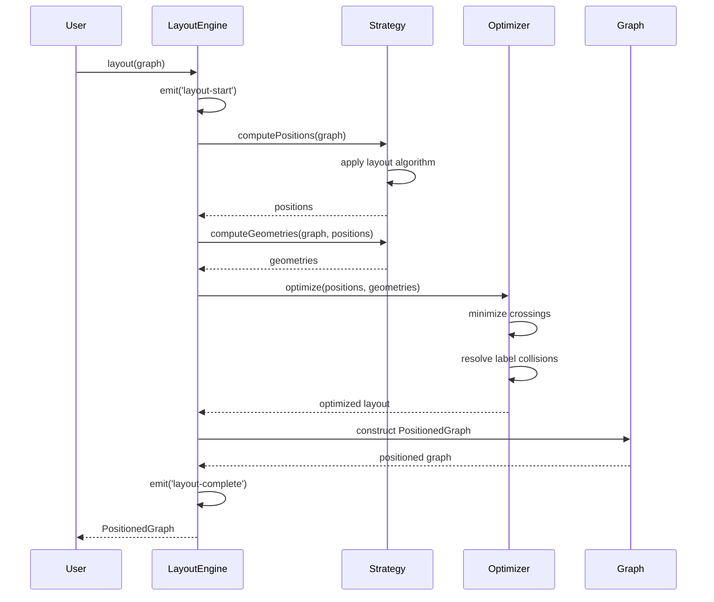
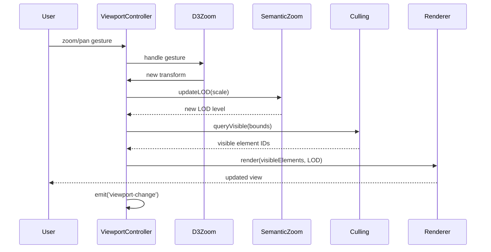
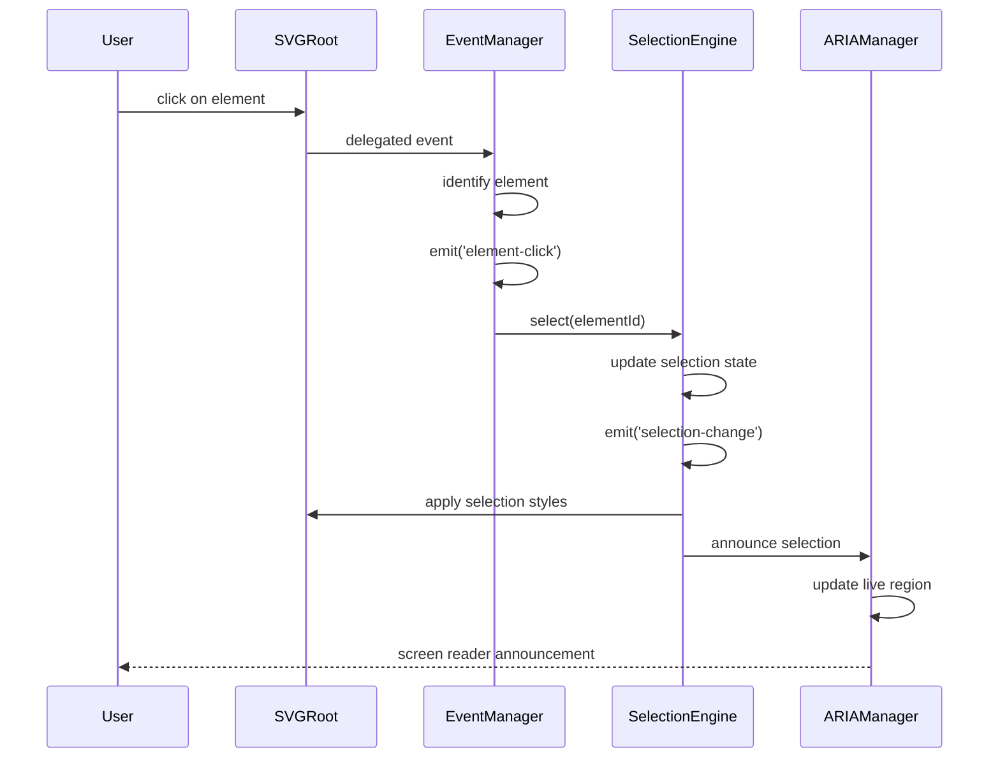

# Design Document: rail-schematic-viz-layout-and-interaction

## Overview

The rail-schematic-viz-layout-and-interaction package provides the UX layer for the Rail Schematic Viz library, transforming the core rendering engine into a fully interactive visualization tool. This package implements multiple layout modes (proportional, compressed, fixed-segment, metro-map), an auto-layout engine using force-directed simulation, viewport controls (pan, zoom, fit-to-view), semantic zoom with level-of-detail rendering, comprehensive event handling, keyboard navigation, element selection, minimap navigation, and viewport culling for performance optimization.

The architecture prioritizes performance, extensibility, and accessibility. The layout engine uses a strategy pattern allowing custom layout modes to be added without modifying core logic. The viewport system leverages D3's zoom and drag behaviors for smooth, hardware-accelerated interactions. Semantic zoom dynamically adjusts visual detail based on zoom level to maintain readability. Viewport culling with spatial indexing ensures 60 FPS performance even with 5000+ elements. The interaction system uses event delegation to minimize overhead. Accessibility features include ARIA annotations, keyboard navigation, and WCAG 2.1 AA compliant focus indicators.

This package builds on @rail-schematic-viz/core and serves as the foundation for overlay visualizations (rail-schematic-viz-overlays) and framework adapters (rail-schematic-viz-adapters).

## Architecture

### System Architecture

The package follows a layered architecture with clear separation between layout computation, viewport management, and interaction handling:

```mermaid
graph TB
    subgraph "Layout Layer"
        LE[LayoutEngine]
        PL[ProportionalLayout]
        CL[CompressedLayout]
        FL[FixedSegmentLayout]
        ML[MetroMapLayout]
        AL[AutoLayout]
    end
    
    subgraph "Viewport Layer"
        VC[ViewportController]
        ZB[ZoomBehavior]
        PB[PanBehavior]
        FV[FitToView]
        SZ[SemanticZoom]
        VCull[ViewportCulling]
    end
    
    subgraph "Interaction Layer"
        EM[EventManager]
        EH[ElementEvents]
        HI[HoverInteraction]
        SE[SelectionEngine]
        BS[BrushSelection]
        KN[KeyboardNavigation]
    end
    
    subgraph "Component Layer"
        MM[Minimap]
        PM[PerformanceMonitor]
        AS[AnimationSystem]
    end
    
    subgraph "Core Dependencies"
        RG[RailGraph<br/>@core]
        SR[SVGRenderer<br/>@core]
    end
    
    RG --> LE
    LE --> PL
    LE --> CL
    LE --> FL
    LE --> ML
    LE --> AL
    
    LE --> VC
    VC --> ZB
    VC --> PB
    VC --> FV
    VC --> SZ
    VC --> VCull
    
    VC --> EM
    EM --> EH
    EM --> HI
    EM --> SE
    EM --> BS
    EM --> KN
    
    VC --> MM
    VC --> PM
    VC --> AS
    
    LE --> SR
    VC --> SR
```

### Module Structure

```
@rail-schematic-viz/layout/
├── src/
│   ├── layout/
│   │   ├── LayoutEngine.ts           # Main layout orchestrator
│   │   ├── LayoutStrategy.ts         # Strategy interface
│   │   ├── ProportionalLayout.ts     # Distance-proportional mode
│   │   ├── CompressedLayout.ts       # Logarithmic compression mode
│   │   ├── FixedSegmentLayout.ts     # Equal-length segments mode
│   │   ├── MetroMapLayout.ts         # Octilinear constraints mode
│   │   ├── AutoLayout.ts             # Force-directed auto-layout
│   │   └── LayoutOptimizer.ts        # Cross-cutting optimization
│   ├── viewport/
│   │   ├── ViewportController.ts     # Main viewport manager
│   │   ├── ZoomBehavior.ts           # Zoom interaction handler
│   │   ├── PanBehavior.ts            # Pan interaction handler
│   │   ├── FitToView.ts              # Fit operations
│   │   ├── SemanticZoom.ts           # LOD management
│   │   └── ViewportCulling.ts        # Spatial culling
│   ├── interactions/
│   │   ├── EventManager.ts           # Event delegation system
│   │   ├── ElementEvents.ts          # Click, double-click, context
│   │   ├── HoverInteraction.ts       # Hover and tooltip
│   │   ├── SelectionEngine.ts        # Selection state management
│   │   ├── BrushSelection.ts         # Rectangle selection
│   │   ├── KeyboardNavigation.ts     # Keyboard focus traversal
│   │   └── TouchGestures.ts          # Touch gesture handling
│   ├── components/
│   │   ├── Minimap.ts                # Overview minimap component
│   │   ├── PerformanceMonitor.ts     # Performance tracking
│   │   └── AnimationSystem.ts        # Animation utilities
│   ├── spatial/
│   │   ├── RTree.ts                  # R-tree spatial index
│   │   └── BoundingBox.ts            # Bounding box utilities
│   ├── accessibility/
│   │   ├── ARIAManager.ts            # ARIA attribute management
│   │   ├── FocusManager.ts           # Focus indicator rendering
│   │   └── KeyboardShortcuts.ts      # Shortcut registry
│   └── index.ts                      # Main entry point
├── types/
│   └── index.d.ts                    # TypeScript type exports
└── package.json
```

### Design Principles

1. **Strategy Pattern for Layouts**: Each layout mode implements a common `LayoutStrategy` interface, allowing the `LayoutEngine` to switch between modes at runtime without conditional logic.

2. **D3 Integration**: Leverage D3's zoom, drag, and force simulation capabilities rather than reimplementing. Wrap D3 behaviors in clean TypeScript interfaces.

3. **Event Delegation**: Use a single event listener on the SVG root with event delegation to minimize overhead, especially important for networks with thousands of interactive elements.

4. **Spatial Indexing**: Use R-tree data structure for viewport culling, enabling O(log n) queries for visible elements instead of O(n) iteration.

5. **Semantic Zoom Thresholds**: Define zoom thresholds as configuration, not hardcoded values, allowing customization per deployment.

6. **Performance Budget**: Target 60 FPS (16ms frame budget) for all interactions. Use `requestAnimationFrame` for animations and debounce expensive operations during continuous interactions.

7. **Accessibility First**: Build accessibility into the core architecture (ARIA, keyboard navigation, focus management) rather than adding it as an afterthought.

8. **Immutable State**: Layout computations produce new positioned graphs rather than mutating input graphs, enabling undo/redo and state comparison.

## Components and Interfaces

### Layout Engine

#### LayoutEngine

The main orchestrator that applies layout strategies to RailGraph instances.

```typescript
class LayoutEngine {
  private strategy: LayoutStrategy;
  private optimizer: LayoutOptimizer;
  private eventEmitter: EventEmitter;
  
  constructor(
    strategy: LayoutStrategy,
    config?: LayoutConfiguration
  );
  
  // Apply current layout strategy to graph
  layout(graph: RailGraph): Promise<PositionedGraph>;
  
  // Switch layout mode at runtime
  setStrategy(strategy: LayoutStrategy): void;
  
  // Export computed positions
  exportLayout(): LayoutData;
  
  // Import saved positions
  importLayout(data: LayoutData): Result<void, LayoutError>;
  
  // Event registration
  on(event: LayoutEvent, handler: EventHandler): void;
}

interface LayoutConfiguration {
  padding: number;
  orientation: 'horizontal' | 'vertical' | 'auto';
  manualOverrides?: Map<NodeId, ScreenCoordinate>;
  optimizationPasses: number;
}

type LayoutEvent = 
  | 'layout-start'
  | 'layout-progress'
  | 'layout-complete'
  | 'layout-error';

interface PositionedGraph extends RailGraph {
  readonly bounds: BoundingBox;
  readonly layoutMode: string;
}

interface LayoutData {
  mode: string;
  nodePositions: Record<string, { x: number; y: number }>;
  edgeGeometries: Record<string, Array<{ x: number; y: number }>>;
  timestamp: string;
}
```

**Design Rationale**: The engine is stateful (holds current strategy) but layout operations are pure (don't mutate input). Async layout method allows progress reporting for long computations. Event system enables UI feedback during layout.

#### LayoutStrategy Interface

```typescript
interface LayoutStrategy {
  readonly name: string;
  
  // Compute positions for all nodes
  computePositions(
    graph: RailGraph,
    config: LayoutConfiguration
  ): Promise<Map<NodeId, ScreenCoordinate>>;
  
  // Compute edge geometries
  computeGeometries(
    graph: RailGraph,
    positions: Map<NodeId, ScreenCoordinate>,
    config: LayoutConfiguration
  ): Map<EdgeId, Array<ScreenCoordinate>>;
  
  // Validate strategy-specific constraints
  validate(graph: RailGraph): ValidationResult;
}
```

**Design Rationale**: Separating position computation from geometry computation allows strategies to focus on node placement while sharing edge routing logic. Async methods support incremental computation with progress updates.

#### ProportionalLayout

```typescript
class ProportionalLayout implements LayoutStrategy {
  readonly name = 'proportional';
  
  constructor(private config: ProportionalConfig);
  
  async computePositions(
    graph: RailGraph,
    config: LayoutConfiguration
  ): Promise<Map<NodeId, ScreenCoordinate>> {
    // 1. Select root node (highest degree or user-specified)
    // 2. Traverse graph breadth-first from root
    // 3. For each edge, compute screen length = realLength * scaleFactor
    // 4. Position target node at computed distance from source
    // 5. Handle conflicts (multiple paths to same node) by averaging
    // 6. Apply orientation (rotate entire layout if needed)
  }
  
  computeGeometries(
    graph: RailGraph,
    positions: Map<NodeId, ScreenCoordinate>,
    config: LayoutConfiguration
  ): Map<EdgeId, Array<ScreenCoordinate>> {
    // Generate straight-line geometries between positioned nodes
    // Preserve junction angles from geographic coordinates if available
  }
}

interface ProportionalConfig {
  scaleFactor: number;  // meters to pixels
  rootNode?: NodeId;
  preserveAngles: boolean;
}
```

**Design Rationale**: Breadth-first traversal ensures consistent scaling. Conflict resolution by averaging prevents disconnected components. Scale factor is configurable to adapt to different screen sizes.

#### CompressedLayout

```typescript
class CompressedLayout implements LayoutStrategy {
  readonly name = 'compressed';
  
  constructor(private config: CompressedConfig);
  
  async computePositions(
    graph: RailGraph,
    config: LayoutConfiguration
  ): Promise<Map<NodeId, ScreenCoordinate>> {
    // 1. Start with proportional layout
    // 2. Apply logarithmic compression: screenLength = k * log(1 + realLength / k)
    // 3. Ensure minimum separation between adjacent nodes
    // 4. Preserve relative ordering along lines
  }
}

interface CompressedConfig {
  compressionStrength: number;  // k parameter in log formula
  minSeparation: number;        // minimum pixels between nodes
}
```

**Design Rationale**: Logarithmic compression reduces visual span while maintaining topology. The compression strength parameter allows tuning the trade-off between compactness and proportionality. Minimum separation prevents overlapping labels.

#### FixedSegmentLayout

```typescript
class FixedSegmentLayout implements LayoutStrategy {
  readonly name = 'fixed-segment';
  
  constructor(private config: FixedSegmentConfig);
  
  async computePositions(
    graph: RailGraph,
    config: LayoutConfiguration
  ): Promise<Map<NodeId, ScreenCoordinate>> {
    // 1. Extract line structures from graph
    // 2. For each line, distribute stations at equal intervals
    // 3. Optimize junction positions to minimize edge crossings
    // 4. Apply parallel line spacing
  }
}

interface FixedSegmentConfig {
  segmentLength: number;      // pixels per segment
  parallelSpacing: number;    // pixels between parallel lines
}
```

**Design Rationale**: Equal segment lengths create clean, uniform diagrams. Junction optimization uses a heuristic algorithm (e.g., barycenter method) to reduce crossings. Parallel line spacing prevents visual clutter.

#### MetroMapLayout

```typescript
class MetroMapLayout implements LayoutStrategy {
  readonly name = 'metro-map';
  
  constructor(private config: MetroMapConfig);
  
  async computePositions(
    graph: RailGraph,
    config: LayoutConfiguration
  ): Promise<Map<NodeId, ScreenCoordinate>> {
    // 1. Start with force-directed layout
    // 2. Snap nodes to grid
    // 3. Constrain edge angles to octilinear (0°, 45°, 90°, 135°, 180°, 225°, 270°, 315°)
    // 4. Apply force-directed optimization with angle constraints
    // 5. Align parallel lines
    // 6. Optimize junction positions for clean intersections
  }
}

interface MetroMapConfig {
  gridSpacing: number;        // pixels between grid points
  angleSnapTolerance: number; // degrees tolerance for angle snapping
  maxIterations: number;      // force simulation iterations
}
```

**Design Rationale**: Octilinear constraints create the characteristic metro map aesthetic. Grid snapping ensures alignment. Force-directed optimization with constraints balances readability and topology preservation.

#### AutoLayout

```typescript
class AutoLayout implements LayoutStrategy {
  readonly name = 'auto';
  
  constructor(private config: AutoLayoutConfig);
  
  async computePositions(
    graph: RailGraph,
    config: LayoutConfiguration
  ): Promise<Map<NodeId, ScreenCoordinate>> {
    // Use D3 force simulation
    // 1. Initialize nodes at random positions
    // 2. Apply link distance force (based on edge lengths)
    // 3. Apply charge force (repulsion to prevent overlap)
    // 4. Apply centering force
    // 5. Apply stronger forces along line edges
    // 6. Run simulation until convergence or max iterations
  }
}

interface AutoLayoutConfig {
  linkDistance: number;       // default link distance
  linkStrength: number;       // link force strength
  chargeStrength: number;     // repulsion strength
  centerStrength: number;     // centering force strength
  lineStrength: number;       // extra strength for line edges
  maxIterations: number;      // simulation iterations
  minNodeDistance: number;    // minimum separation
}
```

**Design Rationale**: D3's force simulation is battle-tested and performant. Line-aware forces keep stations on the same line aligned. Configurable parameters allow tuning for different network topologies.

### Viewport Controller

#### ViewportController

The main manager for viewport state and interactions.

```typescript
class ViewportController {
  private transform: ZoomTransform;
  private config: ViewportConfiguration;
  private semanticZoom: SemanticZoom;
  private culling: ViewportCulling;
  private eventEmitter: EventEmitter;
  
  constructor(
    svgElement: SVGSVGElement,
    config?: ViewportConfiguration
  );
  
  // Pan operations
  panTo(x: number, y: number, animated?: boolean): Promise<void>;
  panBy(dx: number, dy: number, animated?: boolean): Promise<void>;
  
  // Zoom operations
  zoomTo(scale: number, animated?: boolean): Promise<void>;
  zoomBy(factor: number, animated?: boolean): Promise<void>;
  zoomToPoint(x: number, y: number, scale: number): void;
  
  // Fit operations
  fitToView(bounds: BoundingBox, padding?: number): Promise<void>;
  fitSelection(elementIds: string[], padding?: number): Promise<void>;
  
  // State queries
  getTransform(): ZoomTransform;
  getVisibleBounds(): BoundingBox;
  getCurrentLOD(): LODLevel;
  
  // Event registration
  on(event: ViewportEvent, handler: EventHandler): void;
}

interface ViewportConfiguration {
  minZoom: number;
  maxZoom: number;
  panExtent?: [[number, number], [number, number]];
  enablePan: boolean;
  enableZoom: boolean;
  zoomToPoint: boolean;
  animationDuration: number;
  animationEasing: (t: number) => number;
  initialTransform?: { x: number; y: number; scale: number };
}

type ViewportEvent = 
  | 'pan'
  | 'zoom'
  | 'transform'
  | 'lod-change'
  | 'viewport-change';

interface ZoomTransform {
  x: number;      // pan x offset
  y: number;      // pan y offset
  k: number;      // zoom scale
}
```

**Design Rationale**: Wraps D3's zoom behavior in a clean API. Async methods for animated operations return promises that resolve when animation completes. Event system allows components to react to viewport changes.

#### SemanticZoom

```typescript
class SemanticZoom {
  private thresholds: LODThresholds;
  private currentLOD: LODLevel;
  private elementVisibility: Map<string, boolean>;
  
  constructor(config: SemanticZoomConfig);
  
  // Update LOD based on zoom level
  updateLOD(zoomScale: number): LODLevel;
  
  // Check if element should be visible at current LOD
  isVisible(elementType: string, zoomScale: number): boolean;
  
  // Get visibility map for all element types
  getVisibilityMap(zoomScale: number): Map<string, boolean>;
}

interface SemanticZoomConfig {
  thresholds: LODThresholds;
  customRules?: Map<string, LODRule>;
}

interface LODThresholds {
  lowDetail: number;    // zoom scale threshold
  midDetail: number;    // zoom scale threshold
}

type LODLevel = 'low' | 'mid' | 'high';

interface LODRule {
  minZoom: number;
  maxZoom: number;
}

const DEFAULT_LOD_CONFIG: SemanticZoomConfig = {
  thresholds: {
    lowDetail: 0.5,
    midDetail: 1.0,
  },
  customRules: new Map([
    ['station', { minZoom: 0, maxZoom: Infinity }],
    ['line', { minZoom: 0, maxZoom: Infinity }],
    ['junction', { minZoom: 0, maxZoom: Infinity }],
    ['signal', { minZoom: 0.5, maxZoom: Infinity }],
    ['switch', { minZoom: 0.5, maxZoom: Infinity }],
    ['kilometre-post', { minZoom: 1.0, maxZoom: Infinity }],
    ['annotation', { minZoom: 1.0, maxZoom: Infinity }],
    ['asset-marker', { minZoom: 1.0, maxZoom: Infinity }],
  ]),
};
```

**Design Rationale**: Three LOD levels provide good balance between simplicity and flexibility. Custom rules per element type allow fine-grained control. Visibility map enables efficient batch updates during rendering.

#### ViewportCulling

```typescript
class ViewportCulling {
  private spatialIndex: RTree;
  private bufferMargin: number;
  
  constructor(config: CullingConfig);
  
  // Build spatial index from graph
  buildIndex(graph: PositionedGraph): void;
  
  // Query visible elements
  queryVisible(bounds: BoundingBox): Set<string>;
  
  // Update index incrementally
  updateElement(elementId: string, bounds: BoundingBox): void;
}

interface CullingConfig {
  bufferMargin: number;  // extra margin around viewport
  enabled: boolean;
  minElementsForCulling: number;  // only cull if > N elements
}

interface BoundingBox {
  minX: number;
  minY: number;
  maxX: number;
  maxY: number;
}
```

**Design Rationale**: R-tree provides O(log n) spatial queries. Buffer margin prevents pop-in during panning. Culling is only enabled for large networks to avoid overhead on small graphs.

### Interaction System

#### EventManager

```typescript
class EventManager {
  private svgRoot: SVGSVGElement;
  private handlers: Map<string, Set<EventHandler>>;
  private delegationMap: Map<string, string>;
  
  constructor(svgRoot: SVGSVGElement);
  
  // Register event handlers
  on(eventType: InteractionEvent, handler: EventHandler): void;
  off(eventType: InteractionEvent, handler: EventHandler): void;
  
  // Emit events
  emit(eventType: InteractionEvent, data: EventData): void;
  
  // Setup event delegation
  private setupDelegation(): void;
}

type InteractionEvent = 
  | 'element-click'
  | 'element-dblclick'
  | 'element-contextmenu'
  | 'element-hover'
  | 'element-hover-end'
  | 'selection-change'
  | 'brush-start'
  | 'brush-move'
  | 'brush-end'
  | 'focus-change';

interface EventData {
  elementId?: string;
  elementType?: string;
  elementData?: unknown;
  coordinates?: { x: number; y: number };
  modifiers?: { shift: boolean; ctrl: boolean; alt: boolean };
}
```

**Design Rationale**: Single event listener on SVG root with delegation minimizes overhead. Event data includes element information and modifiers for flexible handling. Type-safe event names prevent typos.

#### SelectionEngine

```typescript
class SelectionEngine {
  private selectedIds: Set<string>;
  private config: SelectionConfig;
  private eventEmitter: EventEmitter;
  
  constructor(config?: SelectionConfig);
  
  // Selection operations
  select(elementIds: string | string[]): void;
  deselect(elementIds: string | string[]): void;
  toggle(elementIds: string | string[]): void;
  clearSelection(): void;
  
  // Selection queries
  isSelected(elementId: string): boolean;
  getSelection(): ReadonlySet<string>;
  
  // Programmatic selection
  selectByType(elementType: string): void;
  selectByPredicate(predicate: (element: any) => boolean): void;
  
  // Apply selection styles
  applyStyles(svgRoot: SVGSVGElement): void;
}

interface SelectionConfig {
  mode: 'single' | 'multi' | 'brush';
  multiSelectModifier: 'shift' | 'ctrl' | 'meta';
  styles: {
    stroke: string;
    strokeWidth: number;
    fill?: string;
  };
}
```

**Design Rationale**: Set-based storage for O(1) membership checks. Separate style application allows custom rendering. Predicate-based selection enables complex queries.

#### BrushSelection

```typescript
class BrushSelection {
  private active: boolean;
  private startPoint: { x: number; y: number };
  private currentRect: BoundingBox;
  private config: BrushConfig;
  
  constructor(
    svgRoot: SVGSVGElement,
    spatialIndex: RTree,
    config?: BrushConfig
  );
  
  // Start brush selection
  start(x: number, y: number, modifiers: Modifiers): void;
  
  // Update brush rectangle
  update(x: number, y: number): void;
  
  // Complete brush selection
  end(): string[];
  
  // Render brush rectangle
  private renderBrush(): void;
}

interface BrushConfig {
  modifierKey: 'alt' | 'shift' | 'ctrl';
  mode: 'add' | 'subtract' | 'replace';
  styles: {
    fill: string;
    stroke: string;
    opacity: number;
  };
}

interface Modifiers {
  shift: boolean;
  ctrl: boolean;
  alt: boolean;
  meta: boolean;
}
```

**Design Rationale**: Uses spatial index for efficient element lookup within rectangle. Modifier keys control selection mode (add/subtract/replace). Visual feedback during brushing improves UX.

#### KeyboardNavigation

```typescript
class KeyboardNavigation {
  private focusedElement: string | null;
  private graph: RailGraph;
  private config: KeyboardConfig;
  private shortcuts: Map<string, KeyboardShortcut>;
  
  constructor(
    svgRoot: SVGSVGElement,
    graph: RailGraph,
    config?: KeyboardConfig
  );
  
  // Focus management
  focusElement(elementId: string): void;
  focusNext(): void;
  focusPrevious(): void;
  focusConnected(direction: 'up' | 'down' | 'left' | 'right'): void;
  clearFocus(): void;
  
  // Keyboard shortcuts
  registerShortcut(key: string, handler: () => void): void;
  unregisterShortcut(key: string): void;
  
  // Render focus indicator
  private renderFocusIndicator(): void;
}

interface KeyboardConfig {
  enableNavigation: boolean;
  enableShortcuts: boolean;
  focusStyles: {
    stroke: string;
    strokeWidth: number;
    dashArray?: string;
  };
}

interface KeyboardShortcut {
  key: string;
  modifiers?: Modifiers;
  handler: () => void;
  description: string;
}
```

**Design Rationale**: Topological navigation (following track connections) is more intuitive than spatial navigation for railway networks. Focus indicator meets WCAG 2.1 AA contrast requirements. Shortcut registry allows customization.

### Component Layer

#### Minimap

```typescript
class Minimap {
  private container: HTMLElement;
  private canvas: HTMLCanvasElement;
  private graph: PositionedGraph;
  private mainViewport: ViewportController;
  private config: MinimapConfig;
  
  constructor(
    container: HTMLElement,
    graph: PositionedGraph,
    mainViewport: ViewportController,
    config?: MinimapConfig
  );
  
  // Render minimap
  render(): void;
  
  // Update viewport indicator
  updateViewportIndicator(transform: ZoomTransform): void;
  
  // Handle minimap interactions
  private handleClick(x: number, y: number): void;
  private handleDrag(dx: number, dy: number): void;
  
  // Toggle visibility
  show(): void;
  hide(): void;
}

interface MinimapConfig {
  width: number;
  height: number;
  position: 'top-left' | 'top-right' | 'bottom-left' | 'bottom-right';
  styles: {
    background: string;
    border: string;
    viewportFill: string;
    viewportStroke: string;
  };
  updateThrottle: number;  // ms between updates
}
```

**Design Rationale**: Canvas rendering for performance (minimap doesn't need interactivity per element). Throttled updates prevent excessive redraws during continuous pan/zoom. Position configuration allows flexible placement.

#### PerformanceMonitor

```typescript
class PerformanceMonitor {
  private enabled: boolean;
  private metrics: PerformanceMetrics;
  private thresholds: PerformanceThresholds;
  private eventEmitter: EventEmitter;
  
  constructor(config?: PerformanceConfig);
  
  // Start frame measurement
  startFrame(): void;
  
  // End frame measurement
  endFrame(stats: FrameStats): void;
  
  // Get current metrics
  getMetrics(): PerformanceMetrics;
  
  // Reset metrics
  reset(): void;
}

interface PerformanceConfig {
  enabled: boolean;
  thresholds: PerformanceThresholds;
}

interface PerformanceThresholds {
  frameTime: number;      // ms (16ms = 60 FPS)
  layoutTime: number;     // ms
}

interface PerformanceMetrics {
  averageFrameTime: number;
  maxFrameTime: number;
  lastLayoutTime: number;
  renderedElements: number;
  culledElements: number;
  fps: number;
}

interface FrameStats {
  renderedElements: number;
  culledElements: number;
}
```

**Design Rationale**: Lightweight monitoring with minimal overhead (<5%). Threshold-based events allow reactive performance tuning. Metrics expose both averages and peaks for diagnosis.

#### AnimationSystem

```typescript
class AnimationSystem {
  private activeAnimations: Map<string, Animation>;
  
  // Animate a value over time
  animate(
    id: string,
    from: number,
    to: number,
    duration: number,
    easing: EasingFunction,
    onUpdate: (value: number) => void
  ): Promise<void>;
  
  // Cancel animation
  cancel(id: string): void;
  
  // Cancel all animations
  cancelAll(): void;
}

type EasingFunction = (t: number) => number;

const EASING_FUNCTIONS = {
  linear: (t: number) => t,
  easeInQuad: (t: number) => t * t,
  easeOutQuad: (t: number) => t * (2 - t),
  easeInOutQuad: (t: number) => t < 0.5 ? 2 * t * t : -1 + (4 - 2 * t) * t,
  easeInCubic: (t: number) => t * t * t,
  easeOutCubic: (t: number) => (--t) * t * t + 1,
};

interface Animation {
  id: string;
  startTime: number;
  duration: number;
  from: number;
  to: number;
  easing: EasingFunction;
  onUpdate: (value: number) => void;
  resolve: () => void;
}
```

**Design Rationale**: Centralized animation management prevents conflicts. Promise-based API allows chaining. requestAnimationFrame ensures smooth 60 FPS. Easing functions provide natural motion.

### Spatial Indexing

#### RTree

```typescript
class RTree {
  private root: RTreeNode;
  private maxEntries: number;
  
  constructor(maxEntries?: number);
  
  // Insert element with bounding box
  insert(id: string, bounds: BoundingBox): void;
  
  // Remove element
  remove(id: string): void;
  
  // Query elements intersecting bounds
  search(bounds: BoundingBox): string[];
  
  // Clear all entries
  clear(): void;
  
  // Bulk load (more efficient than individual inserts)
  bulkLoad(entries: Array<{ id: string; bounds: BoundingBox }>): void;
}

interface RTreeNode {
  bounds: BoundingBox;
  children: RTreeNode[];
  entries: Array<{ id: string; bounds: BoundingBox }>;
  isLeaf: boolean;
}
```

**Design Rationale**: R-tree provides O(log n) spatial queries, essential for viewport culling performance. Bulk load optimizes initial index construction. Max entries parameter tunes tree depth vs node size.

### Accessibility

#### ARIAManager

```typescript
class ARIAManager {
  private svgRoot: SVGSVGElement;
  
  constructor(svgRoot: SVGSVGElement);
  
  // Set ARIA attributes on elements
  setRole(elementId: string, role: string): void;
  setLabel(elementId: string, label: string): void;
  setDescription(elementId: string, description: string): void;
  
  // Announce to screen readers
  announce(message: string, priority: 'polite' | 'assertive'): void;
  
  // Setup live regions
  private setupLiveRegions(): void;
}
```

**Design Rationale**: Centralized ARIA management ensures consistency. Live regions enable screen reader announcements for dynamic changes. Priority levels control announcement urgency.

## Data Models

### Type System

```typescript
// Layout types
type LayoutMode = 'proportional' | 'compressed' | 'fixed-segment' | 'metro-map' | 'auto';

interface LayoutResult {
  graph: PositionedGraph;
  bounds: BoundingBox;
  metadata: {
    mode: LayoutMode;
    computationTime: number;
    nodeCount: number;
    edgeCount: number;
  };
}

// Viewport types
interface ViewportState {
  transform: ZoomTransform;
  bounds: BoundingBox;
  lod: LODLevel;
  visibleElements: Set<string>;
}

// Interaction types
interface InteractionState {
  hoveredElement: string | null;
  selectedElements: Set<string>;
  focusedElement: string | null;
  brushActive: boolean;
}

// Configuration types
interface LibraryConfiguration {
  layout: LayoutConfiguration;
  viewport: ViewportConfiguration;
  interaction: InteractionConfiguration;
  accessibility: AccessibilityConfiguration;
  performance: PerformanceConfiguration;
}

interface InteractionConfiguration {
  enableClick: boolean;
  enableHover: boolean;
  enableSelection: boolean;
  enableBrush: boolean;
  enableKeyboard: boolean;
  hoverDelay: number;
  selectionMode: 'single' | 'multi' | 'brush';
  multiSelectModifier: 'shift' | 'ctrl' | 'meta';
  brushModifier: 'alt' | 'shift' | 'ctrl';
  tooltip: TooltipConfiguration;
}

interface TooltipConfiguration {
  enabled: boolean;
  template: (data: any) => string;
  position: 'cursor' | 'element';
  offset: { x: number; y: number };
}

interface AccessibilityConfiguration {
  enableARIA: boolean;
  enableKeyboardNavigation: boolean;
  focusIndicatorStyles: {
    stroke: string;
    strokeWidth: number;
    dashArray?: string;
  };
  announcements: boolean;
}

interface PerformanceConfiguration {
  enableCulling: boolean;
  cullingThreshold: number;
  enableMonitoring: boolean;
  performanceMode: 'quality' | 'balanced' | 'performance';
}
```

### Data Flow Diagrams

#### Layout Computation Flow



#### Viewport Interaction Flow



#### Event Handling Flow



### Algorithm Details

#### Metro Map Octilinear Constraint Algorithm

The metro map layout uses an iterative optimization approach:

1. **Initial Layout**: Start with force-directed layout to get rough positions
2. **Grid Snapping**: Snap all nodes to nearest grid point
3. **Angle Constraint**: For each edge:
   - Calculate current angle
   - Find nearest octilinear angle (0°, 45°, 90°, 135°, 180°, 225°, 270°, 315°)
   - Adjust target node position to satisfy angle constraint
4. **Force Optimization**: Apply modified force simulation:
   - Link force: Pull nodes toward ideal distance
   - Angle force: Pull nodes toward octilinear angles
   - Charge force: Prevent overlap
   - Alignment force: Align parallel lines
5. **Iterate**: Repeat steps 3-4 until convergence or max iterations

**Pseudocode**:
```
function metroMapLayout(graph, config):
  positions = forceDirectedLayout(graph)
  
  for iteration in 1..maxIterations:
    // Snap to grid
    for node in graph.nodes:
      positions[node] = snapToGrid(positions[node], config.gridSpacing)
    
    // Constrain angles
    for edge in graph.edges:
      angle = calculateAngle(positions[edge.source], positions[edge.target])
      targetAngle = nearestOctilinear(angle)
      positions[edge.target] = adjustForAngle(
        positions[edge.source],
        positions[edge.target],
        targetAngle,
        edgeLength(edge)
      )
    
    // Apply forces
    forces = calculateForces(graph, positions, config)
    positions = applyForces(positions, forces)
    
    if converged(positions, previousPositions):
      break
  
  return positions
```

#### Viewport Culling with R-Tree

The culling algorithm uses an R-tree for efficient spatial queries:

1. **Index Construction**: Build R-tree from element bounding boxes
2. **Viewport Query**: Query R-tree for elements intersecting viewport bounds (with buffer)
3. **Visibility Update**: Update element visibility in DOM

**Pseudocode**:
```
function updateVisibleElements(viewport, rtree, bufferMargin):
  // Expand viewport by buffer margin
  queryBounds = {
    minX: viewport.minX - bufferMargin,
    minY: viewport.minY - bufferMargin,
    maxX: viewport.maxX + bufferMargin,
    maxY: viewport.maxY + bufferMargin
  }
  
  // Query R-tree (O(log n))
  visibleIds = rtree.search(queryBounds)
  
  // Update DOM visibility
  for elementId in allElements:
    element = document.getElementById(elementId)
    if visibleIds.contains(elementId):
      element.style.display = 'block'
    else:
      element.style.display = 'none'
  
  return visibleIds
```

**Complexity Analysis**:
- R-tree construction: O(n log n)
- Viewport query: O(log n + k) where k is number of visible elements
- DOM update: O(n) but only when viewport changes significantly

#### Compressed Layout Logarithmic Compression

The compressed layout applies logarithmic compression to reduce visual span:

**Formula**: `screenLength = k * log(1 + realLength / k)`

Where:
- `k` is the compression strength parameter
- `realLength` is the actual distance in meters
- `screenLength` is the computed screen distance in pixels

**Properties**:
- Short segments (realLength << k): approximately linear (screenLength ≈ realLength)
- Long segments (realLength >> k): heavily compressed
- Continuous and monotonic (preserves ordering)

**Pseudocode**:
```
function compressedLayout(graph, config):
  k = config.compressionStrength
  positions = {}
  
  // Start from root node
  root = selectRootNode(graph)
  positions[root] = { x: 0, y: 0 }
  visited = new Set([root])
  queue = [root]
  
  while queue.notEmpty():
    current = queue.dequeue()
    
    for edge in graph.getEdgesFrom(current):
      if visited.contains(edge.target):
        continue
      
      // Apply logarithmic compression
      realLength = edge.length
      screenLength = k * Math.log(1 + realLength / k)
      
      // Ensure minimum separation
      screenLength = Math.max(screenLength, config.minSeparation)
      
      // Position target node
      angle = calculateAngle(edge)
      positions[edge.target] = {
        x: positions[current].x + screenLength * Math.cos(angle),
        y: positions[current].y + screenLength * Math.sin(angle)
      }
      
      visited.add(edge.target)
      queue.enqueue(edge.target)
  
  return positions
```

## Acceptance Criteria Testing Prework

Before defining correctness properties, I'll analyze each acceptance criterion to determine if it's testable as a property, example, edge case, or not testable.

### Requirement 1: Layout Engine Architecture

1.1 THE LayoutEngine SHALL accept a RailGraph and Layout_Mode as input
  Thoughts: This is about the API signature. We can test that the constructor/method accepts these parameters without error for valid inputs.
  Testable: yes - example

1.2 THE LayoutEngine SHALL compute Screen_Coordinate positions for all nodes
  Thoughts: For any graph, after layout, all nodes should have screen coordinates. This is a universal property.
  Testable: yes - property

1.3 THE LayoutEngine SHALL compute geometry arrays for all edges
  Thoughts: For any graph, after layout, all edges should have geometry arrays. This is a universal property.
  Testable: yes - property

1.4 THE LayoutEngine SHALL preserve topological connectivity when computing positions
  Thoughts: For any graph, if two nodes are connected before layout, they should remain connected after layout (edges preserved).
  Testable: yes - property

1.5 THE LayoutEngine SHALL provide a method to switch between layout modes at runtime
  Thoughts: This is about API design. We can test that the method exists and works with a specific example.
  Testable: yes - example

1.6 THE LayoutEngine SHALL emit events when layout computation begins and completes
  Thoughts: For any layout operation, we should receive start and complete events. This is a property.
  Testable: yes - property

1.7 THE LayoutEngine SHALL validate that computed positions do not create overlapping elements
  Thoughts: For any layout result, no two nodes should have the same position (within tolerance). This is a property.
  Testable: yes - property

1.8 WHEN layout computation completes, THE LayoutEngine SHALL return a positioned RailGraph
  Thoughts: For any layout operation, the result should be a RailGraph with positions. This is a property.
  Testable: yes - property

### Requirement 2: Proportional Layout Mode

2.1 WHEN Proportional_Layout mode is selected, THE LayoutEngine SHALL scale segment lengths proportional to edge length properties
  Thoughts: This is testing that the ratio of screen length to real length is consistent. This is a property about all edges.
  Testable: yes - property

2.2 THE LayoutEngine SHALL apply a configurable scale factor to convert real-world distances to screen pixels
  Thoughts: For any edge, screenLength should equal realLength * scaleFactor (within tolerance). This is a property.
  Testable: yes - property

2.3 THE LayoutEngine SHALL maintain consistent scale across all segments in the network
  Thoughts: This is the same as 2.1 - testing that scale is consistent. This is redundant with 2.1.
  Testable: yes - property (redundant with 2.1)

2.4 THE LayoutEngine SHALL support configurable layout orientation (horizontal, vertical, auto)
  Thoughts: This is about API configuration. We can test with specific examples.
  Testable: yes - example

2.5 WHEN edge length data is missing, THE LayoutEngine SHALL emit a warning and fall back to unit length
  Thoughts: This is testing error handling for a specific edge case (missing data).
  Testable: edge-case

2.6 THE LayoutEngine SHALL preserve junction angles from geographic coordinates when available
  Thoughts: For any graph with geographic coordinates, junction angles should be preserved. This is a property.
  Testable: yes - property

2.7 FOR ALL edges in the network, the ratio of screen length to real length SHALL be constant within 1% tolerance
  Thoughts: This is explicitly a universal property about all edges. Same as 2.1 and 2.3.
  Testable: yes - property (redundant with 2.1)

### Requirement 3: Compressed Layout Mode

3.1 WHEN Compressed_Layout mode is selected, THE LayoutEngine SHALL apply logarithmic compression to segment lengths
  Thoughts: For any edge, the screen length should follow the logarithmic formula. This is a property.
  Testable: yes - property

3.2 THE LayoutEngine SHALL ensure minimum visual separation between adjacent stations
  Thoughts: For any two adjacent nodes, the distance should be >= minSeparation. This is a property.
  Testable: yes - property

3.3 THE LayoutEngine SHALL apply greater compression to longer segments than shorter segments
  Thoughts: For any two edges where edge1.length > edge2.length, the compression ratio should be greater for edge1. This is a property.
  Testable: yes - property

3.4 THE LayoutEngine SHALL provide configurable compression strength parameter
  Thoughts: This is about API configuration. We can test with examples.
  Testable: yes - example

3.5 THE LayoutEngine SHALL preserve relative ordering of stations along lines
  Thoughts: For any line, if station A comes before station B in the input, it should come before B in the output. This is a property.
  Testable: yes - property

3.6 THE LayoutEngine SHALL maintain topological accuracy while reducing visual span
  Thoughts: This is the same as 1.4 - preserving connectivity. Redundant.
  Testable: yes - property (redundant with 1.4)

3.7 WHEN compression is applied, THE LayoutEngine SHALL provide a scale indicator showing the non-linear scale
  Thoughts: This is about UI/output format. We can test that the indicator is present with an example.
  Testable: yes - example

### Requirement 4: Fixed-Segment Layout Mode

4.1 WHEN Fixed_Segment_Layout mode is selected, THE LayoutEngine SHALL render all track segments at equal length
  Thoughts: For any graph, all edge screen lengths should be equal (within tolerance). This is a property.
  Testable: yes - property

4.2 THE LayoutEngine SHALL use a configurable segment length value
  Thoughts: For any edge, screen length should equal the configured value. This is a property.
  Testable: yes - property

4.3 THE LayoutEngine SHALL distribute stations evenly along lines
  Thoughts: For any line, stations should be evenly spaced. This is a property.
  Testable: yes - property

4.4 THE LayoutEngine SHALL optimize junction positions to minimize edge crossings
  Thoughts: This is about optimization quality, which is hard to test definitively. We can test that crossings are reduced compared to unoptimized layout.
  Testable: no

4.5 THE LayoutEngine SHALL preserve line continuity and connectivity
  Thoughts: Same as 1.4 - preserving connectivity. Redundant.
  Testable: yes - property (redundant with 1.4)

4.6 THE LayoutEngine SHALL support configurable spacing between parallel lines
  Thoughts: This is about API configuration. We can test with examples.
  Testable: yes - example

4.7 FOR ALL edges in the network, the screen length SHALL be equal within 1 pixel tolerance
  Thoughts: This is the same as 4.1. Redundant.
  Testable: yes - property (redundant with 4.1)

### Requirement 5: Metro-Map Layout Mode

5.1 WHEN Metro_Map_Layout mode is selected, THE LayoutEngine SHALL constrain all edge angles to 0°, 45°, or 90° (octilinear)
  Thoughts: For any edge, the angle should be within 1° of an octilinear angle. This is a property.
  Testable: yes - property

5.2 THE LayoutEngine SHALL apply force-directed optimization to minimize edge length while maintaining angle constraints
  Thoughts: This is about optimization quality. Hard to test definitively.
  Testable: no

5.3 THE LayoutEngine SHALL distribute stations to avoid overlapping labels
  Thoughts: For any two stations, their label bounding boxes should not overlap. This is a property.
  Testable: yes - property

5.4 THE LayoutEngine SHALL align parallel lines to run alongside each other
  Thoughts: This is about visual quality. Hard to test definitively without defining "alongside" precisely.
  Testable: no

5.5 THE LayoutEngine SHALL optimize junction positions to create clean intersections
  Thoughts: This is about visual quality. Hard to test definitively.
  Testable: no

5.6 THE LayoutEngine SHALL support configurable grid spacing for station positioning
  Thoughts: This is about API configuration. We can test with examples.
  Testable: yes - example

5.7 FOR ALL edges in the network, the angle SHALL be within 1° of the nearest octilinear angle
  Thoughts: This is the same as 5.1. Redundant.
  Testable: yes - property (redundant with 5.1)

### Requirement 6: Auto-Layout Engine

6.1 WHEN a RailGraph without Screen_Coordinate data is provided, THE Auto_Layout SHALL generate screen coordinates using force-directed simulation
  Thoughts: For any graph without coordinates, auto-layout should produce coordinates. This is a property.
  Testable: yes - property

6.2 THE Auto_Layout SHALL use D3 force simulation with configurable parameters
  Thoughts: This is about implementation details. We can test that D3 is used with an example.
  Testable: yes - example

6.3 THE Auto_Layout SHALL apply link distance forces based on edge length properties
  Thoughts: This is about internal algorithm behavior. Hard to test directly.
  Testable: no

6.4 THE Auto_Layout SHALL apply charge forces to prevent node overlap
  Thoughts: For any auto-layout result, nodes should not overlap. This is a property.
  Testable: yes - property

6.5 THE Auto_Layout SHALL apply centering forces to keep the network in the viewport
  Thoughts: For any auto-layout result, the center of mass should be near the viewport center. This is a property.
  Testable: yes - property

6.6 THE Auto_Layout SHALL respect line structure by applying stronger forces along line edges
  Thoughts: This is about internal algorithm behavior. Hard to test directly.
  Testable: no

6.7 THE Auto_Layout SHALL provide a method to export computed coordinates for reuse
  Thoughts: This is about API design. We can test with an example.
  Testable: yes - example

6.8 WHEN auto-layout completes for a network with 500 nodes, THE computation SHALL finish within 5 seconds
  Thoughts: This is a performance requirement. We can test with a specific example.
  Testable: yes - example

6.9 FOR ALL generated layouts, nodes SHALL be separated by at least the configured minimum distance
  Thoughts: For any two nodes, distance should be >= minDistance. This is a property.
  Testable: yes - property

### Requirement 7: Layout Optimization

7.1 THE LayoutEngine SHALL minimize edge crossings using a configurable optimization algorithm
  Thoughts: This is about optimization quality. Hard to test definitively.
  Testable: no

7.2 THE LayoutEngine SHALL apply label collision detection and resolution
  Thoughts: For any layout, labels should not overlap. This is a property.
  Testable: yes - property

7.3 THE LayoutEngine SHALL optimize station spacing to maintain readability
  Thoughts: This is about visual quality. Hard to test definitively without defining "readability".
  Testable: no

7.4 THE LayoutEngine SHALL align parallel tracks to run alongside each other
  Thoughts: This is about visual quality. Hard to test definitively.
  Testable: no

7.5 THE LayoutEngine SHALL provide configurable padding around the network bounds
  Thoughts: For any layout, the bounds should include padding. This is a property.
  Testable: yes - property

7.6 THE LayoutEngine SHALL support manual position overrides for specific nodes
  Thoughts: For any node with a manual override, the final position should match the override. This is a property.
  Testable: yes - property

7.7 WHEN optimization is applied, THE LayoutEngine SHALL preserve topological correctness
  Thoughts: Same as 1.4 - preserving connectivity. Redundant.
  Testable: yes - property (redundant with 1.4)

### Requirement 8: Viewport Pan Behavior

8.1 THE Renderer SHALL implement D3 drag behavior for viewport panning
  Thoughts: This is about implementation details. We can test with an example.
  Testable: yes - example

8.2 WHEN a user drags on the schematic background, THE Viewport SHALL translate in the drag direction
  Thoughts: For any drag operation, the viewport should move. This is a property.
  Testable: yes - property

8.3 THE Renderer SHALL support configurable pan extent limits to prevent panning beyond network bounds
  Thoughts: For any pan operation, the viewport should stay within bounds. This is a property.
  Testable: yes - property

8.4 THE Renderer SHALL provide smooth panning with 60 frames per second performance
  Thoughts: This is a performance requirement. We can test with examples.
  Testable: yes - example

8.5 THE Renderer SHALL emit pan events containing the new viewport position
  Thoughts: For any pan operation, a pan event should be emitted. This is a property.
  Testable: yes - property

8.6 THE Renderer SHALL support programmatic panning via a panTo() method
  Thoughts: This is about API design. We can test with an example.
  Testable: yes - example

8.7 THE Renderer SHALL support animated panning with configurable duration and easing
  Thoughts: This is about API design. We can test with an example.
  Testable: yes - example

### Requirement 9: Viewport Zoom Behavior

9.1 THE Renderer SHALL implement D3 zoom behavior with mouse wheel and pinch gesture support
  Thoughts: This is about implementation details. We can test with an example.
  Testable: yes - example

9.2 THE Renderer SHALL support configurable minimum and maximum zoom scale bounds
  Thoughts: For any zoom operation, the scale should stay within bounds. This is a property.
  Testable: yes - property

9.3 THE Renderer SHALL zoom toward the cursor position (zoom-to-point behavior)
  Thoughts: For any zoom operation, the point under the cursor should remain under the cursor. This is a property.
  Testable: yes - property

9.4 THE Renderer SHALL provide smooth zooming with 60 frames per second performance
  Thoughts: This is a performance requirement. We can test with examples.
  Testable: yes - example

9.5 THE Renderer SHALL emit zoom events containing the new zoom level
  Thoughts: For any zoom operation, a zoom event should be emitted. This is a property.
  Testable: yes - property

9.6 THE Renderer SHALL support programmatic zooming via zoomTo() and zoomBy() methods
  Thoughts: This is about API design. We can test with an example.
  Testable: yes - example

9.7 THE Renderer SHALL support animated zooming with configurable duration and easing
  Thoughts: This is about API design. We can test with an example.
  Testable: yes - example

9.8 WHEN zoom level changes, THE Renderer SHALL update within 16 milliseconds (60 FPS)
  Thoughts: This is a performance requirement. We can test with examples.
  Testable: yes - example

### Requirement 10: Fit-to-View Operations

10.1 THE Renderer SHALL provide a fitToView() method that adjusts viewport to show all elements
  Thoughts: For any graph, fitToView should result in all elements being visible. This is a property.
  Testable: yes - property

10.2 THE Renderer SHALL provide a fitSelection() method that adjusts viewport to show selected elements
  Thoughts: For any selection, fitSelection should result in all selected elements being visible. This is a property.
  Testable: yes - property

10.3 THE Renderer SHALL apply configurable padding when fitting to view
  Thoughts: For any fit operation, the viewport should include padding. This is a property.
  Testable: yes - property

10.4 THE Renderer SHALL preserve aspect ratio when fitting to view
  Thoughts: For any fit operation, the aspect ratio should be preserved. This is a property.
  Testable: yes - property

10.5 THE Renderer SHALL support animated fit-to-view with configurable duration
  Thoughts: This is about API design. We can test with an example.
  Testable: yes - example

10.6 THE Renderer SHALL respect minimum and maximum zoom bounds when fitting
  Thoughts: For any fit operation, the resulting zoom should be within bounds. This is a property.
  Testable: yes - property

10.7 WHEN fitToView() is called, THE Renderer SHALL complete the operation within 500 milliseconds
  Thoughts: This is a performance requirement. We can test with examples.
  Testable: yes - example

### Requirement 11: Semantic Zoom System

11.1 THE Renderer SHALL define three LOD levels: low-detail, mid-detail, and high-detail
  Thoughts: This is about API design. We can test with an example.
  Testable: yes - example

11.2 THE Renderer SHALL provide configurable Zoom_Threshold values for each LOD transition
  Thoughts: This is about API configuration. We can test with an example.
  Testable: yes - example

11.3 WHEN zoom level is below low-detail threshold, THE Renderer SHALL display only lines, stations, and major junctions
  Thoughts: For any zoom level below threshold, only specified elements should be visible. This is a property.
  Testable: yes - property

11.4 WHEN zoom level is between low and mid thresholds, THE Renderer SHALL add signals, switches, and kilometre-posts
  Thoughts: For any zoom level in range, specified elements should be visible. This is a property.
  Testable: yes - property

11.5 WHEN zoom level is above mid-detail threshold, THE Renderer SHALL add detailed annotations and asset markers
  Thoughts: For any zoom level above threshold, all elements should be visible. This is a property.
  Testable: yes - property

11.6 THE Renderer SHALL transition between LOD levels within 200 milliseconds
  Thoughts: This is a performance requirement. We can test with examples.
  Testable: yes - example

11.7 THE Renderer SHALL emit LOD change events when crossing thresholds
  Thoughts: For any LOD transition, an event should be emitted. This is a property.
  Testable: yes - property

11.8 THE Renderer SHALL support custom LOD configurations per element type
  Thoughts: This is about API configuration. We can test with an example.
  Testable: yes - example

### Requirement 12: Viewport Culling

12.1 WHEN rendering networks with more than 1000 elements, THE Renderer SHALL implement Viewport_Culling
  Thoughts: For any graph with >1000 elements, culling should be active. This is a property.
  Testable: yes - property

12.2 THE Renderer SHALL compute the visible viewport bounds in graph coordinates
  Thoughts: For any viewport state, bounds should be computed correctly. This is a property.
  Testable: yes - property

12.3 THE Renderer SHALL render only elements whose bounding boxes intersect the viewport
  Thoughts: For any viewport, only intersecting elements should be rendered. This is a property.
  Testable: yes - property

12.4 THE Renderer SHALL use spatial indexing (R-tree or quadtree) for efficient visibility queries
  Thoughts: This is about implementation details. We can test with an example.
  Testable: yes - example

12.5 THE Renderer SHALL update the culled element set within 16 milliseconds when viewport changes
  Thoughts: This is a performance requirement. We can test with examples.
  Testable: yes - example

12.6 THE Renderer SHALL apply a configurable buffer margin around the viewport for smooth panning
  Thoughts: For any viewport, the query bounds should include buffer. This is a property.
  Testable: yes - property

12.7 WHEN viewport culling is active, THE Renderer SHALL maintain 60 FPS during pan and zoom operations
  Thoughts: This is a performance requirement. We can test with examples.
  Testable: yes - example

### Requirement 13: Interactive Element Events

13.1 WHEN a user clicks on an Interactive_Element, THE Renderer SHALL emit a click event with element ID and data
  Thoughts: For any element click, an event should be emitted. This is a property.
  Testable: yes - property

13.2 WHEN a user double-clicks on an Interactive_Element, THE Renderer SHALL emit a double-click event
  Thoughts: For any element double-click, an event should be emitted. This is a property.
  Testable: yes - property

13.3 WHEN a user right-clicks on an Interactive_Element, THE Renderer SHALL emit a context-menu event
  Thoughts: For any element right-click, an event should be emitted. This is a property.
  Testable: yes - property

13.4 THE Renderer SHALL support configurable Event_Handler registration for each event type
  Thoughts: This is about API design. We can test with an example.
  Testable: yes - example

13.5 THE Renderer SHALL use event delegation to minimize listener overhead
  Thoughts: This is about implementation details. We can verify with an example.
  Testable: yes - example

13.6 THE Renderer SHALL provide element data including type, ID, coordinates, and custom properties in events
  Thoughts: For any event, the data should include specified fields. This is a property.
  Testable: yes - property

13.7 WHEN an overlay element is clicked, THE Renderer SHALL emit events for both overlay and underlying track element
  Thoughts: For any overlay click, both events should be emitted. This is a property.
  Testable: yes - property

### Requirement 14: Hover Interaction

14.1 WHEN a user hovers over an Interactive_Element, THE Renderer SHALL emit a hover event
  Thoughts: For any element hover, an event should be emitted. This is a property.
  Testable: yes - property

14.2 WHEN a user moves the cursor away from an element, THE Renderer SHALL emit a hover-end event
  Thoughts: For any hover end, an event should be emitted. This is a property.
  Testable: yes - property

14.3 THE Renderer SHALL apply configurable hover styles to elements under the cursor
  Thoughts: For any hovered element, hover styles should be applied. This is a property.
  Testable: yes - property

14.4 THE Renderer SHALL support configurable hover delay before triggering hover events
  Thoughts: This is about API configuration. We can test with an example.
  Testable: yes - example

14.5 THE Renderer SHALL provide default tooltip rendering with configurable content templates
  Thoughts: This is about API design. We can test with an example.
  Testable: yes - example

14.6 THE Renderer SHALL position tooltips to avoid viewport edges
  Thoughts: For any tooltip, it should be positioned within viewport. This is a property.
  Testable: yes - property

14.7 THE Renderer SHALL update hover state within 16 milliseconds for smooth interaction
  Thoughts: This is a performance requirement. We can test with examples.
  Testable: yes - example

### Requirement 15: Element Selection

15.1 WHEN a user clicks on an element, THE Renderer SHALL add it to the Selection_State
  Thoughts: For any element click, it should be selected. This is a property.
  Testable: yes - property

15.2 WHEN a user clicks on the background, THE Renderer SHALL clear the Selection_State
  Thoughts: For any background click, selection should be cleared. This is a property.
  Testable: yes - property

15.3 WHEN a user shift-clicks on an element, THE Renderer SHALL toggle its selection without clearing others
  Thoughts: For any shift-click, the element should toggle and others remain. This is a property.
  Testable: yes - property

15.4 THE Renderer SHALL apply configurable selection styles to selected elements
  Thoughts: For any selected element, selection styles should be applied. This is a property.
  Testable: yes - property

15.5 THE Renderer SHALL emit selection-change events containing selected element IDs
  Thoughts: For any selection change, an event should be emitted. This is a property.
  Testable: yes - property

15.6 THE Renderer SHALL provide programmatic selection methods: select(), deselect(), clearSelection()
  Thoughts: This is about API design. We can test with an example.
  Testable: yes - example

15.7 THE Renderer SHALL support selecting elements by ID, type, or filter predicate
  Thoughts: This is about API design. We can test with an example.
  Testable: yes - example

### Requirement 16: Brush Selection

16.1 WHEN a user drags on the schematic background with a modifier key, THE Renderer SHALL display a selection rectangle
  Thoughts: For any brush drag, a rectangle should be displayed. This is a property.
  Testable: yes - property

16.2 WHEN the drag ends, THE Renderer SHALL select all elements within the rectangle bounds
  Thoughts: For any brush operation, all elements within bounds should be selected. This is a property.
  Testable: yes - property

16.3 THE Renderer SHALL support configurable modifier key for brush selection (default: Alt key)
  Thoughts: This is about API configuration. We can test with an example.
  Testable: yes - example

16.4 THE Renderer SHALL provide visual feedback during brush selection with a semi-transparent rectangle
  Thoughts: For any brush operation, visual feedback should be present. This is a property.
  Testable: yes - property

16.5 THE Renderer SHALL support additive brush selection (add to existing selection)
  Thoughts: For any additive brush, existing selection should be preserved. This is a property.
  Testable: yes - property

16.6 THE Renderer SHALL support subtractive brush selection (remove from existing selection)
  Thoughts: For any subtractive brush, elements should be removed from selection. This is a property.
  Testable: yes - property

16.7 THE Renderer SHALL emit brush-selection events containing selected element IDs
  Thoughts: For any brush operation, an event should be emitted. This is a property.
  Testable: yes - property

### Requirement 17: Keyboard Navigation

17.1 THE Renderer SHALL implement keyboard focus traversal of all Interactive_Elements
  Thoughts: For any graph, Tab should move focus through all elements. This is a property.
  Testable: yes - property

17.2 THE Renderer SHALL render a visible Focus_Indicator on the focused element
  Thoughts: For any focused element, an indicator should be visible. This is a property.
  Testable: yes - property

17.3 THE Focus_Indicator SHALL meet WCAG 2.1 AA contrast requirements (3:1 minimum)
  Thoughts: For any focus indicator, contrast should meet requirements. This is a property.
  Testable: yes - property

17.4 THE Renderer SHALL support Tab and Shift+Tab for sequential focus traversal
  Thoughts: This is about keyboard behavior. We can test with examples.
  Testable: yes - example

17.5 THE Renderer SHALL support arrow keys for topological navigation (following track connections)
  Thoughts: For any focused element, arrow keys should move to connected elements. This is a property.
  Testable: yes - property

17.6 THE Renderer SHALL support Enter and Space keys to activate focused elements (equivalent to click)
  Thoughts: For any focused element, Enter/Space should trigger click. This is a property.
  Testable: yes - property

17.7 THE Renderer SHALL support Escape key to clear selection and reset focus
  Thoughts: For any state, Escape should clear selection. This is a property.
  Testable: yes - property

17.8 THE Renderer SHALL emit focus-change events when keyboard focus moves
  Thoughts: For any focus change, an event should be emitted. This is a property.
  Testable: yes - property

### Requirement 18: Keyboard Shortcuts

18.1 THE Renderer SHALL support configurable keyboard shortcuts for zoom in (+), zoom out (-), and reset (0)
  Thoughts: For any shortcut key, the corresponding action should execute. This is a property.
  Testable: yes - property

18.2 THE Renderer SHALL support keyboard shortcut for fit-to-view (F key)
  Thoughts: For any F key press, fit-to-view should execute. This is a property.
  Testable: yes - property

18.3 THE Renderer SHALL support keyboard shortcut for fit-selection (Shift+F)
  Thoughts: For any Shift+F press, fit-selection should execute. This is a property.
  Testable: yes - property

18.4 THE Renderer SHALL support keyboard shortcut for select-all (Ctrl/Cmd+A)
  Thoughts: For any Ctrl+A press, all elements should be selected. This is a property.
  Testable: yes - property

18.5 THE Renderer SHALL support keyboard shortcut for deselect-all (Escape)
  Thoughts: Same as 17.7. Redundant.
  Testable: yes - property (redundant with 17.7)

18.6 THE Renderer SHALL provide a method to register custom keyboard shortcuts
  Thoughts: This is about API design. We can test with an example.
  Testable: yes - example

18.7 THE Renderer SHALL prevent default browser behavior for registered shortcuts
  Thoughts: For any registered shortcut, default behavior should be prevented. This is a property.
  Testable: yes - property

18.8 THE Renderer SHALL display a keyboard shortcut reference when Help key (?) is pressed
  Thoughts: For any ? key press, help should be displayed. This is a property.
  Testable: yes - property

### Requirement 19: Minimap Component

19.1 WHERE minimap is enabled, THE Renderer SHALL render an inset overview of the complete schematic
  Thoughts: When enabled, minimap should be present. This is a property.
  Testable: yes - property

19.2 THE Minimap SHALL display a rectangle indicating the current Viewport position and extent
  Thoughts: For any viewport state, minimap should show viewport indicator. This is a property.
  Testable: yes - property

19.3 THE Minimap SHALL support configurable size, position (corner), and styling
  Thoughts: This is about API configuration. We can test with an example.
  Testable: yes - example

19.4 WHEN a user clicks on the Minimap, THE Renderer SHALL pan the main viewport to center on the clicked location
  Thoughts: For any minimap click, viewport should pan to that location. This is a property.
  Testable: yes - property

19.5 WHEN a user drags the viewport rectangle in the Minimap, THE Renderer SHALL update the main viewport in real-time
  Thoughts: For any minimap drag, viewport should update. This is a property.
  Testable: yes - property

19.6 THE Minimap SHALL update within 100 milliseconds when the main viewport changes
  Thoughts: This is a performance requirement. We can test with examples.
  Testable: yes - example

19.7 THE Minimap SHALL use simplified rendering (low LOD) for performance
  Thoughts: This is about implementation details. We can verify with an example.
  Testable: yes - example

19.8 THE Minimap SHALL support toggling visibility via a configuration option
  Thoughts: This is about API configuration. We can test with an example.
  Testable: yes - example

### Requirement 20: Minimap Interaction

20.1 WHEN a user clicks in the Minimap, THE Renderer SHALL animate the main viewport to the clicked location
  Thoughts: Same as 19.4 but specifies animation. This is a property.
  Testable: yes - property (redundant with 19.4)

20.2 WHEN a user drags the viewport indicator in the Minimap, THE Renderer SHALL update the main viewport synchronously
  Thoughts: Same as 19.5. Redundant.
  Testable: yes - property (redundant with 19.5)

20.3 THE Minimap SHALL highlight the viewport indicator on hover
  Thoughts: For any minimap hover, indicator should be highlighted. This is a property.
  Testable: yes - property

20.4 THE Minimap SHALL support mouse wheel zoom on the minimap to adjust main viewport zoom
  Thoughts: For any minimap wheel event, main viewport should zoom. This is a property.
  Testable: yes - property

20.5 THE Minimap SHALL prevent event propagation to avoid triggering main viewport interactions
  Thoughts: For any minimap event, it should not propagate. This is a property.
  Testable: yes - property

20.6 THE Minimap SHALL provide visual feedback during interaction (cursor changes, highlights)
  Thoughts: For any minimap interaction, visual feedback should be present. This is a property.
  Testable: yes - property

20.7 THE Minimap SHALL support keyboard navigation (arrow keys to move viewport indicator)
  Thoughts: For any arrow key press on minimap, viewport should move. This is a property.
  Testable: yes - property

### Requirement 21: Performance Monitoring

21.1 THE Performance_Monitor SHALL track frame render time in milliseconds
  Thoughts: For any frame, render time should be tracked. This is a property.
  Testable: yes - property

21.2 THE Performance_Monitor SHALL track layout computation time
  Thoughts: For any layout operation, computation time should be tracked. This is a property.
  Testable: yes - property

21.3 THE Performance_Monitor SHALL track number of rendered elements per frame
  Thoughts: For any frame, rendered element count should be tracked. This is a property.
  Testable: yes - property

21.4 THE Performance_Monitor SHALL track number of culled elements per frame
  Thoughts: For any frame, culled element count should be tracked. This is a property.
  Testable: yes - property

21.5 THE Performance_Monitor SHALL provide a method to retrieve current performance metrics
  Thoughts: This is about API design. We can test with an example.
  Testable: yes - example

21.6 THE Performance_Monitor SHALL emit performance events when frame time exceeds configurable thresholds
  Thoughts: For any frame exceeding threshold, an event should be emitted. This is a property.
  Testable: yes - property

21.7 THE Performance_Monitor SHALL support enabling/disabling monitoring via configuration
  Thoughts: This is about API configuration. We can test with an example.
  Testable: yes - example

21.8 WHERE performance monitoring is enabled, THE overhead SHALL be less than 5% of total render time
  Thoughts: This is a performance requirement. We can test with examples.
  Testable: yes - example

### Requirement 22: Performance Optimization

22.1 WHEN rendering networks with up to 5000 elements, THE Renderer SHALL maintain 60 FPS during pan and zoom
  Thoughts: This is a performance requirement. We can test with examples.
  Testable: yes - example

22.2 WHEN layout mode changes, THE Renderer SHALL recompute and re-render within 500 milliseconds for networks with 500 elements
  Thoughts: This is a performance requirement. We can test with examples.
  Testable: yes - example

22.3 THE Renderer SHALL use requestAnimationFrame for smooth animation
  Thoughts: This is about implementation details. We can verify with an example.
  Testable: yes - example

22.4 THE Renderer SHALL debounce expensive operations during continuous interactions (pan, zoom)
  Thoughts: This is about implementation details. Hard to test directly.
  Testable: no

22.5 THE Renderer SHALL use D3's update pattern to minimize DOM manipulation
  Thoughts: This is about implementation details. We can verify with an example.
  Testable: yes - example

22.6 THE Renderer SHALL cache computed geometries to avoid redundant calculations
  Thoughts: This is about implementation details. Hard to test directly.
  Testable: no

22.7 THE Renderer SHALL provide configurable performance mode (quality vs speed trade-offs)
  Thoughts: This is about API configuration. We can test with an example.
  Testable: yes - example

### Requirement 23: Layout Configuration

23.1 THE LayoutEngine SHALL accept a configuration object with layout-specific parameters
  Thoughts: This is about API design. We can test with an example.
  Testable: yes - example

23.2-23.8 Configuration parameters
  Thoughts: These are all about API configuration. We can test with examples.
  Testable: yes - example

23.9 THE LayoutEngine SHALL validate configuration and emit warnings for invalid values
  Thoughts: For any invalid configuration, a warning should be emitted. This is a property.
  Testable: yes - property

### Requirement 24: Viewport Configuration

24.1-24.7 Configuration parameters
  Thoughts: These are all about API configuration. We can test with examples.
  Testable: yes - example

24.8 THE Renderer SHALL validate configuration and use defaults for invalid values
  Thoughts: For any invalid configuration, defaults should be used. This is a property.
  Testable: yes - property

### Requirement 25: Interaction Configuration

25.1-25.7 Configuration parameters
  Thoughts: These are all about API configuration. We can test with examples.
  Testable: yes - example

25.8 THE Renderer SHALL validate configuration and emit warnings for invalid values
  Thoughts: For any invalid configuration, a warning should be emitted. This is a property.
  Testable: yes - property

### Requirement 26: Accessibility Support

26.1 THE Renderer SHALL assign ARIA roles to interactive elements (button, link, or application)
  Thoughts: For any interactive element, ARIA role should be assigned. This is a property.
  Testable: yes - property

26.2 THE Renderer SHALL provide ARIA labels for all interactive elements
  Thoughts: For any interactive element, ARIA label should be present. This is a property.
  Testable: yes - property

26.3 THE Renderer SHALL announce selection changes to screen readers via ARIA live regions
  Thoughts: For any selection change, an announcement should be made. This is a property.
  Testable: yes - property

26.4 THE Renderer SHALL announce zoom level changes to screen readers
  Thoughts: For any zoom change, an announcement should be made. This is a property.
  Testable: yes - property

26.5 THE Renderer SHALL ensure Focus_Indicator meets WCAG 2.1 AA contrast requirements (3:1)
  Thoughts: Same as 17.3. Redundant.
  Testable: yes - property (redundant with 17.3)

26.6 THE Renderer SHALL support keyboard-only navigation for all interactive features
  Thoughts: This is a general requirement covered by other keyboard navigation properties.
  Testable: no

26.7 THE Renderer SHALL provide skip-to-content functionality for keyboard users
  Thoughts: For any keyboard user, skip-to-content should be available. This is a property.
  Testable: yes - property

26.8 THE Renderer SHALL document accessibility features and keyboard shortcuts
  Thoughts: This is about documentation, not code behavior.
  Testable: no

### Requirement 27: Touch Gesture Support

27.1 THE Renderer SHALL support pinch-to-zoom gesture on touch devices
  Thoughts: For any pinch gesture, zoom should occur. This is a property.
  Testable: yes - property

27.2 THE Renderer SHALL support two-finger pan gesture on touch devices
  Thoughts: For any two-finger pan, viewport should move. This is a property.
  Testable: yes - property

27.3 THE Renderer SHALL support tap gesture equivalent to click
  Thoughts: For any tap, click event should fire. This is a property.
  Testable: yes - property

27.4 THE Renderer SHALL support long-press gesture equivalent to context menu
  Thoughts: For any long-press, context menu event should fire. This is a property.
  Testable: yes - property

27.5 THE Renderer SHALL prevent default touch behaviors that interfere with interactions
  Thoughts: For any touch event, default behavior should be prevented. This is a property.
  Testable: yes - property

27.6 THE Renderer SHALL provide smooth gesture handling with 60 FPS performance
  Thoughts: This is a performance requirement. We can test with examples.
  Testable: yes - example

27.7 THE Renderer SHALL support configurable gesture sensitivity and thresholds
  Thoughts: This is about API configuration. We can test with an example.
  Testable: yes - example

### Requirement 28: Layout Export and Import

28.1 THE LayoutEngine SHALL provide an exportLayout() method that returns layout data as JSON
  Thoughts: This is about API design. We can test with an example.
  Testable: yes - example

28.2 THE exported layout SHALL include node positions, edge geometries, and layout mode
  Thoughts: For any exported layout, these fields should be present. This is a property.
  Testable: yes - property

28.3 THE LayoutEngine SHALL provide an importLayout() method that applies saved layout data
  Thoughts: This is about API design. We can test with an example.
  Testable: yes - example

28.4 WHEN importing layout, THE LayoutEngine SHALL validate that node IDs match the current RailGraph
  Thoughts: For any import with mismatched IDs, validation should fail. This is a property.
  Testable: yes - property

28.5 THE LayoutEngine SHALL support partial layout import (apply positions for matching nodes only)
  Thoughts: For any partial import, matching nodes should be positioned. This is a property.
  Testable: yes - property

28.6 FOR ALL valid layouts, exporting then importing SHALL produce an equivalent visual result
  Thoughts: This is a round-trip property. For any layout, export then import should preserve it.
  Testable: yes - property

28.7 THE LayoutEngine SHALL emit events when layout is exported or imported
  Thoughts: For any export/import operation, events should be emitted. This is a property.
  Testable: yes - property

### Requirement 29: Animation System

29.1 THE Renderer SHALL provide an animation system for smooth transitions
  Thoughts: This is about API design. We can test with an example.
  Testable: yes - example

29.2 THE Renderer SHALL support configurable animation duration and easing functions
  Thoughts: This is about API configuration. We can test with an example.
  Testable: yes - example

29.3 THE Renderer SHALL animate viewport changes (pan, zoom, fit-to-view)
  Thoughts: For any viewport change with animation enabled, animation should occur. This is a property.
  Testable: yes - property

29.4 THE Renderer SHALL animate layout mode transitions
  Thoughts: For any layout mode change with animation enabled, animation should occur. This is a property.
  Testable: yes - property

29.5 THE Renderer SHALL animate LOD transitions to avoid jarring changes
  Thoughts: For any LOD change with animation enabled, animation should occur. This is a property.
  Testable: yes - property

29.6 THE Renderer SHALL use requestAnimationFrame for smooth 60 FPS animations
  Thoughts: This is about implementation details. We can verify with an example.
  Testable: yes - example

29.7 THE Renderer SHALL support disabling animations via configuration
  Thoughts: This is about API configuration. We can test with an example.
  Testable: yes - example

29.8 THE Renderer SHALL provide animation callbacks for start, progress, and complete events
  Thoughts: For any animation, callbacks should be invoked. This is a property.
  Testable: yes - property

### Requirement 30: Package Structure

30.1-30.9 Package structure and exports
  Thoughts: These are about package organization and build configuration, not runtime behavior.
  Testable: no

## Property Reflection

After analyzing all acceptance criteria, I identified the following redundancies and consolidation opportunities:

**Redundant Properties:**
- 2.3, 2.7 (redundant with 2.1): All test that proportional layout maintains consistent scale
- 3.6, 4.5, 7.7 (redundant with 1.4): All test that topology is preserved
- 4.7 (redundant with 4.1): Both test that fixed-segment layout has equal lengths
- 5.7 (redundant with 5.1): Both test octilinear angle constraints
- 18.5 (redundant with 17.7): Both test Escape key clears selection
- 20.1 (redundant with 19.4): Both test minimap click pans viewport
- 20.2 (redundant with 19.5): Both test minimap drag updates viewport
- 26.5 (redundant with 17.3): Both test focus indicator contrast

**Consolidation Opportunities:**
- Event emission properties (1.6, 8.5, 9.5, 11.7, 13.1-13.3, 14.1-14.2, 15.5, 16.7, 17.8, 28.7): These all test that events are emitted for various operations. Can be consolidated into fewer properties about event system reliability.
- Configuration validation properties (23.9, 24.8, 25.8): All test that invalid configuration is handled. Can be consolidated into one property.
- ARIA properties (26.1-26.4): All test that ARIA attributes are properly set. Can be consolidated into one comprehensive property.
- Touch gesture properties (27.1-27.4): All test that touch gestures trigger corresponding actions. Can be consolidated into one property.

**Properties Providing Unique Value:**
After reflection, the following properties provide unique validation value and should be included in the Correctness Properties section:

1. Layout computation completeness (1.2, 1.3, 1.8)
2. Topology preservation (1.4)
3. No overlapping elements (1.7)
4. Proportional layout scale consistency (2.1)
5. Compressed layout logarithmic formula (3.1)
6. Minimum separation (3.2)
7. Compression increases with length (3.3)
8. Ordering preservation (3.5)
9. Fixed-segment equal lengths (4.1)
10. Octilinear angle constraints (5.1)
11. Auto-layout generates coordinates (6.1)
12. Node separation (6.9)
13. Label collision avoidance (7.2)
14. Manual overrides respected (7.6)
15. Pan within bounds (8.3)
16. Zoom within bounds (9.2)
17. Zoom-to-point behavior (9.3)
18. Fit-to-view shows all elements (10.1, 10.2)
19. LOD visibility rules (11.3-11.5)
20. Viewport culling correctness (12.3)
21. Event data completeness (13.6)
22. Selection state management (15.1-15.3)
23. Brush selection correctness (16.2)
24. Keyboard navigation (17.5)
25. Focus indicator contrast (17.3)
26. Minimap viewport indicator (19.2)
27. Performance monitoring (21.1-21.4)
28. Layout export/import round-trip (28.6)
29. ARIA accessibility (26.1-26.4 consolidated)
30. Touch gesture handling (27.1-27.4 consolidated)

## Correctness Properties

A property is a characteristic or behavior that should hold true across all valid executions of a system—essentially, a formal statement about what the system should do. Properties serve as the bridge between human-readable specifications and machine-verifiable correctness guarantees.

### Property 1: Layout Computation Completeness

For any RailGraph and any LayoutStrategy, after layout computation completes, all nodes shall have screen coordinates and all edges shall have geometry arrays.

**Validates: Requirements 1.2, 1.3, 1.8**

### Property 2: Topology Preservation

For any RailGraph, after layout computation, the set of edges connecting nodes shall be identical to the input graph (no edges added or removed).

**Validates: Requirements 1.4, 3.6, 4.5, 7.7**

### Property 3: No Overlapping Nodes

For any layout result, no two distinct nodes shall have screen coordinates within a minimum separation threshold (preventing visual overlap).

**Validates: Requirements 1.7**

### Property 4: Proportional Layout Scale Consistency

For any RailGraph in proportional layout mode, the ratio of screen length to real length shall be constant across all edges within 1% tolerance.

**Validates: Requirements 2.1, 2.3, 2.7**

### Property 5: Proportional Layout Scale Factor

For any edge in proportional layout mode, the screen length shall equal the real length multiplied by the configured scale factor (within floating-point precision).

**Validates: Requirements 2.2**

### Property 6: Geographic Angle Preservation

For any RailGraph with geographic coordinates in proportional layout mode, junction angles in the screen layout shall match the geographic angles (within 5° tolerance).

**Validates: Requirements 2.6**

### Property 7: Compressed Layout Logarithmic Formula

For any edge in compressed layout mode, the screen length shall equal k * log(1 + realLength / k) where k is the compression strength parameter (within 1% tolerance).

**Validates: Requirements 3.1**

### Property 8: Minimum Node Separation

For any two adjacent nodes in compressed layout mode, the screen distance shall be greater than or equal to the configured minimum separation.

**Validates: Requirements 3.2**

### Property 9: Compression Increases with Length

For any two edges in compressed layout mode where edge1.realLength > edge2.realLength, the compression ratio (screenLength / realLength) for edge1 shall be less than the compression ratio for edge2.

**Validates: Requirements 3.3**

### Property 10: Station Ordering Preservation

For any line in compressed layout mode, if station A appears before station B in the input line sequence, then station A's position along the line direction shall be less than station B's position in the output layout.

**Validates: Requirements 3.5**

### Property 11: Fixed-Segment Equal Lengths

For any RailGraph in fixed-segment layout mode, all edge screen lengths shall be equal to the configured segment length within 1 pixel tolerance.

**Validates: Requirements 4.1, 4.2, 4.7**

### Property 12: Fixed-Segment Even Distribution

For any line in fixed-segment layout mode, the distances between consecutive stations along the line shall be equal (within 1 pixel tolerance).

**Validates: Requirements 4.3**

### Property 13: Metro-Map Octilinear Constraints

For any edge in metro-map layout mode, the angle shall be within 1° of one of the eight octilinear angles (0°, 45°, 90°, 135°, 180°, 225°, 270°, 315°).

**Validates: Requirements 5.1, 5.7**

### Property 14: Label Collision Avoidance

For any two nodes in metro-map layout mode, their label bounding boxes shall not overlap (assuming standard label dimensions).

**Validates: Requirements 5.3, 7.2**

### Property 15: Auto-Layout Coordinate Generation

For any RailGraph without screen coordinates, auto-layout shall generate screen coordinates for all nodes.

**Validates: Requirements 6.1**

### Property 16: Auto-Layout Node Separation

For any two nodes in an auto-layout result, the screen distance shall be greater than or equal to the configured minimum node distance.

**Validates: Requirements 6.4, 6.9**

### Property 17: Auto-Layout Centering

For any auto-layout result, the center of mass of all node positions shall be within 10% of the viewport center coordinates.

**Validates: Requirements 6.5**

### Property 18: Layout Bounds Padding

For any layout result, the bounding box shall include the configured padding on all sides (minimum distance from any node to the bounds edge).

**Validates: Requirements 7.5**

### Property 19: Manual Position Overrides

For any node with a manual position override in the configuration, the final layout position shall match the override coordinates exactly.

**Validates: Requirements 7.6**

### Property 20: Pan Extent Bounds

For any pan operation with configured extent limits, the resulting viewport position shall be within the configured bounds.

**Validates: Requirements 8.3**

### Property 21: Zoom Scale Bounds

For any zoom operation with configured min/max scale bounds, the resulting zoom scale shall be within the configured bounds.

**Validates: Requirements 9.2**

### Property 22: Zoom-to-Point Invariance

For any zoom operation with zoom-to-point enabled, the graph coordinates of the point under the cursor before zoom shall equal the graph coordinates of the point under the cursor after zoom (within 1 pixel tolerance).

**Validates: Requirements 9.3**

### Property 23: Fit-to-View Completeness

For any RailGraph, after fitToView() completes, all nodes shall be within the visible viewport bounds (accounting for configured padding).

**Validates: Requirements 10.1**

### Property 24: Fit-Selection Completeness

For any set of selected elements, after fitSelection() completes, all selected elements shall be within the visible viewport bounds (accounting for configured padding).

**Validates: Requirements 10.2**

### Property 25: Fit-to-View Padding

For any fit-to-view operation with configured padding, the distance from any node to the viewport edge shall be greater than or equal to the padding value.

**Validates: Requirements 10.3**

### Property 26: Fit-to-View Aspect Ratio

For any fit-to-view operation, the aspect ratio of the viewport shall remain unchanged (width/height ratio preserved).

**Validates: Requirements 10.4**

### Property 27: Fit-to-View Zoom Bounds

For any fit-to-view operation, the resulting zoom scale shall be within the configured min/max zoom bounds.

**Validates: Requirements 10.6**

### Property 28: LOD Low-Detail Visibility

For any zoom scale below the low-detail threshold, only elements of type 'line', 'station', and 'junction' shall be visible.

**Validates: Requirements 11.3**

### Property 29: LOD Mid-Detail Visibility

For any zoom scale between low-detail and mid-detail thresholds, elements of type 'line', 'station', 'junction', 'signal', 'switch', and 'kilometre-post' shall be visible.

**Validates: Requirements 11.4**

### Property 30: LOD High-Detail Visibility

For any zoom scale above the mid-detail threshold, all element types shall be visible including 'annotation' and 'asset-marker'.

**Validates: Requirements 11.5**

### Property 31: Viewport Culling Activation

For any RailGraph with more than 1000 elements, viewport culling shall be active (only visible elements rendered).

**Validates: Requirements 12.1**

### Property 32: Viewport Culling Correctness

For any viewport state, the set of rendered elements shall be exactly those whose bounding boxes intersect the viewport bounds (including buffer margin).

**Validates: Requirements 12.3**

### Property 33: Viewport Culling Buffer

For any viewport culling query, the query bounds shall extend beyond the visible viewport by the configured buffer margin on all sides.

**Validates: Requirements 12.6**

### Property 34: Click Event Data Completeness

For any element click event, the event data shall include elementId, elementType, coordinates, and custom properties from the element metadata.

**Validates: Requirements 13.6**

### Property 35: Overlay Event Propagation

For any click on an overlay element, both an event for the overlay and an event for the underlying track element shall be emitted.

**Validates: Requirements 13.7**

### Property 36: Tooltip Viewport Positioning

For any tooltip, the tooltip bounding box shall be entirely within the viewport bounds (repositioned if necessary to avoid edges).

**Validates: Requirements 14.6**

### Property 37: Selection State Click

For any element click (without modifiers), the element shall be added to the selection state and all other elements shall be deselected.

**Validates: Requirements 15.1**

### Property 38: Selection State Background Click

For any background click, the selection state shall be empty (all elements deselected).

**Validates: Requirements 15.2**

### Property 39: Selection State Shift-Click Toggle

For any element shift-click, the element's selection state shall toggle (selected becomes deselected, deselected becomes selected) and all other elements' selection states shall remain unchanged.

**Validates: Requirements 15.3**

### Property 40: Selection Style Application

For any selected element, the element shall have the configured selection styles applied (stroke, strokeWidth, fill).

**Validates: Requirements 15.4**

### Property 41: Brush Selection Completeness

For any brush selection operation, all elements whose bounding boxes are entirely within the brush rectangle shall be selected.

**Validates: Requirements 16.2**

### Property 42: Brush Selection Additive Mode

For any brush selection in additive mode, elements within the brush rectangle shall be added to the selection state and previously selected elements outside the rectangle shall remain selected.

**Validates: Requirements 16.5**

### Property 43: Brush Selection Subtractive Mode

For any brush selection in subtractive mode, elements within the brush rectangle shall be removed from the selection state.

**Validates: Requirements 16.6**

### Property 44: Keyboard Focus Traversal

For any RailGraph, pressing Tab repeatedly shall cycle focus through all interactive elements in a consistent order.

**Validates: Requirements 17.1**

### Property 45: Focus Indicator Visibility

For any focused element, a visible focus indicator shall be rendered on that element.

**Validates: Requirements 17.2**

### Property 46: Focus Indicator Contrast

For any focus indicator, the contrast ratio between the indicator color and the background shall be at least 3:1 (WCAG 2.1 AA).

**Validates: Requirements 17.3, 26.5**

### Property 47: Topological Navigation

For any focused element with connected elements, pressing an arrow key shall move focus to a connected element in the corresponding direction.

**Validates: Requirements 17.5**

### Property 48: Keyboard Activation

For any focused element, pressing Enter or Space shall trigger the same action as clicking the element.

**Validates: Requirements 17.6**

### Property 49: Escape Key Clears Selection

For any selection state, pressing Escape shall clear all selections and reset focus.

**Validates: Requirements 17.7, 18.5**

### Property 50: Keyboard Shortcut Execution

For any registered keyboard shortcut, pressing the shortcut key combination shall execute the associated action.

**Validates: Requirements 18.1, 18.2, 18.3, 18.4, 18.7**

### Property 51: Keyboard Shortcut Help Display

For any keyboard configuration, pressing the '?' key shall display a help reference showing all registered shortcuts.

**Validates: Requirements 18.8**

### Property 52: Minimap Viewport Indicator

For any viewport state when minimap is enabled, the minimap shall display a rectangle indicating the current viewport position and extent relative to the full graph bounds.

**Validates: Requirements 19.2**

### Property 53: Minimap Click Navigation

For any click on the minimap, the main viewport shall pan to center on the clicked location (in graph coordinates).

**Validates: Requirements 19.4, 20.1**

### Property 54: Minimap Drag Navigation

For any drag of the viewport indicator in the minimap, the main viewport shall update synchronously to match the indicator position.

**Validates: Requirements 19.5, 20.2**

### Property 55: Minimap Event Isolation

For any event on the minimap, the event shall not propagate to the main viewport (preventing unintended main viewport interactions).

**Validates: Requirements 20.5**

### Property 56: Performance Metrics Tracking

For any frame when performance monitoring is enabled, the monitor shall track frame render time, rendered element count, and culled element count.

**Validates: Requirements 21.1, 21.3, 21.4**

### Property 57: Performance Threshold Events

For any frame where render time exceeds the configured threshold, a performance warning event shall be emitted.

**Validates: Requirements 21.6**

### Property 58: Layout Export Completeness

For any layout, the exported JSON shall include node positions, edge geometries, and layout mode.

**Validates: Requirements 28.2**

### Property 59: Layout Import Validation

For any layout import where node IDs do not match the current graph, the import operation shall fail with a validation error.

**Validates: Requirements 28.4**

### Property 60: Layout Import Partial Application

For any layout import with partial node ID matches, positions shall be applied only to nodes with matching IDs and other nodes shall retain their current positions.

**Validates: Requirements 28.5**

### Property 61: Layout Export-Import Round-Trip

For any valid layout, exporting then importing shall produce a layout with node positions and edge geometries equivalent to the original (within floating-point precision).

**Validates: Requirements 28.6**

### Property 62: Animation Callback Invocation

For any animation, the start, progress, and complete callbacks shall be invoked at the appropriate times during the animation lifecycle.

**Validates: Requirements 29.8**

### Property 63: Configuration Validation

For any invalid configuration value (out of range, wrong type, or missing required field), the system shall emit a warning and use a default value.

**Validates: Requirements 23.9, 24.8, 25.8**

### Property 64: ARIA Attribute Completeness

For any interactive element, the element shall have ARIA role, label, and description attributes set appropriately for its type.

**Validates: Requirements 26.1, 26.2**

### Property 65: ARIA Live Region Announcements

For any selection change or zoom level change, an announcement shall be made to screen readers via ARIA live regions.

**Validates: Requirements 26.3, 26.4**

### Property 66: Skip-to-Content Availability

For any keyboard user, a skip-to-content link shall be available as the first focusable element.

**Validates: Requirements 26.7**

### Property 67: Touch Gesture Mapping

For any touch gesture (pinch-to-zoom, two-finger pan, tap, long-press), the corresponding action (zoom, pan, click, context menu) shall be triggered.

**Validates: Requirements 27.1, 27.2, 27.3, 27.4**

### Property 68: Touch Event Default Prevention

For any touch event on the schematic, the default browser touch behavior shall be prevented (to avoid conflicts with custom gestures).

**Validates: Requirements 27.5**

## Error Handling

### Error Class Hierarchy

```typescript
abstract class LayoutInteractionError extends Error {
  abstract readonly code: string;
  
  constructor(message: string) {
    super(message);
    this.name = this.constructor.name;
  }
}

class LayoutError extends LayoutInteractionError {
  readonly code: string;
  readonly context?: {
    mode: LayoutMode;
    nodeCount: number;
    edgeCount: number;
  };
  
  constructor(message: string, code: string, context?: any) {
    super(message);
    this.code = code;
    this.context = context;
  }
}

class ViewportError extends LayoutInteractionError {
  readonly code: string;
  readonly transform?: ZoomTransform;
  
  constructor(message: string, code: string, transform?: ZoomTransform) {
    super(message);
    this.code = code;
    this.transform = transform;
  }
}

class InteractionError extends LayoutInteractionError {
  readonly code: string;
  readonly elementId?: string;
  
  constructor(message: string, code: string, elementId?: string) {
    super(message);
    this.code = code;
    this.elementId = elementId;
  }
}

class ConfigurationError extends LayoutInteractionError {
  readonly code: string;
  readonly field: string;
  readonly value: unknown;
  
  constructor(message: string, code: string, field: string, value: unknown) {
    super(message);
    this.code = code;
    this.field = field;
    this.value = value;
  }
}
```

### Error Codes

Error codes follow the pattern `COMPONENT_ERROR_TYPE`:

**Layout Errors:**
- `LAYOUT_INVALID_MODE`: Unsupported layout mode specified
- `LAYOUT_MISSING_COORDINATES`: Graph lacks required coordinate data
- `LAYOUT_CONVERGENCE_FAILED`: Layout algorithm failed to converge
- `LAYOUT_INVALID_OVERRIDE`: Manual position override references non-existent node
- `LAYOUT_IMPORT_MISMATCH`: Imported layout node IDs don't match current graph

**Viewport Errors:**
- `VIEWPORT_INVALID_BOUNDS`: Pan extent or zoom bounds are invalid
- `VIEWPORT_TRANSFORM_FAILED`: Viewport transformation failed
- `VIEWPORT_CULLING_ERROR`: Spatial index query failed

**Interaction Errors:**
- `INTERACTION_INVALID_ELEMENT`: Referenced element does not exist
- `INTERACTION_HANDLER_ERROR`: Event handler threw an exception
- `INTERACTION_GESTURE_CONFLICT`: Conflicting gesture configurations

**Configuration Errors:**
- `CONFIG_INVALID_VALUE`: Configuration value out of valid range
- `CONFIG_MISSING_REQUIRED`: Required configuration field missing
- `CONFIG_TYPE_MISMATCH`: Configuration value has wrong type

### Error Handling Strategy

1. **Layout Errors**: Layout methods return `Promise<Result<PositionedGraph, LayoutError>>`. Errors include context about the graph and layout mode to aid debugging.

2. **Viewport Errors**: Viewport operations that fail validation (e.g., pan beyond bounds) are clamped to valid values rather than throwing errors. Invalid configurations emit warnings.

3. **Interaction Errors**: Event handler errors are caught and logged but don't crash the application. The error is emitted as an event for application-level handling.

4. **Configuration Errors**: Invalid configuration values emit warnings and fall back to defaults. The system remains functional with safe defaults.

5. **Graceful Degradation**: When optional features fail (e.g., minimap rendering), the main visualization continues to function. Errors are logged and emitted as events.

## Testing Strategy

### Dual Testing Approach

The testing strategy employs both unit tests and property-based tests as complementary approaches:

- **Unit tests** verify specific examples, edge cases, and error conditions with concrete inputs
- **Property-based tests** verify universal properties across randomly generated inputs

Together, these approaches provide comprehensive coverage: unit tests catch concrete bugs in specific scenarios, while property tests verify general correctness across the input space. Unit tests are helpful for specific examples and edge cases, but we should avoid writing too many unit tests since property-based tests handle covering lots of inputs.

### Property-Based Testing Configuration

**Library Selection**: Use `fast-check` for TypeScript property-based testing. It provides:
- Arbitrary generators for primitive and complex types
- Shrinking to find minimal failing examples
- Configurable iteration counts
- Good TypeScript integration
- Support for async properties (important for layout algorithms)

**Test Configuration**:
- Minimum 100 iterations per property test (due to randomization)
- Each property test must reference its design document property in a comment
- Tag format: `// Feature: rail-schematic-viz-layout-and-interaction, Property {number}: {property_text}`
- Each correctness property must be implemented by a single property-based test

**Example Property Test Structure**:

```typescript
import fc from 'fast-check';
import { LayoutEngine, ProportionalLayout } from '@rail-schematic-viz/layout';

describe('Property 4: Proportional Layout Scale Consistency', () => {
  it('should maintain consistent scale across all edges', async () => {
    // Feature: rail-schematic-viz-layout-and-interaction, Property 4: Proportional Layout Scale Consistency
    await fc.assert(
      fc.asyncProperty(
        arbitraryRailGraph(),
        fc.double({ min: 0.1, max: 10.0 }),
        async (graph, scaleFactor) => {
          const layout = new ProportionalLayout({ scaleFactor });
          const engine = new LayoutEngine(layout);
          const result = await engine.layout(graph);
          
          // Calculate scale ratio for each edge
          const ratios = Array.from(result.edges.values()).map(edge => {
            const screenLength = calculateScreenLength(edge, result);
            const realLength = edge.length;
            return screenLength / realLength;
          });
          
          // Check that all ratios are within 1% of each other
          const avgRatio = ratios.reduce((a, b) => a + b, 0) / ratios.length;
          const maxDeviation = Math.max(...ratios.map(r => Math.abs(r - avgRatio) / avgRatio));
          
          expect(maxDeviation).toBeLessThan(0.01);
        }
      ),
      { numRuns: 100 }
    );
  });
});
```

### Unit Testing Focus Areas

Unit tests should focus on:

1. **Specific Examples**: Concrete test cases that demonstrate correct behavior
   - Layout a simple 3-station line in proportional mode
   - Pan viewport to a specific position
   - Select multiple elements with shift-click
   - Fit a 5-node graph to view

2. **Edge Cases**: Boundary conditions and special cases
   - Empty graphs (no nodes, no edges)
   - Single-node graphs
   - Graphs with disconnected components
   - Zoom at minimum/maximum bounds
   - Pan at extent limits
   - Selection with no elements
   - Brush selection with empty rectangle
   - LOD transitions at exact threshold values

3. **Error Conditions**: Specific error scenarios
   - Layout with invalid mode
   - Import layout with mismatched node IDs
   - Invalid configuration values
   - Event handler exceptions
   - Viewport transformation failures

4. **Integration Points**: Component interactions
   - Layout → Viewport → Renderer pipeline
   - Event Manager → Selection Engine → ARIA Manager
   - Viewport Controller → Semantic Zoom → Culling
   - Minimap → Viewport Controller synchronization

5. **Performance Benchmarks**: Specific performance tests
   - Layout 500 nodes within 5 seconds
   - Maintain 60 FPS with 5000 elements
   - Viewport culling update within 16ms
   - LOD transition within 200ms

### Property Test Generators

Custom generators (arbitraries) needed for property tests:

```typescript
// Generate random layout configurations
const arbitraryLayoutConfig = (): fc.Arbitrary<LayoutConfiguration> =>
  fc.record({
    padding: fc.double({ min: 0, max: 100 }),
    orientation: fc.constantFrom('horizontal', 'vertical', 'auto'),
    optimizationPasses: fc.integer({ min: 0, max: 10 }),
  });

// Generate random viewport transforms
const arbitraryZoomTransform = (): fc.Arbitrary<ZoomTransform> =>
  fc.record({
    x: fc.double({ min: -1000, max: 1000 }),
    y: fc.double({ min: -1000, max: 1000 }),
    k: fc.double({ min: 0.1, max: 10.0 }),
  });

// Generate random selection states
const arbitrarySelection = (
  graph: RailGraph
): fc.Arbitrary<Set<string>> => {
  const elementIds = Array.from(graph.nodes.keys());
  return fc.subarray(elementIds).map(ids => new Set(ids));
};

// Generate random bounding boxes
const arbitraryBoundingBox = (): fc.Arbitrary<BoundingBox> =>
  fc.record({
    minX: fc.double({ min: -1000, max: 1000 }),
    minY: fc.double({ min: -1000, max: 1000 }),
  }).chain(({ minX, minY }) =>
    fc.record({
      minX: fc.constant(minX),
      minY: fc.constant(minY),
      maxX: fc.double({ min: minX, max: minX + 1000 }),
      maxY: fc.double({ min: minY, max: minY + 1000 }),
    })
  );

// Generate random positioned graphs
const arbitraryPositionedGraph = (): fc.Arbitrary<PositionedGraph> =>
  fc.record({
    nodes: fc.array(arbitraryRailNode('screen'), { minLength: 1, maxLength: 20 }),
    edges: fc.array(arbitraryRailEdge(), { minLength: 0, maxLength: 40 }),
  }).chain(({ nodes, edges }) => {
    // Ensure edges only reference existing nodes
    const nodeIds = nodes.map(n => n.id);
    const validEdges = edges.filter(e =>
      nodeIds.includes(e.source) && nodeIds.includes(e.target)
    );
    
    // Add screen coordinates to all nodes
    const positionedNodes = nodes.map(n => ({
      ...n,
      coordinate: {
        type: 'screen' as const,
        x: fc.sample(fc.double({ min: 0, max: 1000 }), 1)[0],
        y: fc.sample(fc.double({ min: 0, max: 1000 }), 1)[0],
      },
    }));
    
    return fc.constant(new RailGraph(positionedNodes, validEdges, []));
  });

// Generate random keyboard events
const arbitraryKeyboardEvent = (): fc.Arbitrary<KeyboardEvent> =>
  fc.record({
    key: fc.constantFrom('Tab', 'Enter', 'Escape', 'ArrowUp', 'ArrowDown', 'ArrowLeft', 'ArrowRight', '+', '-', '0', 'f', 'F', '?'),
    shiftKey: fc.boolean(),
    ctrlKey: fc.boolean(),
    altKey: fc.boolean(),
    metaKey: fc.boolean(),
  });

// Generate random touch gestures
const arbitraryTouchGesture = (): fc.Arbitrary<TouchGesture> =>
  fc.oneof(
    fc.record({
      type: fc.constant('pinch' as const),
      scale: fc.double({ min: 0.5, max: 2.0 }),
    }),
    fc.record({
      type: fc.constant('pan' as const),
      deltaX: fc.double({ min: -100, max: 100 }),
      deltaY: fc.double({ min: -100, max: 100 }),
    }),
    fc.record({
      type: fc.constant('tap' as const),
      x: fc.double({ min: 0, max: 1000 }),
      y: fc.double({ min: 0, max: 1000 }),
    }),
    fc.record({
      type: fc.constant('longpress' as const),
      x: fc.double({ min: 0, max: 1000 }),
      y: fc.double({ min: 0, max: 1000 }),
      duration: fc.integer({ min: 500, max: 2000 }),
    })
  );
```

### Test Organization

```
tests/
├── unit/
│   ├── layout/
│   │   ├── LayoutEngine.test.ts
│   │   ├── ProportionalLayout.test.ts
│   │   ├── CompressedLayout.test.ts
│   │   ├── FixedSegmentLayout.test.ts
│   │   ├── MetroMapLayout.test.ts
│   │   └── AutoLayout.test.ts
│   ├── viewport/
│   │   ├── ViewportController.test.ts
│   │   ├── SemanticZoom.test.ts
│   │   ├── ViewportCulling.test.ts
│   │   └── FitToView.test.ts
│   ├── interactions/
│   │   ├── EventManager.test.ts
│   │   ├── SelectionEngine.test.ts
│   │   ├── BrushSelection.test.ts
│   │   ├── KeyboardNavigation.test.ts
│   │   └── TouchGestures.test.ts
│   ├── components/
│   │   ├── Minimap.test.ts
│   │   ├── PerformanceMonitor.test.ts
│   │   └── AnimationSystem.test.ts
│   └── accessibility/
│       ├── ARIAManager.test.ts
│       └── FocusManager.test.ts
├── property/
│   ├── layout.properties.test.ts
│   ├── viewport.properties.test.ts
│   ├── interaction.properties.test.ts
│   ├── selection.properties.test.ts
│   ├── keyboard.properties.test.ts
│   └── accessibility.properties.test.ts
├── integration/
│   ├── layout-viewport.test.ts
│   ├── viewport-culling.test.ts
│   ├── event-selection.test.ts
│   └── minimap-viewport.test.ts
├── performance/
│   ├── layout-benchmarks.test.ts
│   ├── rendering-benchmarks.test.ts
│   └── culling-benchmarks.test.ts
└── fixtures/
    ├── graphs/
    │   ├── simple-line.json
    │   ├── complex-network.json
    │   ├── metro-map.json
    │   └── large-network-5000.json
    └── layouts/
        ├── proportional-layout.json
        ├── compressed-layout.json
        └── metro-map-layout.json
```

### Coverage Goals

- **Line Coverage**: Minimum 90% for all source files
- **Branch Coverage**: Minimum 85% for conditional logic
- **Property Coverage**: Each correctness property must have at least one property test
- **Error Path Coverage**: Each error code must be triggered by at least one test
- **Interaction Coverage**: Each user interaction path must be tested

### Continuous Testing

- Run unit tests on every commit (fast feedback)
- Run property tests with 100 iterations on every commit
- Run extended property tests with 1000 iterations nightly
- Run performance benchmarks weekly
- Track property test failures and shrunk examples in CI logs
- Monitor test execution time and fail if tests take >5 minutes

### Accessibility Testing

In addition to automated tests, accessibility should be validated with:
- Manual testing with screen readers (NVDA, JAWS, VoiceOver)
- Keyboard-only navigation testing
- Color contrast validation tools
- WCAG 2.1 AA compliance checkers

Note: We cannot claim full WCAG compliance through automated testing alone, as it requires manual validation with assistive technologies.
