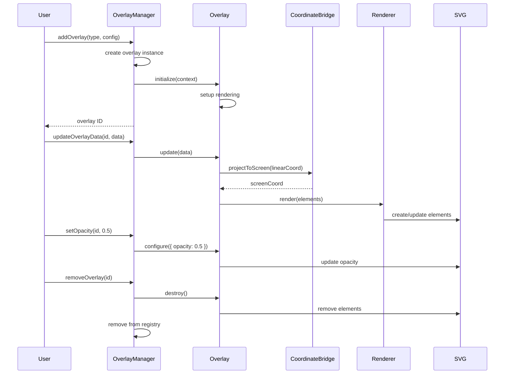
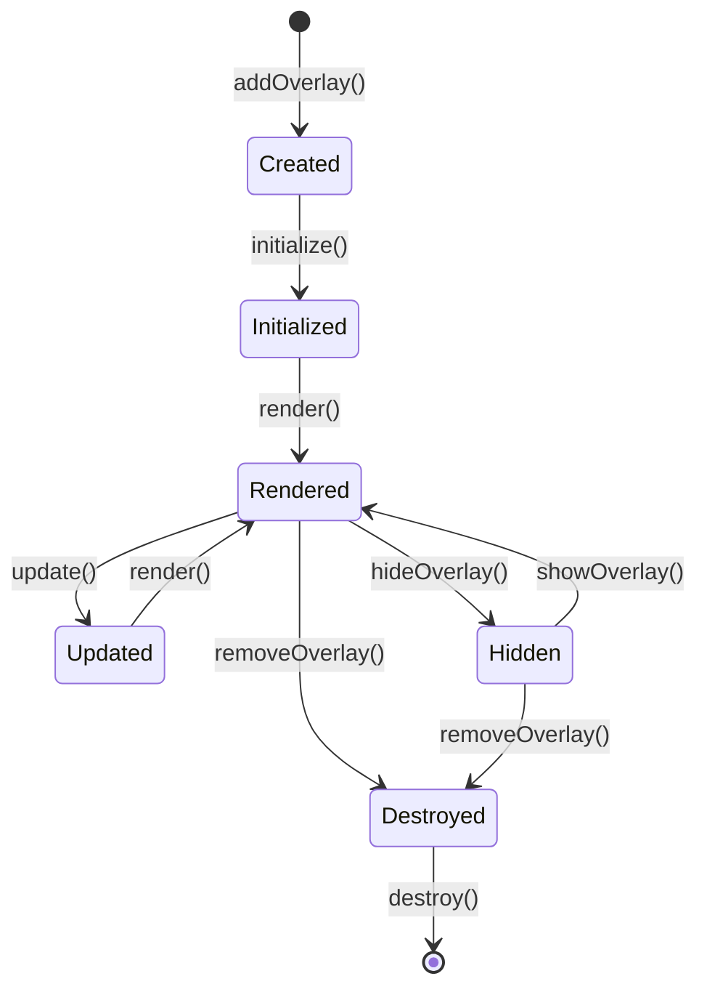

# Design Document: rail-schematic-viz-overlays

## Overview

The rail-schematic-viz-overlays package provides the data visualization layer for the Rail Schematic Viz library, implementing a pluggable overlay system that enables railway operators, analysts, and planners to visualize operational data, metrics, and annotations on top of railway schematic diagrams. This package transforms static diagrams into dynamic, data-driven visualizations suitable for operational monitoring, capacity planning, maintenance tracking, and analytical workflows.

The architecture prioritizes performance, extensibility, and composability. The overlay system uses a common RailOverlay interface that all overlay types implement, enabling uniform lifecycle management, rendering, and event handling. Five built-in overlay types provide comprehensive visualization capabilities: heat-maps for continuous scalar metrics, annotations for labeled markers, range bands for track section highlighting, traffic flow for directional frequency visualization, and time-series for temporal data replay. The system supports custom overlay development through a well-documented plugin API.

Performance optimizations include Canvas rendering for dense data layers (10,000+ points at 60 FPS), spatial indexing (R-tree) for viewport culling, efficient D3 update patterns to avoid full re-renders, and intelligent label collision detection. The color scale and palette libraries provide accessible, color-blind safe visualizations meeting WCAG 2.1 AA standards. The legend rendering system automatically generates visual encoding guides for all overlays.

This package builds on @rail-schematic-viz/core (data model, rendering, coordinate bridge) and @rail-schematic-viz/layout (viewport, interaction) to provide rich data visualization capabilities that integrate seamlessly with the existing rendering pipeline.

## Architecture

### System Architecture

The package follows a layered architecture with clear separation between overlay management, rendering strategies, and data visualization:

```mermaid
graph TB
    subgraph "Overlay Management Layer"
        OM[OverlayManager]
        OR[OverlayRegistry]
        OL[OverlayLifecycle]
    end
    
    subgraph "Built-in Overlays"
        HM[HeatMapOverlay]
        AN[AnnotationOverlay]
        RB[RangeBandOverlay]
        TF[TrafficFlowOverlay]
        TS[TimeSeriesOverlay]
    end
    
    subgraph "Rendering Layer"
        RS[RenderStrategy]
        SVGRender[SVGRenderer]
        CanvasRender[CanvasRenderer]
        UP[UpdatePattern]
    end
    
    subgraph "Visualization Support"
        CS[ColorScale]
        CP[ColorPalette]
        LR[LegendRenderer]
        CD[CollisionDetection]
        SI[SpatialIndex]
    end
    
    subgraph "Core Dependencies"
        CB[CoordinateBridge<br/>@core]
        RG[RailGraph<br/>@core]
        VC[ViewportController<br/>@layout]
        EM[EventManager<br/>@layout]
    end
    
    OR --> OM
    OL --> OM
    
    HM --> OM
    AN --> OM
    RB --> OM
    TF --> OM
    TS --> OM
    
    OM --> RS
    RS --> SVGRender
    RS --> CanvasRender
    RS --> UP
    
    HM --> CS
    HM --> CP
    HM --> CanvasRender
    AN --> CD
    AN --> SI
    RB --> SVGRender
    TF --> SVGRender
    TS --> UP
    
    OM --> LR
    
    CB --> HM
    CB --> AN
    CB --> RB
    CB --> TF
    CB --> TS
    
    RG --> OM
    VC --> OM
    EM --> OM
```

### Module Structure

```
@rail-schematic-viz/overlays/
├── src/
│   ├── core/
│   │   ├── RailOverlay.ts           # Overlay interface
│   │   ├── OverlayManager.ts        # Overlay lifecycle manager
│   │   ├── OverlayRegistry.ts       # Custom overlay registration
│   │   └── OverlayConfiguration.ts  # Configuration types
│   ├── overlays/
│   │   ├── HeatMapOverlay.ts        # Heat-map implementation
│   │   ├── AnnotationOverlay.ts     # Annotation implementation
│   │   ├── RangeBandOverlay.ts      # Range band implementation
│   │   ├── TrafficFlowOverlay.ts    # Traffic flow implementation
│   │   └── TimeSeriesOverlay.ts     # Time-series implementation
│   ├── rendering/
│   │   ├── RenderStrategy.ts        # Rendering strategy interface
│   │   ├── SVGRenderer.ts           # SVG rendering implementation
│   │   ├── CanvasRenderer.ts        # Canvas rendering implementation
│   │   └── UpdatePattern.ts         # D3 enter-update-exit pattern
│   ├── colors/
│   │   ├── ColorScale.ts            # Color scale functions
│   │   ├── ColorPalette.ts          # Predefined palettes
│   │   └── accessibility.ts         # Color-blind safe palettes
│   ├── legend/
│   │   ├── LegendRenderer.ts        # Legend rendering
│   │   ├── LegendDescriptor.ts      # Legend metadata
│   │   └── LegendLayout.ts          # Legend positioning
│   ├── spatial/
│   │   ├── CollisionDetection.ts    # Label collision detection
│   │   ├── Clustering.ts            # Annotation clustering
│   │   └── SpatialIndex.ts          # R-tree for viewport culling
│   ├── animation/
│   │   ├── AnimationController.ts   # Animation lifecycle
│   │   └── Interpolation.ts         # Value interpolation
│   ├── performance/
│   │   ├── PerformanceMonitor.ts    # Performance tracking
│   │   └── Debounce.ts              # Update debouncing
│   └── index.ts                     # Main entry point
├── types/
│   └── index.d.ts                   # TypeScript type exports
└── package.json
```

### Design Principles

1. **Interface-Based Architecture**: All overlays implement the RailOverlay interface, enabling uniform lifecycle management, rendering, and event handling without conditional logic based on overlay type.

2. **Rendering Strategy Pattern**: Overlays choose between SVG and Canvas rendering based on data density. SVG for interactive elements (<1000 points), Canvas for dense data layers (>1000 points).

3. **Coordinate Projection Abstraction**: All overlays use CoordinateBridge from @core to project linear positions to screen coordinates, maintaining consistency with the base schematic rendering.

4. **Efficient Update Patterns**: Use D3's enter-update-exit pattern for data-driven updates, avoiding full re-renders when only data changes.

5. **Spatial Optimization**: R-tree spatial indexing enables O(log n) viewport culling and collision detection queries instead of O(n) iteration.

6. **Composable Visualization**: Multiple overlay instances can coexist with independent data, configuration, and lifecycle, enabling complex multi-layer visualizations.

7. **Accessibility First**: Color scales include color-blind safe options, legends provide text alternatives for color encoding, and all interactive elements have ARIA labels.

8. **Performance Budget**: Target 60 FPS (16ms frame budget) for all overlay operations. Use Canvas for dense data, debounce updates during continuous viewport changes, and cache rendered elements.

## Components and Interfaces

### Core Overlay System

#### RailOverlay Interface

The fundamental interface that all overlay types must implement.

```typescript
interface RailOverlay {
  readonly id: string;
  readonly type: string;
  readonly zOrder: number;
  readonly opacity: number;
  readonly visible: boolean;
  
  // Lifecycle methods
  initialize(context: OverlayContext): void;
  render(context: RenderContext): void;
  update(data: unknown): void;
  resize(dimensions: ViewportDimensions): void;
  destroy(): void;
  
  // Metadata
  getLegend(): LegendDescriptor | null;
  getPerformanceMetrics(): PerformanceMetrics;
  
  // Configuration
  configure(config: Partial<OverlayConfiguration>): void;
  getConfiguration(): OverlayConfiguration;
}

interface OverlayContext {
  coordinateBridge: CoordinateBridge;
  railGraph: RailGraph;
  viewport: ViewportController;
  eventManager: EventManager;
  svgRoot: SVGSVGElement;
  canvasContext?: CanvasRenderingContext2D;
}

interface RenderContext {
  coordinateBridge: CoordinateBridge;
  viewport: ViewportController;
  visibleBounds: BoundingBox;
  zoomScale: number;
  timestamp: number;
}

interface ViewportDimensions {
  width: number;
  height: number;
}

interface PerformanceMetrics {
  lastRenderTime: number;
  lastUpdateTime: number;
  dataPointCount: number;
  renderedElementCount: number;
  culledElementCount: number;
}
```

**Design Rationale**: The interface separates lifecycle (initialize, render, update, resize, destroy) from metadata (getLegend, getPerformanceMetrics) and configuration. Context objects provide access to core dependencies without tight coupling. Render context includes viewport state for culling and LOD decisions.

#### OverlayManager

The central manager for overlay lifecycle, visibility, z-order, and opacity control.

```typescript
class OverlayManager {
  private overlays: Map<string, RailOverlay>;
  private registry: OverlayRegistry;
  private context: OverlayContext;
  private eventEmitter: EventEmitter;
  
  constructor(
    context: OverlayContext,
    registry?: OverlayRegistry
  );
  
  // Overlay lifecycle
  addOverlay(
    type: string,
    config: OverlayConfiguration
  ): Result<string, OverlayError>;
  
  removeOverlay(id: string): Result<void, OverlayError>;
  
  getOverlay(id: string): RailOverlay | undefined;
  
  getAllOverlays(): ReadonlyArray<RailOverlay>;
  
  // Visibility control
  showOverlay(id: string): void;
  hideOverlay(id: string): void;
  toggleOverlay(id: string): void;
  showAll(): void;
  hideAll(): void;
  
  // Z-order control
  setZOrder(id: string, zOrder: number): void;
  bringToFront(id: string): void;
  sendToBack(id: string): void;
  
  // Opacity control
  setOpacity(id: string, opacity: number): void;
  
  // Data updates
  updateOverlayData(id: string, data: unknown): void;
  batchUpdate(updates: Array<{ id: string; data: unknown }>): void;
  
  // Rendering
  renderAll(): void;
  renderOverlay(id: string): void;
  
  // Legend management
  getLegends(): Array<{ id: string; legend: LegendDescriptor }>;
  
  // Event registration
  on(event: OverlayEvent, handler: EventHandler): void;
}

type OverlayEvent = 
  | 'overlay-added'
  | 'overlay-removed'
  | 'visibility-change'
  | 'z-order-change'
  | 'opacity-change'
  | 'data-update'
  | 'configuration-change';

interface OverlayError extends Error {
  code: string;
  overlayId?: string;
  context?: unknown;
}
```

**Design Rationale**: Manager pattern centralizes overlay lifecycle and state management. Batch update method enables efficient multi-overlay updates. Event system allows UI components to react to overlay changes. Result type makes error handling explicit.

#### OverlayRegistry

Registry for custom overlay types with factory pattern.

```typescript
class OverlayRegistry {
  private factories: Map<string, OverlayFactory>;
  
  constructor();
  
  // Register custom overlay type
  register(
    type: string,
    factory: OverlayFactory
  ): Result<void, RegistryError>;
  
  // Unregister overlay type
  unregister(type: string): void;
  
  // Create overlay instance
  create(
    type: string,
    config: OverlayConfiguration
  ): Result<RailOverlay, RegistryError>;
  
  // Query registered types
  isRegistered(type: string): boolean;
  getRegisteredTypes(): ReadonlyArray<string>;
}

type OverlayFactory = (config: OverlayConfiguration) => RailOverlay;

interface RegistryError extends Error {
  code: string;
  overlayType?: string;
}

// Built-in overlay types
const BUILTIN_OVERLAY_TYPES = [
  'heat-map',
  'annotation',
  'range-band',
  'traffic-flow',
  'time-series',
] as const;
```

**Design Rationale**: Factory pattern decouples overlay creation from manager. Registry validates that custom overlays implement the RailOverlay interface. Built-in types are pre-registered during initialization.

### Built-in Overlay Implementations

#### HeatMapOverlay

Visualizes continuous scalar metrics along tracks using color gradients.

```typescript
class HeatMapOverlay implements RailOverlay {
  readonly type = 'heat-map';
  
  private data: HeatMapDataPoint[];
  private config: HeatMapConfiguration;
  private colorScale: ColorScaleFunction;
  private spatialIndex: SpatialIndex;
  private canvasRenderer: CanvasRenderer;
  private cache: Map<string, ImageData>;
  
  constructor(config: HeatMapConfiguration);
  
  initialize(context: OverlayContext): void {
    // Setup Canvas rendering context
    // Build spatial index for viewport culling
    // Initialize color scale from configuration
  }
  
  render(context: RenderContext): void {
    // Query visible data points using spatial index
    // Project linear positions to screen coordinates
    // Render color gradient using Canvas
    // Apply interpolation between data points
  }
  
  update(data: HeatMapDataPoint[]): void {
    // Use D3 update pattern for efficient updates
    // Rebuild spatial index if needed
    // Invalidate cache
    // Trigger re-render
  }
  
  getLegend(): LegendDescriptor {
    // Return color scale, value range, units
  }
}

interface HeatMapDataPoint {
  linearPosition: LinearCoordinate;
  value: number;
  metadata?: Record<string, unknown>;
}

interface HeatMapConfiguration extends OverlayConfiguration {
  colorScale: ColorScaleType;
  colorPalette: ColorPaletteName;
  interpolation: 'linear' | 'step' | 'smooth';
  valueRange?: [number, number];
  units?: string;
  metricName?: string;
  performanceMode: 'quality' | 'balanced' | 'speed';
  cacheEnabled: boolean;
}

type ColorScaleType = 'linear' | 'logarithmic' | 'quantile' | 'threshold' | 'custom';
type ColorPaletteName = 'Blues' | 'Greens' | 'Reds' | 'Greys' | 'RdBu' | 'RdYlGn' | 'Spectral' | 'Viridis' | 'ColorBlindSafe';
```

**Design Rationale**: Canvas rendering provides performance for dense data (10,000+ points). Spatial index enables viewport culling. Cache stores rendered gradients to avoid redundant computation. Color scale and palette are configurable for different data types and accessibility needs.

#### AnnotationOverlay

Displays labeled markers at specific track locations with collision detection and clustering.

```typescript
class AnnotationOverlay implements RailOverlay {
  readonly type = 'annotation';
  
  private data: AnnotationDataPoint[];
  private config: AnnotationConfiguration;
  private collisionDetector: CollisionDetection;
  private clustering: Clustering;
  private svgRenderer: SVGRenderer;
  
  constructor(config: AnnotationConfiguration);
  
  initialize(context: OverlayContext): void {
    // Setup SVG rendering
    // Initialize collision detection
    // Initialize clustering if enabled
  }
  
  render(context: RenderContext): void {
    // Project linear positions to screen coordinates
    // Apply clustering if zoom level is low
    // Run collision detection on labels
    // Render pin markers and labels
    // Render leader lines for adjusted labels
  }
  
  update(data: AnnotationDataPoint[]): void {
    // Use D3 enter-update-exit pattern
    // Update collision detection
    // Update clustering
  }
  
  private handleClick(annotation: AnnotationDataPoint): void {
    // Emit click event with annotation data
  }
}

interface AnnotationDataPoint {
  linearPosition: LinearCoordinate;
  label: string;
  icon?: string | SVGElement;
  priority?: number;
  metadata?: Record<string, unknown>;
}

interface AnnotationConfiguration extends OverlayConfiguration {
  pinIcon: 'default' | 'circle' | 'square' | 'triangle' | 'custom';
  customIcon?: SVGElement;
  pinSize: number;
  pinColor: string;
  labelStyle: {
    fontSize: number;
    fontFamily: string;
    color: string;
    backgroundColor: string;
    padding: number;
  };
  collisionDetection: {
    enabled: boolean;
    proximityThreshold: number;
    strategy: 'adjust' | 'hide' | 'cluster';
  };
  clustering: {
    enabled: boolean;
    distanceThreshold: number;
    minZoomForExpansion: number;
  };
  leaderLines: {
    enabled: boolean;
    color: string;
    width: number;
  };
}
```

**Design Rationale**: SVG rendering enables interactive elements (click events). Collision detection prevents overlapping labels. Clustering reduces clutter at low zoom levels. Priority field allows important annotations to take precedence during collision resolution.

#### RangeBandOverlay

Highlights track sections between two positions with support for overlapping bands.

```typescript
class RangeBandOverlay implements RailOverlay {
  readonly type = 'range-band';
  
  private data: RangeBandDataPoint[];
  private config: RangeBandConfiguration;
  private svgRenderer: SVGRenderer;
  
  constructor(config: RangeBandConfiguration);
  
  initialize(context: OverlayContext): void {
    // Setup SVG rendering
  }
  
  render(context: RenderContext): void {
    // Project start and end positions to screen coordinates
    // Follow track topology for multi-segment bands
    // Render colored zones with configured styling
    // Render optional labels at band midpoints
  }
  
  update(data: RangeBandDataPoint[]): void {
    // Use D3 update pattern
  }
  
  private handleHover(band: RangeBandDataPoint): void {
    // Emit hover event with band data
    // Highlight topmost band if overlapping
  }
}

interface RangeBandDataPoint {
  startPosition: LinearCoordinate;
  endPosition: LinearCoordinate;
  color: string;
  label?: string;
  priority?: number;
  metadata?: Record<string, unknown>;
}

interface RangeBandConfiguration extends OverlayConfiguration {
  bandOpacity: number;
  borderWidth: number;
  borderColor: string;
  blendMode: 'normal' | 'multiply' | 'screen';
  stackingMode: 'overlay' | 'stacked';
  stackOffset: number;
  labelPosition: 'above' | 'below' | 'inline';
  labelStyle: {
    fontSize: number;
    color: string;
    backgroundColor: string;
  };
}
```

**Design Rationale**: SVG rendering enables hover events and styling flexibility. Blend modes and stacking modes handle overlapping bands. Track topology following ensures bands render correctly across junctions and switches.

#### TrafficFlowOverlay

Visualizes train frequency and direction with directional arrows.

```typescript
class TrafficFlowOverlay implements RailOverlay {
  readonly type = 'traffic-flow';
  
  private data: TrafficFlowDataPoint[];
  private config: TrafficFlowConfiguration;
  private svgRenderer: SVGRenderer;
  private animationController: AnimationController;
  
  constructor(config: TrafficFlowConfiguration);
  
  initialize(context: OverlayContext): void {
    // Setup SVG rendering
    // Initialize animation controller if enabled
  }
  
  render(context: RenderContext): void {
    // Project linear positions to screen coordinates
    // Calculate arrow dimensions based on frequency
    // Orient arrows based on direction
    // Render arrows with configured styling
    // Start animation if enabled
  }
  
  update(data: TrafficFlowDataPoint[]): void {
    // Use D3 update pattern
    // Update animations
  }
  
  getLegend(): LegendDescriptor {
    // Return frequency scale and units
  }
}

interface TrafficFlowDataPoint {
  linearPosition: LinearCoordinate;
  direction: 'up' | 'down' | 'bidirectional';
  frequency: number;
  metadata?: Record<string, unknown>;
}

interface TrafficFlowConfiguration extends OverlayConfiguration {
  arrowStyle: 'solid' | 'outline' | 'dashed';
  arrowColor: string;
  arrowSpacing: number;
  widthScale: (frequency: number) => number;
  animation: {
    enabled: boolean;
    speed: number;
    style: 'continuous' | 'pulsing' | 'dashed';
  };
  frequencyUnits: string;
}
```

**Design Rationale**: SVG rendering with CSS animations provides smooth 60 FPS performance. Width scale function allows custom frequency-to-width mapping. Bidirectional support renders separate arrows for each direction.

#### TimeSeriesOverlay

Displays temporal data with playback controls and multi-metric support.

```typescript
class TimeSeriesOverlay implements RailOverlay {
  readonly type = 'time-series';
  
  private data: TimeSeriesDataPoint[];
  private config: TimeSeriesConfiguration;
  private currentTimestamp: number;
  private playbackState: PlaybackState;
  private temporalIndex: Map<number, TimeSeriesDataPoint[]>;
  private metricVisibility: Map<string, boolean>;
  private animationController: AnimationController;
  
  constructor(config: TimeSeriesConfiguration);
  
  initialize(context: OverlayContext): void {
    // Build temporal index for efficient queries
    // Initialize playback controls UI
    // Setup metric toggle controls
  }
  
  render(context: RenderContext): void {
    // Query data points for current timestamp
    // Filter by visible metrics
    // Render visualization for current state
    // Update time slider position
  }
  
  update(data: TimeSeriesDataPoint[]): void {
    // Rebuild temporal index
    // Update playback controls
  }
  
  // Playback control methods
  play(): void;
  pause(): void;
  stop(): void;
  setPlaybackSpeed(speed: number): void;
  seekTo(timestamp: number): void;
  
  // Metric control methods
  toggleMetric(metric: string): void;
  setMetricVisibility(metric: string, visible: boolean): void;
  
  getLegend(): LegendDescriptor {
    // Return all metrics with visibility state
  }
}

interface TimeSeriesDataPoint {
  timestamp: number;
  linearPosition: LinearCoordinate;
  metric: string;
  value: number;
  metadata?: Record<string, unknown>;
}

interface TimeSeriesConfiguration extends OverlayConfiguration {
  playbackSpeed: number;
  timeFormat: string;
  sliderPosition: 'top' | 'bottom';
  metrics: Array<{
    name: string;
    color: string;
    visible: boolean;
  }>;
  preloadFrames: number;
  temporalResolution?: number;
  cacheEnabled: boolean;
}

type PlaybackState = 'stopped' | 'playing' | 'paused';
```

**Design Rationale**: Temporal index enables O(1) queries for timestamp. Preloading adjacent frames ensures smooth playback. Metric visibility map allows toggling individual metrics. Frame caching improves performance for frequently accessed timestamps.


### Rendering Layer

#### RenderStrategy

Strategy interface for different rendering approaches.

```typescript
interface RenderStrategy {
  readonly name: string;
  
  render(
    elements: RenderElement[],
    context: RenderContext
  ): void;
  
  update(
    elements: RenderElement[],
    context: RenderContext
  ): void;
  
  clear(): void;
}

interface RenderElement {
  id: string;
  type: string;
  geometry: Geometry;
  style: RenderStyle;
  data?: unknown;
}

type Geometry = 
  | PointGeometry
  | LineGeometry
  | PolygonGeometry
  | PathGeometry;

interface PointGeometry {
  type: 'point';
  x: number;
  y: number;
}

interface LineGeometry {
  type: 'line';
  points: Array<{ x: number; y: number }>;
}

interface PolygonGeometry {
  type: 'polygon';
  points: Array<{ x: number; y: number }>;
}

interface PathGeometry {
  type: 'path';
  pathData: string;
}

interface RenderStyle {
  fill?: string;
  stroke?: string;
  strokeWidth?: number;
  opacity?: number;
  className?: string;
}
```

**Design Rationale**: Strategy pattern allows overlays to choose rendering approach based on data characteristics. Geometry types cover all visualization needs. Style object separates visual properties from geometry.

#### SVGRenderer

SVG-based rendering for interactive elements.

```typescript
class SVGRenderer implements RenderStrategy {
  readonly name = 'svg';
  
  private svgRoot: SVGSVGElement;
  private elementMap: Map<string, SVGElement>;
  
  constructor(svgRoot: SVGSVGElement);
  
  render(elements: RenderElement[], context: RenderContext): void {
    // Use D3 data join for efficient rendering
    // Create SVG elements based on geometry type
    // Apply styles and event handlers
  }
  
  update(elements: RenderElement[], context: RenderContext): void {
    // Use D3 enter-update-exit pattern
    // Update only changed elements
  }
  
  clear(): void {
    // Remove all rendered elements
  }
  
  private createSVGElement(element: RenderElement): SVGElement {
    // Create appropriate SVG element based on geometry type
  }
  
  private applyStyle(svgElement: SVGElement, style: RenderStyle): void {
    // Apply style properties to SVG element
  }
}
```

**Design Rationale**: D3 data join provides efficient enter-update-exit pattern. Element map enables O(1) lookup for updates. SVG provides interactivity (hover, click) and styling flexibility.

#### CanvasRenderer

Canvas-based rendering for dense data layers.

```typescript
class CanvasRenderer implements RenderStrategy {
  readonly name = 'canvas';
  
  private canvas: HTMLCanvasElement;
  private context: CanvasRenderingContext2D;
  private offscreenCanvas?: OffscreenCanvas;
  
  constructor(canvas: HTMLCanvasElement);
  
  render(elements: RenderElement[], context: RenderContext): void {
    // Clear canvas
    // Render elements using Canvas API
    // Use offscreen canvas for complex rendering
  }
  
  update(elements: RenderElement[], context: RenderContext): void {
    // Full re-render (Canvas doesn't support partial updates)
    // Use dirty rectangle optimization if possible
  }
  
  clear(): void {
    // Clear entire canvas
  }
  
  private renderPoint(point: PointGeometry, style: RenderStyle): void {
    // Render point using arc or rect
  }
  
  private renderLine(line: LineGeometry, style: RenderStyle): void {
    // Render line using moveTo/lineTo
  }
  
  private renderPolygon(polygon: PolygonGeometry, style: RenderStyle): void {
    // Render polygon using path
  }
  
  private renderPath(path: PathGeometry, style: RenderStyle): void {
    // Render path using Path2D
  }
}
```

**Design Rationale**: Canvas provides superior performance for dense data (10,000+ elements). Offscreen canvas enables complex rendering without blocking main thread. Dirty rectangle optimization minimizes redraws.

#### UpdatePattern

D3 enter-update-exit pattern implementation.

```typescript
class UpdatePattern {
  static apply<T>(
    selection: d3.Selection<SVGElement, T, any, any>,
    data: T[],
    keyFunction: (d: T) => string,
    enterFunction: (enter: d3.Selection<d3.EnterElement, T, any, any>) => d3.Selection<SVGElement, T, any, any>,
    updateFunction: (update: d3.Selection<SVGElement, T, any, any>) => d3.Selection<SVGElement, T, any, any>,
    exitFunction: (exit: d3.Selection<SVGElement, T, any, any>) => void
  ): void {
    const joined = selection.data(data, keyFunction);
    
    // Enter: create new elements
    const entered = enterFunction(joined.enter());
    
    // Update: modify existing elements
    updateFunction(joined.merge(entered));
    
    // Exit: remove old elements
    exitFunction(joined.exit());
  }
}
```

**Design Rationale**: Encapsulates D3's data join pattern for reuse across overlays. Key function enables efficient element tracking. Separate enter/update/exit functions provide flexibility.

### Color System

#### ColorScale

Color scale functions for mapping values to colors.

```typescript
type ColorScaleFunction = (value: number) => string;

class ColorScale {
  static linear(
    domain: [number, number],
    range: [string, string]
  ): ColorScaleFunction {
    return d3.scaleLinear<string>()
      .domain(domain)
      .range(range)
      .interpolate(d3.interpolateRgb);
  }
  
  static logarithmic(
    domain: [number, number],
    range: [string, string]
  ): ColorScaleFunction {
    return d3.scaleLog<string>()
      .domain(domain)
      .range(range)
      .interpolate(d3.interpolateRgb);
  }
  
  static quantile(
    domain: number[],
    range: string[]
  ): ColorScaleFunction {
    return d3.scaleQuantile<string>()
      .domain(domain)
      .range(range);
  }
  
  static threshold(
    domain: number[],
    range: string[]
  ): ColorScaleFunction {
    return d3.scaleThreshold<number, string>()
      .domain(domain)
      .range(range);
  }
  
  static sequential(
    domain: [number, number],
    interpolator: (t: number) => string
  ): ColorScaleFunction {
    return d3.scaleSequential(interpolator)
      .domain(domain);
  }
  
  static diverging(
    domain: [number, number, number],
    interpolator: (t: number) => string
  ): ColorScaleFunction {
    return d3.scaleDiverging(interpolator)
      .domain(domain);
  }
  
  static custom(
    fn: (value: number) => string
  ): ColorScaleFunction {
    return fn;
  }
}
```

**Design Rationale**: Leverages D3's battle-tested scale functions. Each scale type is appropriate for different data characteristics (linear for continuous, quantile for distribution-based, threshold for categorical).

#### ColorPalette

Predefined color palettes with accessibility support.

```typescript
class ColorPalette {
  // Sequential palettes (single-hue gradients)
  static readonly Blues = ['#f7fbff', '#deebf7', '#c6dbef', '#9ecae1', '#6baed6', '#4292c6', '#2171b5', '#08519c', '#08306b'];
  static readonly Greens = ['#f7fcf5', '#e5f5e0', '#c7e9c0', '#a1d99b', '#74c476', '#41ab5d', '#238b45', '#006d2c', '#00441b'];
  static readonly Reds = ['#fff5f0', '#fee0d2', '#fcbba1', '#fc9272', '#fb6a4a', '#ef3b2c', '#cb181d', '#a50f15', '#67000d'];
  static readonly Greys = ['#ffffff', '#f0f0f0', '#d9d9d9', '#bdbdbd', '#969696', '#737373', '#525252', '#252525', '#000000'];
  
  // Diverging palettes (two-hue gradients with neutral midpoint)
  static readonly RdBu = ['#67001f', '#b2182b', '#d6604d', '#f4a582', '#fddbc7', '#f7f7f7', '#d1e5f0', '#92c5de', '#4393c3', '#2166ac', '#053061'];
  static readonly RdYlGn = ['#a50026', '#d73027', '#f46d43', '#fdae61', '#fee08b', '#ffffbf', '#d9ef8b', '#a6d96a', '#66bd63', '#1a9850', '#006837'];
  static readonly Spectral = ['#9e0142', '#d53e4f', '#f46d43', '#fdae61', '#fee08b', '#ffffbf', '#e6f598', '#abdda4', '#66c2a5', '#3288bd', '#5e4fa2'];
  
  // Perceptually uniform palettes
  static readonly Viridis = ['#440154', '#482777', '#3f4a8a', '#31678e', '#26838f', '#1f9d8a', '#6cce5a', '#b6de2b', '#fee825'];
  static readonly Plasma = ['#0d0887', '#5302a3', '#8b0aa5', '#b83289', '#db5c68', '#f48849', '#febd2a', '#f0f921'];
  static readonly Inferno = ['#000004', '#1b0c41', '#4a0c6b', '#781c6d', '#a52c60', '#cf4446', '#ed6925', '#fb9b06', '#f7d13d'];
  
  // Color-blind safe palettes
  static readonly ColorBlindSafe = ['#0173b2', '#de8f05', '#029e73', '#cc78bc', '#ca9161', '#fbafe4', '#949494', '#ece133', '#56b4e9'];
  static readonly ColorBlindSafeDiverging = ['#ca0020', '#f4a582', '#f7f7f7', '#92c5de', '#0571b0'];
  
  // High contrast palette (WCAG 2.1 AAA)
  static readonly HighContrast = ['#000000', '#ffffff', '#ff0000', '#00ff00', '#0000ff', '#ffff00', '#ff00ff', '#00ffff'];
  
  // Categorical palettes
  static readonly Category10 = ['#1f77b4', '#ff7f0e', '#2ca02c', '#d62728', '#9467bd', '#8c564b', '#e377c2', '#7f7f7f', '#bcbd22', '#17becf'];
  static readonly Category20 = ['#1f77b4', '#aec7e8', '#ff7f0e', '#ffbb78', '#2ca02c', '#98df8a', '#d62728', '#ff9896', '#9467bd', '#c5b0d5', '#8c564b', '#c49c94', '#e377c2', '#f7b6d2', '#7f7f7f', '#c7c7c7', '#bcbd22', '#dbdb8d', '#17becf', '#9edae5'];
  
  static getPalette(name: ColorPaletteName): string[] {
    return ColorPalette[name] || ColorPalette.Blues;
  }
  
  static isColorBlindSafe(name: ColorPaletteName): boolean {
    return name === 'ColorBlindSafe' || 
           name === 'ColorBlindSafeDiverging' ||
           name === 'Viridis' ||
           name === 'Plasma' ||
           name === 'Inferno';
  }
  
  static isHighContrast(name: ColorPaletteName): boolean {
    return name === 'HighContrast';
  }
}
```

**Design Rationale**: Comprehensive palette library covers all use cases (sequential, diverging, categorical). Color-blind safe palettes ensure accessibility. High contrast palette meets WCAG 2.1 AAA requirements. Perceptually uniform palettes (Viridis, Plasma, Inferno) avoid misleading visual artifacts.

### Legend System

#### LegendDescriptor

Metadata describing an overlay's visual encoding.

```typescript
interface LegendDescriptor {
  title: string;
  type: LegendType;
  items: LegendItem[];
  units?: string;
}

type LegendType = 'continuous' | 'discrete' | 'categorical';

type LegendItem = 
  | ContinuousLegendItem
  | DiscreteLegendItem
  | CategoricalLegendItem;

interface ContinuousLegendItem {
  type: 'continuous';
  colorScale: ColorScaleFunction;
  domain: [number, number];
  ticks?: number[];
}

interface DiscreteLegendItem {
  type: 'discrete';
  stops: Array<{
    value: number;
    color: string;
    label?: string;
  }>;
}

interface CategoricalLegendItem {
  type: 'categorical';
  categories: Array<{
    label: string;
    color: string;
    symbol?: string;
  }>;
}
```

**Design Rationale**: Discriminated union for legend types enables type-safe rendering. Continuous legends show gradients, discrete legends show color stops, categorical legends show symbols. Units and ticks provide context for interpretation.

#### LegendRenderer

Renders legend descriptors as SVG elements.

```typescript
class LegendRenderer {
  private config: LegendConfiguration;
  
  constructor(config?: LegendConfiguration);
  
  render(
    legends: Array<{ id: string; legend: LegendDescriptor }>,
    container: SVGSVGElement
  ): void {
    // Position legends based on configuration
    // Render each legend based on type
    // Add collapse/expand controls if enabled
  }
  
  private renderContinuous(
    legend: ContinuousLegendItem,
    container: SVGGElement
  ): void {
    // Render gradient bar
    // Render tick marks and labels
  }
  
  private renderDiscrete(
    legend: DiscreteLegendItem,
    container: SVGGElement
  ): void {
    // Render color stops with labels
  }
  
  private renderCategorical(
    legend: CategoricalLegendItem,
    container: SVGGElement
  ): void {
    // Render symbols with labels
  }
  
  update(
    legends: Array<{ id: string; legend: LegendDescriptor }>
  ): void {
    // Update existing legends without full re-render
  }
  
  clear(): void {
    // Remove all legends
  }
}

interface LegendConfiguration {
  position: 'top-left' | 'top-right' | 'bottom-left' | 'bottom-right' | 'custom';
  customPosition?: { x: number; y: number };
  collapsible: boolean;
  defaultCollapsed: boolean;
  style: {
    fontSize: number;
    fontFamily: string;
    backgroundColor: string;
    borderColor: string;
    borderWidth: number;
    padding: number;
    spacing: number;
  };
  gradientWidth: number;
  gradientHeight: number;
}
```

**Design Rationale**: Separate rendering methods for each legend type. Collapsible legends save screen space. Position configuration allows flexible placement. Update method avoids full re-render when only data changes.

### Spatial Optimization

#### CollisionDetection

Prevents overlapping labels for annotation readability.

```typescript
class CollisionDetection {
  private config: CollisionConfig;
  private boundingBoxes: Map<string, BoundingBox>;
  
  constructor(config?: CollisionConfig);
  
  detect(
    labels: Array<{ id: string; position: { x: number; y: number }; text: string; priority: number }>
  ): CollisionResult {
    // Compute bounding boxes for all labels
    // Detect overlaps using spatial queries
    // Resolve collisions based on strategy
  }
  
  private computeBoundingBox(
    position: { x: number; y: number },
    text: string,
    fontSize: number
  ): BoundingBox {
    // Estimate text dimensions
    // Add padding
  }
  
  private resolveCollisions(
    collisions: Array<[string, string]>,
    labels: Map<string, LabelData>,
    strategy: CollisionStrategy
  ): Map<string, AdjustedPosition> {
    // Apply collision resolution strategy
  }
}

interface CollisionConfig {
  proximityThreshold: number;
  strategy: CollisionStrategy;
  maxIterations: number;
}

type CollisionStrategy = 'adjust' | 'hide' | 'cluster';

interface CollisionResult {
  adjustedPositions: Map<string, AdjustedPosition>;
  hiddenLabels: Set<string>;
  clusters: Array<Cluster>;
}

interface AdjustedPosition {
  x: number;
  y: number;
  needsLeaderLine: boolean;
}

interface LabelData {
  id: string;
  position: { x: number; y: number };
  text: string;
  priority: number;
  boundingBox: BoundingBox;
}
```

**Design Rationale**: Bounding box computation estimates text dimensions. Priority field allows important labels to take precedence. Strategy pattern supports different resolution approaches (adjust positions, hide lower priority, cluster nearby).

#### Clustering

Groups nearby annotations into cluster markers.

```typescript
class Clustering {
  private config: ClusteringConfig;
  private spatialIndex: SpatialIndex;
  
  constructor(config?: ClusteringConfig);
  
  cluster(
    annotations: Array<{ id: string; position: { x: number; y: number }; data: unknown }>,
    zoomScale: number
  ): ClusterResult {
    // Build spatial index
    // Group nearby annotations based on distance threshold
    // Create cluster markers with counts
  }
  
  private shouldCluster(zoomScale: number): boolean {
    // Check if zoom level is below expansion threshold
  }
  
  private groupNearby(
    annotations: Array<{ id: string; position: { x: number; y: number }; data: unknown }>,
    distanceThreshold: number
  ): Array<Cluster> {
    // Use spatial index to find nearby annotations
    // Group into clusters
  }
}

interface ClusteringConfig {
  enabled: boolean;
  distanceThreshold: number;
  minZoomForExpansion: number;
  maxClusterSize: number;
}

interface ClusterResult {
  clusters: Array<Cluster>;
  unclustered: Array<string>;
}

interface Cluster {
  id: string;
  position: { x: number; y: number };
  count: number;
  annotationIds: string[];
}
```

**Design Rationale**: Spatial index enables efficient proximity queries. Zoom-based clustering reduces clutter at low zoom levels. Cluster markers show count badges. Expansion threshold determines when to show individual annotations.

#### SpatialIndex

R-tree spatial index for viewport culling and collision detection.

```typescript
class SpatialIndex {
  private tree: RBush<IndexEntry>;
  
  constructor();
  
  insert(id: string, bounds: BoundingBox): void {
    this.tree.insert({
      minX: bounds.minX,
      minY: bounds.minY,
      maxX: bounds.maxX,
      maxY: bounds.maxY,
      id,
    });
  }
  
  remove(id: string): void {
    const entries = this.tree.all().filter(e => e.id === id);
    entries.forEach(e => this.tree.remove(e));
  }
  
  search(bounds: BoundingBox): string[] {
    const results = this.tree.search({
      minX: bounds.minX,
      minY: bounds.minY,
      maxX: bounds.maxX,
      maxY: bounds.maxY,
    });
    return results.map(r => r.id);
  }
  
  clear(): void {
    this.tree.clear();
  }
  
  bulkLoad(entries: Array<{ id: string; bounds: BoundingBox }>): void {
    const items = entries.map(e => ({
      minX: e.bounds.minX,
      minY: e.bounds.minY,
      maxX: e.bounds.maxX,
      maxY: e.bounds.maxY,
      id: e.id,
    }));
    this.tree.load(items);
  }
}

interface IndexEntry {
  minX: number;
  minY: number;
  maxX: number;
  maxY: number;
  id: string;
}
```

**Design Rationale**: Uses RBush library for efficient R-tree implementation. O(log n) spatial queries enable viewport culling and collision detection. Bulk load optimizes initial index construction.

### Animation System

#### AnimationController

Manages animation lifecycle for traffic flow and time-series overlays.

```typescript
class AnimationController {
  private animations: Map<string, AnimationState>;
  private rafId: number | null = null;
  
  constructor();
  
  start(
    id: string,
    config: AnimationConfig,
    onFrame: (progress: number) => void
  ): void {
    // Create animation state
    // Start requestAnimationFrame loop
  }
  
  stop(id: string): void {
    // Stop animation
    // Clean up state
  }
  
  pause(id: string): void {
    // Pause animation
  }
  
  resume(id: string): void {
    // Resume animation
  }
  
  setSpeed(id: string, speed: number): void {
    // Adjust animation speed
  }
  
  private tick(timestamp: number): void {
    // Update all active animations
    // Call onFrame callbacks
    // Request next frame
  }
}

interface AnimationConfig {
  duration?: number;
  loop: boolean;
  speed: number;
  easing?: (t: number) => number;
}

interface AnimationState {
  id: string;
  config: AnimationConfig;
  startTime: number;
  pausedTime?: number;
  progress: number;
  onFrame: (progress: number) => void;
}
```

**Design Rationale**: Centralized animation management prevents conflicts. requestAnimationFrame ensures smooth 60 FPS. Speed control allows playback rate adjustment. Pause/resume support enables user control.

### Performance Optimization

#### PerformanceMonitor

Tracks overlay rendering performance.

```typescript
class PerformanceMonitor {
  private metrics: Map<string, OverlayMetrics>;
  private enabled: boolean;
  
  constructor(enabled: boolean = true);
  
  startMeasure(overlayId: string, operation: string): void {
    // Start performance measurement
  }
  
  endMeasure(overlayId: string, operation: string): void {
    // End performance measurement
    // Update metrics
  }
  
  getMetrics(overlayId: string): OverlayMetrics | undefined {
    return this.metrics.get(overlayId);
  }
  
  getAllMetrics(): Map<string, OverlayMetrics> {
    return new Map(this.metrics);
  }
  
  reset(): void {
    this.metrics.clear();
  }
}

interface OverlayMetrics {
  overlayId: string;
  renderTime: {
    average: number;
    max: number;
    min: number;
    count: number;
  };
  updateTime: {
    average: number;
    max: number;
    min: number;
    count: number;
  };
  dataPointCount: number;
  renderedElementCount: number;
  culledElementCount: number;
}
```

**Design Rationale**: Lightweight monitoring with minimal overhead. Per-overlay metrics enable targeted optimization. Average/max/min statistics identify performance outliers.

#### Debounce

Debounces expensive operations during continuous viewport changes.

```typescript
class Debounce {
  private timeoutId: number | null = null;
  
  static debounce<T extends (...args: any[]) => void>(
    fn: T,
    delay: number
  ): (...args: Parameters<T>) => void {
    let timeoutId: number | null = null;
    
    return (...args: Parameters<T>) => {
      if (timeoutId !== null) {
        clearTimeout(timeoutId);
      }
      
      timeoutId = window.setTimeout(() => {
        fn(...args);
        timeoutId = null;
      }, delay);
    };
  }
  
  static throttle<T extends (...args: any[]) => void>(
    fn: T,
    delay: number
  ): (...args: Parameters<T>) => void {
    let lastCall = 0;
    
    return (...args: Parameters<T>) => {
      const now = Date.now();
      
      if (now - lastCall >= delay) {
        lastCall = now;
        fn(...args);
      }
    };
  }
}
```

**Design Rationale**: Debounce delays execution until activity stops. Throttle limits execution frequency. Both prevent excessive re-renders during continuous pan/zoom.

## Data Models

### Type System

```typescript
// Core overlay types
interface OverlayConfiguration {
  id?: string;
  zOrder?: number;
  opacity?: number;
  visible?: boolean;
}

// Coordinate types (from @core)
interface LinearCoordinate {
  readonly type: 'linear';
  readonly trackId: string;
  readonly distance: number;
}

interface ScreenCoordinate {
  readonly type: 'screen';
  readonly x: number;
  readonly y: number;
}

// Bounding box
interface BoundingBox {
  minX: number;
  minY: number;
  maxX: number;
  maxY: number;
}

// Result type for error handling
type Result<T, E extends Error> = 
  | { success: true; value: T }
  | { success: false; error: E };
```

### Data Flow



### Overlay Lifecycle




## Correctness Properties

A property is a characteristic or behavior that should hold true across all valid executions of a system—essentially, a formal statement about what the system should do. Properties serve as the bridge between human-readable specifications and machine-verifiable correctness guarantees.

### Acceptance Criteria Testing Prework

Before defining correctness properties, I analyzed each acceptance criterion to determine testability:

**Requirement 1: Overlay System Architecture**
1.1 THE Overlay_System SHALL define a RailOverlay interface
  Thoughts: This is about the existence of an interface definition, which is a structural requirement, not a behavioral one we can test at runtime.
  Testable: no

1.2 THE RailOverlay interface SHALL include a render() method
  Thoughts: This is about interface structure, verified by TypeScript compiler.
  Testable: no

1.3-1.5 Interface method requirements
  Thoughts: These are structural requirements verified by TypeScript.
  Testable: no

1.6 THE Overlay_System SHALL maintain a collection of active overlay instances
  Thoughts: We can test that after adding overlays, they appear in the collection.
  Testable: yes - property

1.7 THE Overlay_System SHALL render overlays in z-order sequence
  Thoughts: We can test that overlays with higher z-order render after (on top of) overlays with lower z-order.
  Testable: yes - property


**Requirement 2: Overlay Registration**
2.1 THE Renderer SHALL provide an addOverlay() method
  Thoughts: This is about API existence, verified by TypeScript.
  Testable: no

2.3 THE Renderer SHALL assign a unique identifier to each overlay instance
  Thoughts: We can test that all overlay IDs are unique.
  Testable: yes - property

2.4 WHEN an overlay is added, THE Renderer SHALL invoke the overlay's render() method
  Thoughts: We can test that render() is called after addOverlay().
  Testable: yes - property

2.5 WHEN an overlay is removed, THE Renderer SHALL invoke the overlay's destroy() method
  Thoughts: We can test that destroy() is called after removeOverlay().
  Testable: yes - property

2.6 THE Renderer SHALL support adding multiple instances of the same overlay type
  Thoughts: We can test that adding multiple instances of the same type works.
  Testable: yes - property

**Requirement 3: Heat-Map Overlay Implementation**
3.1 THE Heat_Map_Overlay SHALL accept data as an array of {linearPosition, value} pairs
  Thoughts: This is about data structure acceptance, which we can test.
  Testable: yes - property

3.2 WHEN heat-map data is provided, THE Heat_Map_Overlay SHALL project each linearPosition to Screen_Coordinate
  Thoughts: We can test that all linear positions are projected using CoordinateBridge.
  Testable: yes - property

3.8 WHEN heat-map data is updated, THE Heat_Map_Overlay SHALL use D3's update pattern
  Thoughts: This is about implementation approach, hard to test directly.
  Testable: no


**Requirement 4: Heat-Map Performance**
4.1-4.7 Performance requirements
  Thoughts: These are performance benchmarks, not functional correctness properties.
  Testable: no (performance tests, not property tests)

**Requirement 5: Heat-Map Legend**
5.1 THE Heat_Map_Overlay SHALL provide a getLegend() method returning Legend_Descriptor
  Thoughts: We can test that getLegend() returns a valid LegendDescriptor.
  Testable: yes - property

5.2-5.5 Legend content requirements
  Thoughts: We can test that the legend descriptor contains required fields.
  Testable: yes - property

**Requirement 6: Annotation Overlay Implementation**
6.1 THE Annotation_Overlay SHALL accept data as an array of {linearPosition, label, icon} objects
  Thoughts: We can test that the overlay accepts this data structure.
  Testable: yes - property

6.2 WHEN annotation data is provided, THE Annotation_Overlay SHALL project each linearPosition
  Thoughts: We can test that all positions are projected.
  Testable: yes - property

6.7 THE Annotation_Overlay SHALL emit click events when annotation pins are clicked
  Thoughts: We can test that clicking triggers events.
  Testable: yes - property


**Requirement 7: Annotation Collision Detection**
7.1 THE Annotation_Overlay SHALL implement Collision_Detection
  Thoughts: We can test that overlapping labels are detected and adjusted.
  Testable: yes - property

7.6 THE Collision_Detection SHALL use leader lines for adjusted labels
  Thoughts: We can test that adjusted labels have leader lines.
  Testable: yes - property

**Requirement 8: Annotation Clustering**
8.1 WHERE clustering is enabled, THE Annotation_Overlay SHALL group nearby annotations
  Thoughts: We can test that nearby annotations are grouped into clusters.
  Testable: yes - property

8.4 WHEN a user clicks on a cluster marker, THE Annotation_Overlay SHALL emit a cluster-click event
  Thoughts: We can test that clicking clusters triggers events.
  Testable: yes - property

**Requirement 9: Range Band Overlay Implementation**
9.1 THE Range_Band_Overlay SHALL accept data as an array of {startPosition, endPosition, color, label}
  Thoughts: We can test that the overlay accepts this data structure.
  Testable: yes - property

9.2 WHEN range band data is provided, THE Range_Band_Overlay SHALL project start and end positions
  Thoughts: We can test that both positions are projected.
  Testable: yes - property


**Requirement 10: Range Band Overlap Handling**
10.1 WHEN multiple range bands overlap, THE Range_Band_Overlay SHALL render them with configurable z-ordering
  Thoughts: We can test that overlapping bands respect z-order.
  Testable: yes - property

**Requirement 11: Traffic Flow Overlay Implementation**
11.1 THE Traffic_Flow_Overlay SHALL accept data as an array of {linearPosition, direction, frequency}
  Thoughts: We can test that the overlay accepts this data structure.
  Testable: yes - property

11.2 WHEN traffic flow data is provided, THE Traffic_Flow_Overlay SHALL render directional arrows
  Thoughts: We can test that arrows are rendered for each data point.
  Testable: yes - property

11.8 THE Traffic_Flow_Overlay SHALL provide a getLegend() method
  Thoughts: We can test that getLegend() returns a valid descriptor.
  Testable: yes - property

**Requirement 13: Time-Series Overlay Implementation**
13.1 THE Time_Series_Overlay SHALL accept data as an array of {timestamp, linearPosition, value, metric}
  Thoughts: We can test that the overlay accepts this data structure.
  Testable: yes - property

13.3 WHEN the time slider position changes, THE Time_Series_Overlay SHALL update visualization
  Thoughts: We can test that changing the slider updates the displayed data.
  Testable: yes - property


**Requirement 14: Time-Series Multi-Metric Support**
14.1 WHEN time-series data includes multiple metrics, THE Time_Series_Overlay SHALL provide metric toggle controls
  Thoughts: We can test that metrics can be toggled on/off.
  Testable: yes - property

14.4 WHEN a metric is toggled off, THE Time_Series_Overlay SHALL hide that metric's visualization
  Thoughts: We can test that toggling off a metric hides it.
  Testable: yes - property

**Requirement 16: Custom Overlay Registration**
16.1 THE Overlay_System SHALL provide a registerOverlay() method
  Thoughts: This is about API existence.
  Testable: no

16.3 WHEN a custom overlay is registered, THE Overlay_System SHALL validate that it implements required methods
  Thoughts: We can test that invalid overlays are rejected.
  Testable: yes - property

16.6 THE Overlay_System SHALL support multiple instances of custom overlay types
  Thoughts: We can test that multiple instances can be created.
  Testable: yes - property

**Requirement 17: Custom Overlay Lifecycle**
17.6 THE Overlay_System SHALL invoke lifecycle methods in the correct sequence
  Thoughts: We can test that methods are called in order: initialize → render → update → destroy.
  Testable: yes - property


**Requirement 18: Overlay Manager Implementation**
18.1 THE Overlay_Manager SHALL maintain a list of all active overlays
  Thoughts: We can test that added overlays appear in the list.
  Testable: yes - property

18.7 THE Overlay_Manager SHALL emit visibility-change events
  Thoughts: We can test that toggling visibility emits events.
  Testable: yes - property

**Requirement 19: Overlay Visibility Control**
19.1 WHEN an overlay's visibility is toggled, THE Renderer SHALL update display within 100 milliseconds
  Thoughts: This is a performance requirement.
  Testable: no (performance test)

19.2 THE Renderer SHALL not re-render other overlays when toggling visibility of one overlay
  Thoughts: We can test that only the target overlay is affected.
  Testable: yes - property

**Requirement 20: Overlay Z-Order Control**
20.1 THE Overlay_Manager SHALL assign a z-order value to each overlay
  Thoughts: We can test that all overlays have z-order values.
  Testable: yes - property

20.4 WHEN z-order changes, THE Renderer SHALL re-render overlays in the new order
  Thoughts: We can test that rendering order matches z-order.
  Testable: yes - property


**Requirement 21: Overlay Opacity Control**
21.1 THE Overlay_Manager SHALL support opacity values from 0.0 to 1.0
  Thoughts: We can test that opacity values outside this range are rejected.
  Testable: yes - property

21.6 THE Overlay_Manager SHALL validate that opacity values are in the range [0.0, 1.0]
  Thoughts: Same as 21.1, this is input validation.
  Testable: yes - property

**Requirement 22: Legend Rendering**
22.2 THE Renderer SHALL query each visible overlay's getLegend() method
  Thoughts: We can test that legends are only queried for visible overlays.
  Testable: yes - property

**Requirement 23: Overlay Data Updates**
23.2 WHEN overlay data is updated, THE Overlay_System SHALL invoke the overlay's update() method
  Thoughts: We can test that update() is called when data changes.
  Testable: yes - property

23.4 THE Overlay_System SHALL not re-render other overlays when updating one overlay's data
  Thoughts: We can test that only the target overlay is updated.
  Testable: yes - property

**Requirement 24: Overlay Event Handling**
24.1 THE Overlay_System SHALL emit click events when overlay elements are clicked
  Thoughts: We can test that clicking elements triggers events.
  Testable: yes - property


**Requirement 25: Overlay Configuration**
25.5 THE Overlay_System SHALL validate configuration and use defaults for missing properties
  Thoughts: We can test that invalid configurations are rejected and defaults are applied.
  Testable: yes - property

**Requirement 26: Color Scale Library**
26.8 THE library SHALL support custom scale functions
  Thoughts: We can test that custom functions can be registered and used.
  Testable: yes - property

**Requirement 27: Color Palette Library**
27.8 THE library SHALL support custom palettes
  Thoughts: We can test that custom palettes can be defined and used.
  Testable: yes - property

### Property Reflection

After analyzing all acceptance criteria, I identified the following redundancies:

- **Overlay lifecycle properties (2.4, 2.5, 17.6)**: These test similar lifecycle concepts and can be combined into a single property about lifecycle method invocation order.
- **Data acceptance properties (3.1, 6.1, 9.1, 11.1, 13.1)**: Each overlay type accepts specific data structures, but these are similar patterns that can be tested with a single property about data structure validation.
- **Projection properties (3.2, 6.2, 9.2)**: All overlays project linear coordinates to screen coordinates, which can be combined into one property.
- **Legend properties (5.1, 11.8)**: Both test that getLegend() returns valid descriptors, which can be combined.
- **Event emission properties (6.7, 8.4, 18.7, 24.1)**: Multiple properties test event emission, which can be consolidated.
- **Isolation properties (19.2, 23.4)**: Both test that operations on one overlay don't affect others, which can be combined.
- **Opacity validation properties (21.1, 21.6)**: These are duplicate tests for the same validation.

After reflection, the following properties provide unique validation value:


### Property 1: Overlay Collection Maintenance

For any OverlayManager and any overlay added via addOverlay(), the overlay SHALL appear in the collection returned by getAllOverlays().

**Validates: Requirements 1.6**

### Property 2: Z-Order Rendering Sequence

For any OverlayManager with multiple overlays, overlays SHALL be rendered in ascending z-order (lower z-order values render first, higher values render on top).

**Validates: Requirements 1.7, 20.4**

### Property 3: Unique Overlay Identifiers

For any OverlayManager, all overlay identifiers returned by addOverlay() SHALL be unique (no two overlays have the same ID).

**Validates: Requirements 2.3**

### Property 4: Overlay Lifecycle Method Invocation

For any overlay, lifecycle methods SHALL be invoked in the correct sequence: initialize() → render() → update() (zero or more times) → destroy().

**Validates: Requirements 2.4, 2.5, 17.6**

### Property 5: Multiple Instances Support

For any overlay type, the OverlayManager SHALL support adding multiple independent instances with different configurations and data.

**Validates: Requirements 2.6, 16.6**

### Property 6: Data Structure Validation

For any overlay type, providing data that conforms to the overlay's expected schema SHALL succeed, while providing invalid data SHALL result in an error.

**Validates: Requirements 3.1, 6.1, 9.1, 11.1, 13.1**


### Property 7: Coordinate Projection Completeness

For any overlay with data containing linear coordinates, all linear positions SHALL be projected to screen coordinates using the CoordinateBridge.

**Validates: Requirements 3.2, 6.2, 9.2**

### Property 8: Legend Descriptor Validity

For any overlay that provides a legend, getLegend() SHALL return a LegendDescriptor containing all required fields (title, type, items).

**Validates: Requirements 5.1, 5.2, 5.3, 5.4, 5.5, 11.8**

### Property 9: Event Emission on Interaction

For any interactive overlay element (annotation pin, cluster marker, range band), user interactions (click, hover) SHALL emit events containing the element's data and coordinates.

**Validates: Requirements 6.7, 8.4, 24.1**

### Property 10: Collision Detection for Overlapping Labels

For any AnnotationOverlay with collision detection enabled, when labels overlap (bounding boxes intersect), the collision detection algorithm SHALL adjust positions or hide labels to prevent overlap.

**Validates: Requirements 7.1**

### Property 11: Leader Lines for Adjusted Labels

For any AnnotationOverlay with collision detection enabled, labels that are adjusted away from their original position SHALL have leader lines connecting them to their pin markers.

**Validates: Requirements 7.6**

### Property 12: Annotation Clustering by Proximity

For any AnnotationOverlay with clustering enabled and zoom level below the expansion threshold, annotations within the distance threshold SHALL be grouped into cluster markers.

**Validates: Requirements 8.1**


### Property 13: Range Band Z-Order Respect

For any RangeBandOverlay with multiple overlapping bands, bands SHALL be rendered in z-order sequence (higher z-order bands appear on top).

**Validates: Requirements 10.1**

### Property 14: Custom Overlay Validation

For any custom overlay registered via registerOverlay(), the overlay SHALL be validated to implement all required RailOverlay interface methods (initialize, render, update, resize, destroy, getLegend, getPerformanceMetrics, configure, getConfiguration).

**Validates: Requirements 16.3**

### Property 15: Overlay Manager State Consistency

For any OverlayManager, the list of active overlays returned by getAllOverlays() SHALL exactly match the set of overlays that have been added and not yet removed.

**Validates: Requirements 18.1**

### Property 16: Visibility Change Event Emission

For any overlay, calling showOverlay(), hideOverlay(), or toggleOverlay() SHALL emit a visibility-change event containing the overlay ID and new visibility state.

**Validates: Requirements 18.7**

### Property 17: Overlay Operation Isolation

For any OverlayManager with multiple overlays, operations on one overlay (visibility toggle, data update, configuration change) SHALL NOT trigger re-renders or updates of other overlays.

**Validates: Requirements 19.2, 23.4**

### Property 18: Z-Order Assignment

For any overlay added to the OverlayManager, the overlay SHALL be assigned a z-order value (either from configuration or a default value).

**Validates: Requirements 20.1**


### Property 19: Opacity Range Validation

For any overlay, setting opacity SHALL accept values in the range [0.0, 1.0] and reject values outside this range with an error.

**Validates: Requirements 21.1, 21.6**

### Property 20: Legend Query for Visible Overlays

For any OverlayManager, when rendering legends, getLegend() SHALL be called only for overlays where visible === true.

**Validates: Requirements 22.2**

### Property 21: Update Method Invocation on Data Change

For any overlay, calling updateOverlayData() SHALL invoke the overlay's update() method with the new data.

**Validates: Requirements 23.2**

### Property 22: Configuration Validation and Defaults

For any overlay, providing a configuration object with missing optional properties SHALL result in default values being applied, while invalid required properties SHALL result in an error.

**Validates: Requirements 25.5**

### Property 23: Custom Color Scale Registration

For any custom color scale function, the color scale library SHALL accept and apply the function to map values to colors.

**Validates: Requirements 26.8**

### Property 24: Custom Color Palette Registration

For any custom color palette (array of color values), the color palette library SHALL accept and use the palette for visualizations.

**Validates: Requirements 27.8**


### Property 25: Time-Series Timestamp Filtering

For any TimeSeriesOverlay, when the time slider is set to timestamp T, only data points with timestamp === T SHALL be rendered.

**Validates: Requirements 13.3**

### Property 26: Time-Series Metric Visibility Toggle

For any TimeSeriesOverlay with multiple metrics, toggling a metric's visibility to false SHALL hide all data points for that metric, while toggling to true SHALL show them.

**Validates: Requirements 14.1, 14.4**

## Error Handling

The overlay system implements comprehensive error handling to ensure robustness:

### Error Types

```typescript
class OverlayError extends Error {
  constructor(
    message: string,
    public code: string,
    public overlayId?: string,
    public context?: unknown
  ) {
    super(message);
    this.name = 'OverlayError';
  }
}

// Error codes
const ERROR_CODES = {
  OVERLAY_NOT_FOUND: 'OVERLAY_NOT_FOUND',
  INVALID_OVERLAY_TYPE: 'INVALID_OVERLAY_TYPE',
  INVALID_CONFIGURATION: 'INVALID_CONFIGURATION',
  INVALID_DATA: 'INVALID_DATA',
  PROJECTION_FAILED: 'PROJECTION_FAILED',
  RENDER_FAILED: 'RENDER_FAILED',
  LIFECYCLE_ERROR: 'LIFECYCLE_ERROR',
  VALIDATION_FAILED: 'VALIDATION_FAILED',
} as const;
```

### Error Handling Strategies

1. **Validation Errors**: Configuration and data validation errors are caught early and returned as Result types, preventing invalid state.

2. **Projection Errors**: CoordinateBridge projection failures are caught and logged, with fallback to skipping the problematic data point rather than crashing the entire overlay.

3. **Render Errors**: Rendering errors in one overlay are isolated and don't affect other overlays. Errors are logged with context for debugging.

4. **Lifecycle Errors**: Errors in custom overlay lifecycle methods are caught and logged, with the overlay marked as failed to prevent further operations.

5. **Event Handler Errors**: Errors in user-provided event handlers are caught and logged without affecting the overlay system.


### Error Recovery

```typescript
class OverlayManager {
  private handleOverlayError(
    overlayId: string,
    error: Error,
    operation: string
  ): void {
    // Log error with context
    console.error(`Overlay ${overlayId} failed during ${operation}:`, error);
    
    // Emit error event
    this.eventEmitter.emit('overlay-error', {
      overlayId,
      operation,
      error,
      timestamp: Date.now(),
    });
    
    // Mark overlay as failed
    const overlay = this.overlays.get(overlayId);
    if (overlay) {
      (overlay as any).failed = true;
    }
    
    // Continue with other overlays
  }
}
```

## Testing Strategy

The overlay system requires comprehensive testing using both unit tests and property-based tests to ensure correctness across all scenarios.

### Dual Testing Approach

**Unit Tests**: Verify specific examples, edge cases, and error conditions
- Specific overlay configurations with known data
- Edge cases (empty data, single data point, extreme values)
- Error conditions (invalid data, projection failures)
- Integration points between overlays and core components
- Event emission and handling
- Legend rendering for specific configurations

**Property Tests**: Verify universal properties across all inputs
- Overlay lifecycle correctness for any configuration
- Data structure validation for any input
- Coordinate projection for any linear positions
- Z-order rendering for any overlay combinations
- Collision detection for any label arrangements
- Clustering for any annotation distributions
- Configuration validation for any config objects

### Property-Based Testing Configuration

All property tests will use fast-check library with minimum 100 iterations per test:

```typescript
import fc from 'fast-check';
import { describe, it, expect } from 'vitest';

describe('Overlay System Properties', () => {
  it('Property 1: Overlay Collection Maintenance', () => {
    fc.assert(
      fc.property(
        fc.array(overlayConfigArbitrary(), { minLength: 1, maxLength: 10 }),
        (configs) => {
          const manager = new OverlayManager(mockContext);
          const ids = configs.map(config => 
            manager.addOverlay(config.type, config).value
          );
          
          const allOverlays = manager.getAllOverlays();
          expect(allOverlays.length).toBe(ids.length);
          
          ids.forEach(id => {
            expect(allOverlays.some(o => o.id === id)).toBe(true);
          });
        }
      ),
      { numRuns: 100 }
    );
  });
  
  // Additional property tests...
});

// Arbitraries for generating test data
function overlayConfigArbitrary(): fc.Arbitrary<OverlayConfiguration> {
  return fc.record({
    type: fc.constantFrom('heat-map', 'annotation', 'range-band', 'traffic-flow', 'time-series'),
    zOrder: fc.integer({ min: 0, max: 100 }),
    opacity: fc.double({ min: 0, max: 1 }),
    visible: fc.boolean(),
  });
}

function linearCoordinateArbitrary(): fc.Arbitrary<LinearCoordinate> {
  return fc.record({
    type: fc.constant('linear' as const),
    trackId: fc.string({ minLength: 1, maxLength: 10 }),
    distance: fc.double({ min: 0, max: 10000 }),
  });
}
```


### Test Coverage Requirements

- Minimum 80% code coverage across all modules
- 100% coverage of error handling paths
- All 26 correctness properties implemented as property-based tests
- Unit tests for each built-in overlay type
- Integration tests for overlay manager and renderer interaction
- Performance tests for Canvas rendering with 10,000+ data points
- Accessibility tests for ARIA labels and keyboard navigation

### Test Organization

```
tests/
├── unit/
│   ├── overlays/
│   │   ├── HeatMapOverlay.test.ts
│   │   ├── AnnotationOverlay.test.ts
│   │   ├── RangeBandOverlay.test.ts
│   │   ├── TrafficFlowOverlay.test.ts
│   │   └── TimeSeriesOverlay.test.ts
│   ├── core/
│   │   ├── OverlayManager.test.ts
│   │   ├── OverlayRegistry.test.ts
│   │   └── OverlayConfiguration.test.ts
│   ├── rendering/
│   │   ├── SVGRenderer.test.ts
│   │   ├── CanvasRenderer.test.ts
│   │   └── UpdatePattern.test.ts
│   ├── colors/
│   │   ├── ColorScale.test.ts
│   │   └── ColorPalette.test.ts
│   ├── legend/
│   │   └── LegendRenderer.test.ts
│   └── spatial/
│       ├── CollisionDetection.test.ts
│       ├── Clustering.test.ts
│       └── SpatialIndex.test.ts
├── properties/
│   ├── overlay-lifecycle.property.test.ts
│   ├── data-validation.property.test.ts
│   ├── coordinate-projection.property.test.ts
│   ├── z-order-rendering.property.test.ts
│   ├── collision-detection.property.test.ts
│   ├── clustering.property.test.ts
│   ├── event-emission.property.test.ts
│   └── configuration-validation.property.test.ts
├── integration/
│   ├── overlay-manager-integration.test.ts
│   ├── multi-overlay-interaction.test.ts
│   └── viewport-integration.test.ts
├── performance/
│   ├── canvas-rendering.perf.test.ts
│   ├── spatial-indexing.perf.test.ts
│   └── collision-detection.perf.test.ts
└── accessibility/
    ├── aria-labels.test.ts
    └── keyboard-navigation.test.ts
```

### Property Test Tags

Each property-based test must include a comment tag referencing the design document property:

```typescript
/**
 * Feature: rail-schematic-viz-overlays, Property 1: Overlay Collection Maintenance
 * 
 * For any OverlayManager and any overlay added via addOverlay(), 
 * the overlay SHALL appear in the collection returned by getAllOverlays().
 */
it('Property 1: Overlay Collection Maintenance', () => {
  // Test implementation
});
```

### Example Property Test Implementation

```typescript
/**
 * Feature: rail-schematic-viz-overlays, Property 7: Coordinate Projection Completeness
 * 
 * For any overlay with data containing linear coordinates, all linear positions 
 * SHALL be projected to screen coordinates using the CoordinateBridge.
 */
describe('Property 7: Coordinate Projection Completeness', () => {
  it('projects all linear coordinates for heat-map overlay', () => {
    fc.assert(
      fc.property(
        fc.array(heatMapDataPointArbitrary(), { minLength: 1, maxLength: 100 }),
        (dataPoints) => {
          const mockBridge = createMockCoordinateBridge();
          const overlay = new HeatMapOverlay(defaultConfig);
          overlay.initialize(createMockContext(mockBridge));
          overlay.update(dataPoints);
          
          // Verify all linear positions were projected
          expect(mockBridge.projectToScreen).toHaveBeenCalledTimes(dataPoints.length);
          
          dataPoints.forEach(point => {
            expect(mockBridge.projectToScreen).toHaveBeenCalledWith(
              point.linearPosition
            );
          });
        }
      ),
      { numRuns: 100 }
    );
  });
  
  it('projects all linear coordinates for annotation overlay', () => {
    fc.assert(
      fc.property(
        fc.array(annotationDataPointArbitrary(), { minLength: 1, maxLength: 100 }),
        (dataPoints) => {
          const mockBridge = createMockCoordinateBridge();
          const overlay = new AnnotationOverlay(defaultConfig);
          overlay.initialize(createMockContext(mockBridge));
          overlay.update(dataPoints);
          
          expect(mockBridge.projectToScreen).toHaveBeenCalledTimes(dataPoints.length);
        }
      ),
      { numRuns: 100 }
    );
  });
});
```


## Package Structure and Exports

### Package Configuration

```json
{
  "name": "@rail-schematic-viz/overlays",
  "version": "1.0.0",
  "description": "Data visualization overlay system for Rail Schematic Viz library",
  "main": "dist/index.js",
  "module": "dist/index.esm.js",
  "types": "dist/index.d.ts",
  "exports": {
    ".": {
      "import": "./dist/index.esm.js",
      "require": "./dist/index.js",
      "types": "./dist/index.d.ts"
    },
    "./overlays": {
      "import": "./dist/overlays/index.esm.js",
      "require": "./dist/overlays/index.js",
      "types": "./dist/overlays/index.d.ts"
    },
    "./colors": {
      "import": "./dist/colors/index.esm.js",
      "require": "./dist/colors/index.js",
      "types": "./dist/colors/index.d.ts"
    },
    "./legend": {
      "import": "./dist/legend/index.esm.js",
      "require": "./dist/legend/index.js",
      "types": "./dist/legend/index.d.ts"
    }
  },
  "peerDependencies": {
    "@rail-schematic-viz/core": "^1.0.0",
    "@rail-schematic-viz/layout": "^1.0.0",
    "d3": "^7.0.0"
  },
  "dependencies": {
    "rbush": "^3.0.1"
  },
  "devDependencies": {
    "@types/d3": "^7.0.0",
    "@types/rbush": "^3.0.0",
    "fast-check": "^3.0.0",
    "vitest": "^1.0.0",
    "typescript": "^5.0.0"
  }
}
```

### Main Entry Point

```typescript
// src/index.ts
export { OverlayManager } from './core/OverlayManager';
export { OverlayRegistry } from './core/OverlayRegistry';
export type { 
  RailOverlay,
  OverlayContext,
  RenderContext,
  OverlayConfiguration,
  OverlayError,
} from './core/RailOverlay';

export { HeatMapOverlay } from './overlays/HeatMapOverlay';
export { AnnotationOverlay } from './overlays/AnnotationOverlay';
export { RangeBandOverlay } from './overlays/RangeBandOverlay';
export { TrafficFlowOverlay } from './overlays/TrafficFlowOverlay';
export { TimeSeriesOverlay } from './overlays/TimeSeriesOverlay';

export { ColorScale } from './colors/ColorScale';
export { ColorPalette } from './colors/ColorPalette';

export { LegendRenderer } from './legend/LegendRenderer';
export type { LegendDescriptor, LegendConfiguration } from './legend/LegendDescriptor';

export { CollisionDetection } from './spatial/CollisionDetection';
export { Clustering } from './spatial/Clustering';
export { SpatialIndex } from './spatial/SpatialIndex';

export { AnimationController } from './animation/AnimationController';
export { PerformanceMonitor } from './performance/PerformanceMonitor';
```

### Submodule Exports

```typescript
// src/overlays/index.ts
export { HeatMapOverlay } from './HeatMapOverlay';
export { AnnotationOverlay } from './AnnotationOverlay';
export { RangeBandOverlay } from './RangeBandOverlay';
export { TrafficFlowOverlay } from './TrafficFlowOverlay';
export { TimeSeriesOverlay } from './TimeSeriesOverlay';

export type {
  HeatMapConfiguration,
  HeatMapDataPoint,
  AnnotationConfiguration,
  AnnotationDataPoint,
  RangeBandConfiguration,
  RangeBandDataPoint,
  TrafficFlowConfiguration,
  TrafficFlowDataPoint,
  TimeSeriesConfiguration,
  TimeSeriesDataPoint,
} from './types';

// src/colors/index.ts
export { ColorScale } from './ColorScale';
export { ColorPalette } from './ColorPalette';
export type { ColorScaleFunction, ColorScaleType, ColorPaletteName } from './types';

// src/legend/index.ts
export { LegendRenderer } from './LegendRenderer';
export type { 
  LegendDescriptor, 
  LegendConfiguration,
  LegendType,
  LegendItem,
} from './LegendDescriptor';
```

## Usage Examples

### Basic Heat-Map Overlay

```typescript
import { OverlayManager, HeatMapOverlay } from '@rail-schematic-viz/overlays';
import { CoordinateBridge, RailGraph } from '@rail-schematic-viz/core';
import { ViewportController } from '@rail-schematic-viz/layout';

// Setup context
const context = {
  coordinateBridge: new CoordinateBridge(linearGraph, screenGraph),
  railGraph: graph,
  viewport: viewportController,
  eventManager: eventManager,
  svgRoot: svgElement,
};

// Create overlay manager
const overlayManager = new OverlayManager(context);

// Add heat-map overlay
const heatMapId = overlayManager.addOverlay('heat-map', {
  colorScale: 'linear',
  colorPalette: 'Viridis',
  metricName: 'Track Temperature',
  units: '°C',
  performanceMode: 'balanced',
}).value;

// Update with data
const temperatureData = [
  { linearPosition: { type: 'linear', trackId: 'track-1', distance: 0 }, value: 25 },
  { linearPosition: { type: 'linear', trackId: 'track-1', distance: 100 }, value: 28 },
  { linearPosition: { type: 'linear', trackId: 'track-1', distance: 200 }, value: 32 },
];

overlayManager.updateOverlayData(heatMapId, temperatureData);
```

### Annotation Overlay with Collision Detection

```typescript
// Add annotation overlay
const annotationId = overlayManager.addOverlay('annotation', {
  pinIcon: 'default',
  pinSize: 12,
  pinColor: '#ff0000',
  collisionDetection: {
    enabled: true,
    proximityThreshold: 50,
    strategy: 'adjust',
  },
  leaderLines: {
    enabled: true,
    color: '#666666',
    width: 1,
  },
}).value;

// Add annotations
const annotations = [
  {
    linearPosition: { type: 'linear', trackId: 'track-1', distance: 150 },
    label: 'Speed Restriction',
    priority: 1,
  },
  {
    linearPosition: { type: 'linear', trackId: 'track-1', distance: 160 },
    label: 'Signal',
    priority: 2,
  },
];

overlayManager.updateOverlayData(annotationId, annotations);

// Handle click events
overlayManager.on('element-click', (event) => {
  if (event.overlayId === annotationId) {
    console.log('Clicked annotation:', event.elementData);
  }
});
```

### Time-Series Overlay with Playback

```typescript
// Add time-series overlay
const timeSeriesId = overlayManager.addOverlay('time-series', {
  playbackSpeed: 1.0,
  timeFormat: 'HH:mm:ss',
  sliderPosition: 'bottom',
  metrics: [
    { name: 'speed', color: '#0000ff', visible: true },
    { name: 'occupancy', color: '#ff0000', visible: true },
  ],
  preloadFrames: 10,
  cacheEnabled: true,
}).value;

// Add temporal data
const timeSeriesData = [
  { timestamp: 1000, linearPosition: { type: 'linear', trackId: 'track-1', distance: 0 }, metric: 'speed', value: 60 },
  { timestamp: 1000, linearPosition: { type: 'linear', trackId: 'track-1', distance: 100 }, metric: 'speed', value: 65 },
  { timestamp: 2000, linearPosition: { type: 'linear', trackId: 'track-1', distance: 0 }, metric: 'speed', value: 62 },
  { timestamp: 2000, linearPosition: { type: 'linear', trackId: 'track-1', distance: 100 }, metric: 'speed', value: 68 },
];

overlayManager.updateOverlayData(timeSeriesId, timeSeriesData);

// Control playback
const overlay = overlayManager.getOverlay(timeSeriesId) as TimeSeriesOverlay;
overlay.play();
overlay.setPlaybackSpeed(2.0);
overlay.pause();
overlay.seekTo(1500);
```

### Custom Overlay Development

```typescript
import { RailOverlay, OverlayContext, RenderContext } from '@rail-schematic-viz/overlays';

class CustomHeatZoneOverlay implements RailOverlay {
  readonly type = 'custom-heat-zone';
  id: string;
  zOrder: number = 0;
  opacity: number = 1.0;
  visible: boolean = true;
  
  private data: HeatZoneData[];
  private config: HeatZoneConfiguration;
  
  constructor(config: HeatZoneConfiguration) {
    this.config = config;
    this.id = `custom-heat-zone-${Date.now()}`;
  }
  
  initialize(context: OverlayContext): void {
    // Setup rendering context
  }
  
  render(context: RenderContext): void {
    // Render heat zones
    this.data.forEach(zone => {
      const startScreen = context.coordinateBridge.projectToScreen(zone.start);
      const endScreen = context.coordinateBridge.projectToScreen(zone.end);
      
      // Render zone visualization
    });
  }
  
  update(data: HeatZoneData[]): void {
    this.data = data;
  }
  
  resize(dimensions: ViewportDimensions): void {
    // Handle viewport resize
  }
  
  destroy(): void {
    // Cleanup resources
  }
  
  getLegend(): LegendDescriptor {
    return {
      title: 'Heat Zones',
      type: 'categorical',
      items: [{
        type: 'categorical',
        categories: [
          { label: 'High', color: '#ff0000', symbol: 'rect' },
          { label: 'Medium', color: '#ffff00', symbol: 'rect' },
          { label: 'Low', color: '#00ff00', symbol: 'rect' },
        ],
      }],
    };
  }
  
  getPerformanceMetrics(): PerformanceMetrics {
    return {
      lastRenderTime: 0,
      lastUpdateTime: 0,
      dataPointCount: this.data.length,
      renderedElementCount: this.data.length,
      culledElementCount: 0,
    };
  }
  
  configure(config: Partial<HeatZoneConfiguration>): void {
    this.config = { ...this.config, ...config };
  }
  
  getConfiguration(): HeatZoneConfiguration {
    return this.config;
  }
}

// Register custom overlay
const registry = new OverlayRegistry();
registry.register('custom-heat-zone', (config) => new CustomHeatZoneOverlay(config));

// Use custom overlay
const manager = new OverlayManager(context, registry);
const customId = manager.addOverlay('custom-heat-zone', {
  threshold: 50,
  colors: ['#00ff00', '#ffff00', '#ff0000'],
}).value;
```


### Multi-Overlay Visualization

```typescript
// Create a comprehensive visualization with multiple overlay types
const overlayManager = new OverlayManager(context);

// 1. Heat-map for track utilization
const utilizationId = overlayManager.addOverlay('heat-map', {
  colorScale: 'linear',
  colorPalette: 'RdYlGn',
  metricName: 'Track Utilization',
  units: '%',
  zOrder: 1,
  opacity: 0.7,
}).value;

// 2. Range bands for maintenance zones
const maintenanceId = overlayManager.addOverlay('range-band', {
  bandOpacity: 0.3,
  borderWidth: 2,
  borderColor: '#ff0000',
  labelPosition: 'above',
  zOrder: 2,
}).value;

// 3. Annotations for signals and restrictions
const annotationId = overlayManager.addOverlay('annotation', {
  pinIcon: 'default',
  collisionDetection: { enabled: true, strategy: 'adjust' },
  clustering: { enabled: true, distanceThreshold: 100 },
  zOrder: 3,
}).value;

// 4. Traffic flow for train movements
const trafficId = overlayManager.addOverlay('traffic-flow', {
  arrowStyle: 'solid',
  animation: { enabled: true, speed: 1.0, style: 'continuous' },
  zOrder: 4,
}).value;

// Update all overlays with data
overlayManager.batchUpdate([
  { id: utilizationId, data: utilizationData },
  { id: maintenanceId, data: maintenanceZones },
  { id: annotationId, data: signalAnnotations },
  { id: trafficId, data: trafficFlowData },
]);

// Control visibility
overlayManager.showAll();
overlayManager.hideOverlay(trafficId); // Hide traffic flow temporarily

// Adjust z-order
overlayManager.bringToFront(annotationId); // Ensure annotations are on top

// Render legends
const legendRenderer = new LegendRenderer({
  position: 'top-right',
  collapsible: true,
});

const legends = overlayManager.getLegends();
legendRenderer.render(legends, svgRoot);
```

## Performance Considerations

### Rendering Performance

1. **Canvas vs SVG Selection**:
   - Use Canvas for dense data layers (>1000 points)
   - Use SVG for interactive elements (<1000 points)
   - Automatic selection based on data point count

2. **Viewport Culling**:
   - R-tree spatial index for O(log n) visibility queries
   - Buffer margin prevents pop-in during panning
   - Only render elements within visible bounds + buffer

3. **Update Optimization**:
   - D3 enter-update-exit pattern avoids full re-renders
   - Debounce updates during continuous viewport changes
   - Cache rendered elements for frequently accessed data

4. **Animation Performance**:
   - requestAnimationFrame for smooth 60 FPS
   - CSS animations for simple transforms
   - Pause animations when overlays are hidden

### Memory Management

1. **Data Structures**:
   - Use typed arrays for large numeric datasets
   - Implement object pooling for frequently created objects
   - Clear caches when memory pressure is detected

2. **Spatial Indexing**:
   - Bulk load R-tree for initial construction
   - Incremental updates for small changes
   - Rebuild index when >50% of data changes

3. **Event Handling**:
   - Event delegation to minimize listener overhead
   - Weak references for event handlers
   - Automatic cleanup on overlay destruction

### Scalability Targets

- 10,000+ data points at 60 FPS (Canvas rendering)
- 1,000+ annotations with collision detection (<200ms)
- 100+ overlays with independent lifecycle
- 5+ simultaneous animations without frame drops
- <100ms update latency for data changes

## Accessibility

### ARIA Support

All interactive overlay elements include ARIA attributes:

```typescript
// Annotation pins
<circle
  role="button"
  aria-label="Speed Restriction at 150m"
  aria-describedby="annotation-tooltip-1"
  tabindex="0"
/>

// Cluster markers
<g
  role="button"
  aria-label="Cluster of 5 annotations"
  aria-expanded="false"
  tabindex="0"
/>

// Time-series controls
<button
  aria-label="Play time-series"
  aria-pressed="false"
/>

// Legend
<g
  role="img"
  aria-label="Heat-map legend showing track temperature from 20°C to 40°C"
/>
```

### Keyboard Navigation

All interactive elements support keyboard navigation:

- Tab: Move focus between overlay elements
- Enter/Space: Activate focused element (click)
- Escape: Close expanded clusters or tooltips
- Arrow keys: Navigate between related elements

### Color Accessibility

- All color palettes include color-blind safe options
- High contrast mode available (WCAG 2.1 AAA)
- Legends provide text alternatives for color encoding
- Minimum 3:1 contrast ratio for all visual elements

### Screen Reader Support

- Live regions announce overlay visibility changes
- Status updates for time-series playback
- Descriptive labels for all interactive elements
- Alternative text for visual-only information

## Migration and Compatibility

### Version Compatibility

The overlay system follows semantic versioning:

- Major version: Breaking API changes
- Minor version: New features, backward compatible
- Patch version: Bug fixes, backward compatible

### Breaking Changes Policy

Breaking changes will be:
1. Announced in release notes with migration guide
2. Deprecated for at least one minor version before removal
3. Accompanied by automated migration tools when possible

### Backward Compatibility

The package maintains backward compatibility for:
- Public API interfaces (RailOverlay, OverlayManager)
- Built-in overlay types and configurations
- Event names and data structures
- Legend descriptor format

Internal implementation details may change between minor versions.

## Conclusion

The rail-schematic-viz-overlays package provides a comprehensive, performant, and extensible overlay system for railway schematic visualizations. The architecture prioritizes:

- **Modularity**: Interface-based design enables custom overlay development
- **Performance**: Canvas rendering, spatial indexing, and efficient update patterns ensure 60 FPS
- **Accessibility**: ARIA support, keyboard navigation, and color-blind safe palettes
- **Correctness**: 26 property-based tests verify universal properties across all inputs
- **Extensibility**: Plugin architecture supports domain-specific visualizations

The five built-in overlay types (heat-map, annotation, range band, traffic flow, time-series) cover common railway visualization needs, while the custom overlay API enables unlimited extension. The color scale and palette libraries provide accessible, scientifically-sound color encodings. The legend rendering system automatically generates visual encoding guides.

This package transforms static railway schematics into dynamic, data-driven visualizations suitable for operational monitoring, capacity planning, maintenance tracking, and analytical workflows.
