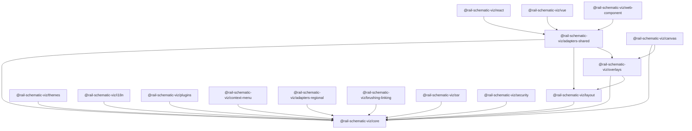

# Package Structure

`rail-schematic-viz` ships as a modular npm workspace under the `@rail-schematic-viz` scope. Each package is published independently and can be tree-shaken.

## Package Guide

| Package | Purpose | Key Peer Dependencies |
| --- | --- | --- |
| `@rail-schematic-viz/core` | Graph model, parsers, coordinates, rendering primitives | `d3` |
| `@rail-schematic-viz/layout` | Layout, viewport, minimap, interactions, accessibility | `@rail-schematic-viz/core` |
| `@rail-schematic-viz/overlays` | Overlay rendering, legends, built-in overlay types | `@rail-schematic-viz/core`, `@rail-schematic-viz/layout`, `d3` |
| `@rail-schematic-viz/adapters-shared` | Shared export, lifecycle, and event mapping helpers | `@rail-schematic-viz/core`, `@rail-schematic-viz/layout`, `@rail-schematic-viz/overlays` |
| `@rail-schematic-viz/react` | React adapter and hook | `react`, `react-dom` |
| `@rail-schematic-viz/vue` | Vue adapter and composable | `vue` |
| `@rail-schematic-viz/web-component` | Framework-agnostic custom element adapter | `@rail-schematic-viz/adapters-shared` |
| `@rail-schematic-viz/themes` | Theme registry and built-in accessible themes | `@rail-schematic-viz/core` |
| `@rail-schematic-viz/i18n` | Locale management and RTL-aware translations | `@rail-schematic-viz/core` |
| `@rail-schematic-viz/plugins` | Extensibility and lifecycle hooks | `@rail-schematic-viz/core` |
| `@rail-schematic-viz/context-menu` | Context menu controller and menu state | `@rail-schematic-viz/core` |
| `@rail-schematic-viz/adapters-regional` | CSV, GeoJSON, ELR, and RINF data ingestion | `@rail-schematic-viz/core` |
| `@rail-schematic-viz/brushing-linking` | Cross-view coordination and linked selections | `@rail-schematic-viz/core` |
| `@rail-schematic-viz/ssr` | Server-side SVG rendering | `@rail-schematic-viz/core` |
| `@rail-schematic-viz/canvas` | Canvas and hybrid rendering | `@rail-schematic-viz/core`, `@rail-schematic-viz/overlays`, `d3` |
| `@rail-schematic-viz/security` | Sanitization, CSP checks, privacy guards | `@rail-schematic-viz/core` |

## Installation Guidance

- Minimal renderer: install `@rail-schematic-viz/core`.
- Interactive schematic: add `@rail-schematic-viz/layout`.
- Rich overlays: add `@rail-schematic-viz/overlays`.
- Framework use:
  - React apps: add `@rail-schematic-viz/react`.
  - Vue apps: add `@rail-schematic-viz/vue`.
  - Framework-agnostic apps: add `@rail-schematic-viz/web-component`.
- Production features:
  - Theming: `@rail-schematic-viz/themes`
  - Localization: `@rail-schematic-viz/i18n`
  - Plugins: `@rail-schematic-viz/plugins`
  - SSR: `@rail-schematic-viz/ssr`
  - Canvas fallback: `@rail-schematic-viz/canvas`

## Dependency Graph

## Package Size And Distribution

- ESM, CommonJS, and primary-entry UMD browser bundles are published for every package.
- TypeScript declarations and source maps are included in published artifacts.
- Tree-shaking is enabled by `sideEffects: false` plus subpath exports where appropriate.
- Bundle budgets are enforced with `npm run check:bundles`.

## Release Process

1. Run `npm run check`.
2. Run `npm run check:distribution`.
3. Update [CHANGELOG.md](https://github.com/rail-schematic-viz/rail-schematic-viz/blob/main/CHANGELOG.md) with the release section.
4. Extract publish-ready notes with `npm run release:notes`.
5. Publish the affected `@rail-schematic-viz/*` packages to the public npm registry.
